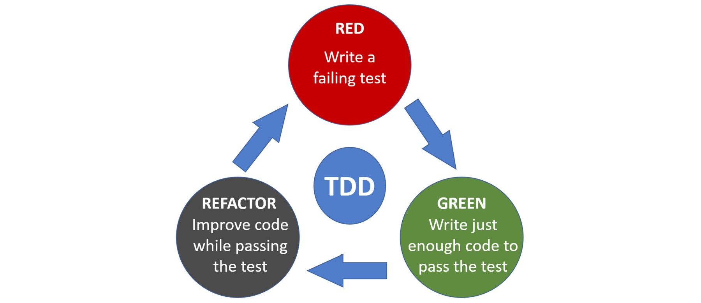
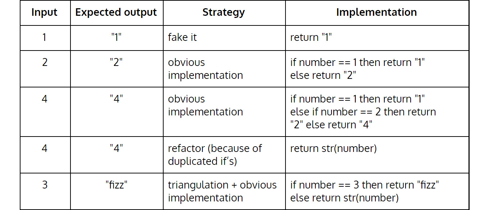
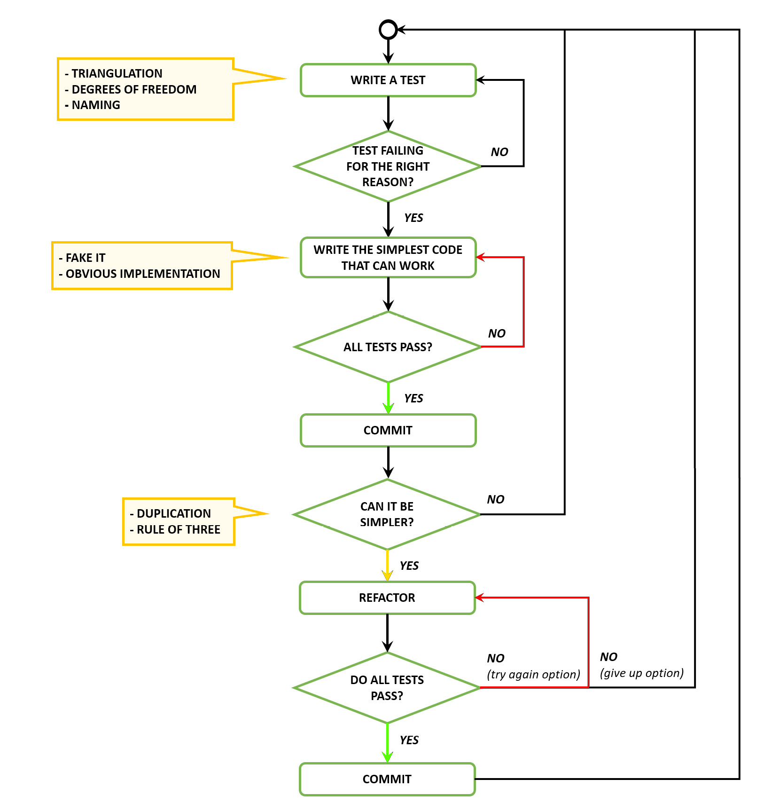
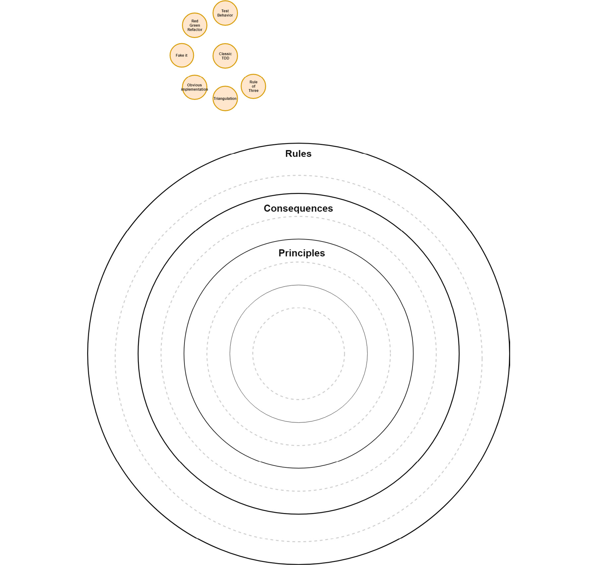

# 经典 TDD I – 测试驱动开发
> 任何傻瓜都可以编写计算机可以理解的代码。优秀的程序员会编写人类可以理解的代码。
>
> – 马丁福勒

当我为自动取款机开发软件时，我们创建了一个简单的图形用户界面 (GUI) 来测试我们的代码。 GUI 是一个充满小按钮的普通窗口，每个按钮执行特定的操作。

要执行测试，操作员将按下 GUI 上的按钮。操作的粒度非常精细，以至于要运行测试，操作员必须按特定顺序按下多个按钮。

我们没有自动序列，也没有生成任何报告。尽管如此，我们为我们的测试 GUI 感到非常自豪。质量保证工程师很喜欢它们，它们在很多情况下都是救命稻草。

这与测试驱动开发 (TDD) 几乎没有相似之处，但当时还没有发明 TDD。然而，该机制提供的高价值让我意识到测试的重要性。

当我第一次阅读 TDD 时，我感到很惊讶。我们应该在实现之前编写测试，测试应该是测试行为而不是执行原子操作；运行所有测试将自动化并生成报告。我立刻被卖了。

不要让 TDD 表面上的简单性欺骗了你。多年来，我一直相信我在做 TDD。有一次，我有机会与一位经验丰富的 TDD 实践者结对；那时我才意识到我错过了很多。

## 经典TDD

经典 TDD 是 Kent Beck 创建的原始 TDD 方法。它也被称为 TDD 的底特律/芝加哥学校。这种做法可以让你：

- 花更少的时间调试代码来证明它有效：测试将表明你的代码工作正常并实现了预期的行为。
- 减少对更改代码的恐惧：测试充当安全网。你会在几百英尺高的绳子上行走吗？如果你有一个安全网呢？ TDD 是你的安全网。
- 使用测试作为活文档：精心设计的测试描述了代码中的行为，最重要的是，作为最新的文档。
- 使用测试作为设计决策的反馈循环：如果测试难以编写，你的设计可能会得到改进。

## TDD 三大定律
遵循这些规则，直到你在 TDD 中获得足够的经验，或者直到你有足够的信心打破它们（如 Picasso）。

Robert C. Martin（鲍勃叔叔）正式制定了 TDD 规则：http://butunclebob.com/ArticleS.UncleBob.TheThreeRulesOfTdd 详细介绍了 TDD 的三个规则。

### 1.不允许你再写一个足以失败的单元测试，编译失败就是失败

首先编写一个失败的单元测试。我们不想事先编写所有测试，因为有时实现会建议我们以前没有设想过的测试。如果我们事先编写所有测试，我们可能会错过一些重要的测试场景。 TDD 是一个双向工作的反馈循环。我们不仅从失败和通过测试中获得反馈，生产代码还提供对所需测试的反馈。

确保测试因正确的原因失败。意外失败不是有效失败（此类失败可能包括抛出意外异常、缺少库或缺少导入）。缺少实现实际上可能是一个有效的失败场景。如果我们从编写测试开始，我们将不会有我们正在测试的主题的任何实现，因此编译器应该会出错。创建足够的生产代码以允许我们的代码编译，然后重新检查测试是否由于正确的原因而失败（即测试断言暂时无效）。

### 2.除非要使失败的单元测试通过，否则不允许编写任何生产代码

此规则确保仅在需要实现特定行为（由一个或多个单元测试表示）时才生成生产代码。如果我们遵循这个规则，我们最终应该测试覆盖所有生产代码，从而增加我们对生产代码的信心。此规则还有助于确保所有设计决策都是作为对我们的生产代码需要实现的行为的响应做出的。

### 3.你不能再写任何足以通过一个失败的单元测试的生产代码

一旦我们有一个通过的测试，我们就不会再编写任何生产代码，直到我们有一个失败的测试。原因请参见上一条规则。

这些规则定义了 TDD 的红绿重构循环，如下图所示：



## 重构和三原则——婴儿步骤

之前的规则中缺少重构。我们觉得没有重构的 TDD 只是游戏的一半。暂时，在重构阶段，只是寻找重复。但是等到你确定你有一个重复模式。避免过早删除重复，因为这可能会导致你提取错误的抽象。

> 重要的
>
> 仅当你第三次看到它时才提取重复项。

三法则推迟重复最小化，直到有足够的重复证据。不包含重复的代码通常被称为遵守不重复自己 (DRY) 原则。

> 重要的
>
> 复制比错误的抽象更容易重构。如果你不确定正确的抽象是什么样子，请使用三法则。

## 在 TDD 中前进的三种方法
所以，你已经编写了第一个测试，但由于正确的原因它失败了。怎么办？你如何让它通过（让它变成绿色）？有几种简单的方法可以实现这一点。

### 从红色到绿色

1. **假装**
    只需返回你需要的确切值。如果你的测试期望方法为零，只需执行即可。通常，当你不确定如何实现特定功能，或者你之前的步骤太重要而你无法弄清楚出了什么问题时，你会使用它。有用的东西总比没用的好！
2. **明显的实现**
    当你确定需要编写的代码时，编写它，然后看到测试变绿了！大多数情况下，你将使用此方法快速推进 TDD。
3. **三角测量**
    当你想要引入新行为时，请编写一个新的、更具体的测试，强制代码更加通用（三角剖分等于使用测试作为支点）。

## 自由程度

我们从物理、化学和力学中借用了这个概念。在力学中，自由度是指六个自由度：

> 六自由度（6DoF）是指刚体在三维空间中的运动自由度。具体来说，身体可以自由地改变位置，如在三个垂直轴上向前/向后（喘振）、上/下（起伏）、左/右（摇摆）平移，结合通过绕三个垂直轴旋转的方向变化，通常称为yaw（法向轴）、pitch（横向轴）和 roll（纵向轴）。
>
> – 维基百科

维基百科（六自由度）：https://en.wikipedia.org/wiki/Six_degrees_of_freedom。

三维空间中的六个自由度：

六个自由度的概念可以用作代码行为的隐喻，在编写测试时非常有用。 这个想法是我们保持一种行为，直到我们确定该行为完成。

因此，扩展这个比喻，如果你正在测试特定的自由度（例如，滚动），请坚持下去，直到你确信它按预期工作，然后继续进行冲击、起伏和摇摆。 避免在一个行为完成之前从一个行为跳到另一个行为。 坚持一种行为意味着测试该行为的快乐和悲伤路径以及它可能暴露的平均和极端值。 在独立测试之前，请特别注意不要开始实施不同行为的组合。


## 命名测试

测试应具有描述业务功能或行为的名称。 命名测试时，应避免：

- 使用测试的技术名称（如在 myMethodNameReturnsSomething 中）
- 泄漏测试名称中的实现细节（如在 myTestReturnsFalse 或 CommandPatternTest 中）

如果你的测试名称表达了业务行为，那么当你更改技术实现或重构代码时，你的测试名称应保持不变。

我们已经看到许多开发人员使用类似于 ClassName_MethodName_ShouldDoSomething 的测试名称策略。 但是，这可能会导致问题； 如果你重命名类或方法，则会混淆测试名称的含义。

## 测试名称模式

```c#
class MyClassShould {
    [Test]
    void DoSomething(){}
}
```

我们将测试名称读为以测试类名称开头的完整句子：My class should do something。

例如：

```c#
class CarShould {
    [Test]
    void decrease_speed_when_brakes_are_applied(){}
    [Test]
    void increase_speed_when_accelerator_is_applied(){}
}
```

## Katas

### 网络道场的 Fizz Buzz

Cyber-dojo 基金会（见许可）：http://www.cyber-dojo.org/。

编写一个函数，将 1 到 100 的数字作为字符串输出，但对于 3 的倍数，它返回 Fizz 而不是数字，对于 5 的倍数，它返回 Buzz。对于 3 和 5 的倍数，它返回 FizzBuzz。

> 提示
>
> 首先编写一个失败的测试。想想你的代码应该实现什么行为。

**Fizz Buzz – 部分演练**

让我们首先选择不能被 3 或 5 整除的数字作为字符串返回的行为。让我们从数字 1 开始。

编写一个新的失败测试。

当我 fizzbuzz 数字 1 时，我得到一个代表它的字符串
使用假它作为实施策略。

返回“1”
运行测试并确保它是绿色的。

编写一个新的失败测试，因为我们还没有足够的示例来证明我们正在实施的行为。

当我 fizzbuzz 数字 2 时，我得到一个代表它的字符串
使用明显的实施作为实施策略。

如果数字 == 1 则返回“1”否则返回“2”
运行测试并确保它们都是绿色的。

编写一个新的失败测试。

当我 fizzbuzz 数字 4 时，我得到一个代表它的字符串
为什么我们没有在 2 号测试之后编写 3 号测试？原因是数字 3 会向代码库添加新行为，而我们还没有完成我们正在处理的行为。

使用明显的实施作为实施策略。

如果数字 == 1 则返回“1”
否则如果数字== 2则返回“2”
否则返回“4”
运行测试并确保它们都是绿色的。

现在我们的代码中有重复，所以是时候重构以删除它了。

返回 str(number)
重构之后，运行测试并确保它们都是绿色的。

现在我们有测试来证明不能被 3 或 5 整除的数字的行为，我们可以开始测试可以被 3 整除的数字。

使用三角测量强制更改为新行为。

编写一个新的失败测试。

当我 fizzbuzz 数字 3 时，我会回复“fizz”
使用明显的实施作为实施策略。

如果数字 == 3 然后返回“嘶嘶声”
否则返回 str(number)
运行测试并确保它们都是绿色的。

该实现现在有一个枢轴点。 if 语句将执行转向两个不同的方向。

**Fizz Buzz Kata 摘要**



从这一点开始接手并自己完成 Fizz Buzz kata。

笔记

可在第 367 页找到此问题的解决方案。

## 更多Katas

### 网络道场的闰年

编写一个函数，根据其输入整数是否为闰年，返回 true 或 false。闰年被定义为可以被 4 整除的年份，但不能被 100 整除，除非它也可以被 400 整除。例如，2001 年是典型的平年，1996 年是典型的闰年，而 1900 是非典型的平年，2000年是非典型闰年。

Cyber-dojo 基金会（见许可）：http://www.cyber-dojo.org/。

### 网络道场的 Nth Fibonacci

编写一些代码来生成第 n 个位置的斐波那契数。例如：int Fibonacci(int position)。序列中的第一个斐波那契数是 0, 1, 1, 2, 3, 5, 8, 13, 21, 34。

Cyber-dojo 基金会（见许可）：http://www.cyber-dojo.org/。

> 笔记
>
> 可在第 368 页找到此问题的解决方案。

## 好习惯

你应该将一系列好习惯内化。在接下来的课程中，我们将在此列表中添加更多内容。

编写新测试时的注意事项

- 测试应该只测试一件事。
    假设你有 1,000 个测试和一个失败的测试。你能发现一个失败的行为吗？这并不意味着你应该编写单个断言。只要测试相同的行为，就可以有多个断言。
- 创建更具体的测试，通过添加强制代码旋转的新测试来驱动更通用的解决方案（三角测量）。
- 为你的测试指定有意义的名称（行为/面向目标的名称），以表达你的业务领域。
    – 避免测试的技术名称。例如：myMethodNameReturnsSomething。
    – 避免泄漏测试名称中的实现细节：例如：myTestReturnsFalse 或 CommandPatternTest。
    – 避免编写技术测试；你应该测试行为，而不是组件的技术性。
- 始终看到测试失败的原因是正确的。
- 意外故障不是有效故障。此类失败的示例包括抛出意外异常、缺少库和缺少导入。

- 确保你从失败的测试中获得有意义的反馈。
    确保你的测试名称、示例和断言在测试失败时提供良好的反馈。当测试失败时，你应该能够直观地查明损坏的行为。
- 将你的测试和生产代码分开。
    不要将测试代码与生产代码混合使用。你不想将测试代码与生产代码一起部署。
- 组织你的单元测试以反映你的生产代码。
    测试项目应该遵循类似于生产代码结构的结构。

### 使失败的测试通过时的注意事项

编写最简单的代码来通过测试。伪造它或使用明显的实现。可以编写任何使你更快地进入重构阶段的代码。编写任何你可能会在以后改进的代码都是可以的。不要因为编写简单的代码而感到尴尬。过早尝试编写智能代码通常不是最佳选择。

### 测试通过后的注意事项

使用三法则来解决重复问题。如果你需要一次，请构建它。如果你需要两次，请注意。如果你第三次需要它，抽象它。请记住，重复比错误的抽象更容易解决。这就是我们希望看到重复三次的原因。

## 经典 TDD 流程
这里展示的测试驱动编程工作流程的灵感来自我们的好朋友 Rachel M. Carmena 的一条推文：



上图的灵感来自 Rachel M. Carmena（@bberrycarmen，https://twitter.com/bberrycarmen/status/1062670041416716289）的推文。

## 我们在面向对象 (OO) 软件设计的大局中处于什么位置？



## 我应该什么时候进入下一课？
一旦你可以应用 TDD 的红绿重构实践来解决程序问题：

- 你能在任何代码之前写一个测试吗？
- 你的测试和测试名称是否与行为相关？
- 你能保持同样的行为直到你完成它吗？
- 你能写出让测试通过的最简单的实现吗？
- 你能发现重复并重构它，包括测试代码中的重复吗？

只要有可能，就在 TDD 中应用三种前进的方法：

- 假装
- 明显的实现
- 三角测量

奖金

你可以使用 TDD 在 20 分钟内从头开始编写任何 katas 吗？

如果你需要复习某些内容来回答上述任何问题，请查阅“好习惯”部分，我们在该部分总结了本课中的大部分新材料。

当你对上述所有问题都回答“是”时，你就可以继续前进了。

## 资源

### 网络

- 三角测量的神秘艺术，Jason Gorman：http://codemanship.co.uk/parlezuml/blog/?postid=1157。
- 测试驱动开发，维基百科：https://en.wikipedia.org/wiki/Test-driven_development。
- 测试驱动的编程工作流，Rachel M. Carmena：https://twitter.com/bberrycarmen/status/1062670041416716289。
- TDD 的三个规则，Robert C. Martin：http://butunclebob.com/ArticleS.UncleBob.TheThreeRulesOfTdd。

## 图书

- 测试驱动开发：以 Kent Beck 为例：https://www.goodreads.com/book/show/387190.Test_Driven_Development。