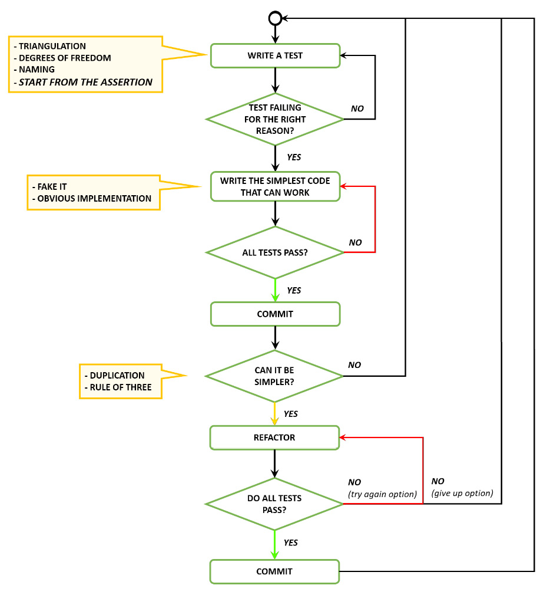
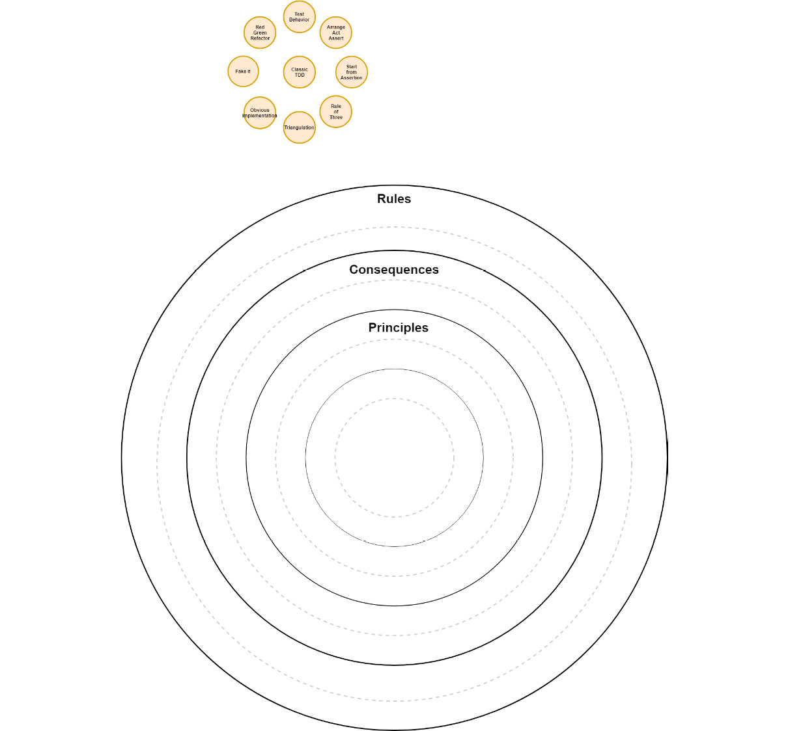

# 经典 TDD II
> 我不是一个伟大的程序员；我只是一个有很好习惯的好程序员。
>
> – 肯特贝克

像大多数开始 TDD 的开发人员一样，我遇到了一个常见的障碍：想出好的测试名称。凭借经验和其他程序员的一点帮助，我学会了不要太早到达测试名称。我给测试取了一个临时名称； foo 是个好名字。然后我专注于我正在测试的行为的断言应该是什么样子。一旦我得到了正确的断言，我就需要思考我是如何到达那里的。一旦我有了这一切，命名测试就变得容易多了。

## 先写断言，再往后写

在本课中，我们将以稍微不同的方式编写测试。在创建新测试时，我们将直接进入我们试图证明的断言。这将确保测试代码的存在仅用于支持断言，从而最大限度地减少为测试编写的任何代码。

一旦我们有了断言，我们将向后编码，编写我们需要执行断言的代码。只有这样我们才能定义测试名称。

例如，让我们看看 fizzbuzz：

按写作顺序：

```
assert fizzBuzzed == "1"
var fizzBuzzed = fizzBuzzer.FizzBuzz(1)
var fizzBuzzer = new FizzBuzzer()
```

最终代码：

```
var fizzBuzzer = new FizzBuzzer() +
var fizzBuzzed = fizzBuzzer.FizzBuzz(1) +
assert fizzBuzzed == "1"
```

## 在安排、行动和断言块中组织你的测试

测试是关于断言 (ASSERT)。为了使断言成为可能，我们需要对我们正在断言的代码 (ACT) 采取行动。有时，要采取行动，我们需要创建上下文以启用该行动 (ARRANGE)。在排列、操作和断言块中组织测试有助于保持测试干净且易于阅读。

例如，让我们看看 fizzbuzz：

```
//Arrange block (aka Given) – create all necessary preconditions
var fizzBuzzer = new FizzBuzzer()
//Act block (aka When) – execute the subject under test
var fizzBuzzed = fizzBuzzer.FizzBuzz(1)
//Assert block (aka Then) – assert the expected results have occurred
assert fizzBuzzed == "1"
```

但是，当我们试图理解某些代码的含义时，我们认为少即是多。我们不喜欢代码中的内联注释，特别是如果它们很快就会重复。你不需要将它们添加到你的块中。一旦开始对所有测试使用此约定，使用空行进行简单分隔就足够了。如果你有纪律，它会很快陷入困境。

理想的单元测试应该只有三个语句：

1. 创建一个对象。
2. 调用一个方法。
3. 断言。

尽管并不总是可以保持如此最少，但你可以使用私有方法和测试设置片段来最小化每个部分中的行数。

将测试中的代码保持在最低限度可以优化清晰度和可读性。当测试失败时，你不想花太多时间来理解它。

```
var fizzBuzzer = new FizzBuzzer()
var fizzBuzzed = fizzBuzzer.FizzBuzz(1)
assert fizzBuzzed == "1"
```

### 在Arrange、Act 和Assert 块中组织测试的好处

- 将正在测试的内容与设置和验证步骤清楚地分开
- 明确并关注具体的测试职责
- 使一些测试气味更明显，例如与 Act 代码混合的断言或一次测试太多东西的测试

## 单元测试原则
- 快速：单元测试必须快速才能经常执行。快速意味着测试应该在几毫秒内执行。
- 隔离：测试之间不应该有依赖关系。理想情况下，我们应该能够以随机顺序执行它们。
- 可重复：不应该假设初始状态，不应该留下任何东西，也不应该依赖可能不可用的外部服务，例如数据库或文件系统。
- 自我验证：不应有手动测试解释或干预。红色或绿色！
- 及时：测试是在正确的时间编写的。

## Katas

解决套路时使用你的新习惯。从断言开始，向后工作。将你的测试组织成安排、行动和断言块。遵循我们刚刚看到的单元测试原则。

### Cyber-dojo 的统计计算器

你的任务是处理一系列整数以确定以下统计信息：

- 最小值
- 最大值
- 序列中的元素数
- 平均值

Cyber-dojo 基金会（见许可）：http://www.cyber-dojo.org/。

例如：[6, 9, 15, -2, 92, 11]

- 最小值 = -2
- 最大值 = 92
- 序列中的元素数 = 6
- 平均值 = 21.833333

### 网络道场的字谜

编写一个程序来生成输入字符串的所有潜在字谜。

Cyber-dojo 基金会（见许可）：http://www.cyber-dojo.org/。

例如，biro 的潜在字谜是：

- biro bior brio broi boir bori
- ibro ibor irbo irob iobr iorb
- rbio rboi ribo riob roib robi
- obir obri oibr oirb orbi orib

奖金！在极端情况下实践 TDD——婴儿步骤

分配最多两分钟的时间来完成以下每项任务。如果卡住并超过两分钟，请重新设置工作并从头开始。

编写失败测试（这是唯一允许失败测试的任务）：

- 使失败的测试通过。
- 重构。
- 思考（你不能重复这个任务）。

> 重要的

如果你在两分钟内无法取得进展，通常是由于：

- 试图达到太多。将你的工作分解为更小的步骤。
- 代码库状态不佳。你可能需要重构。

## 好习惯

在本课中，我们介绍了一些新的 TDD 习惯。在以下列表中查看它们。

### 编写新测试时的注意事项

- 测试应该只测试一件事。
- 创建更具体的测试以推动更通用的解决方案（三角测量）。
- 为你的测试提供反映你的业务领域的有意义的名称（行为/面向目标的名称）。
- 查看测试是否因正确的原因而失败。
- 确保你从失败的测试中获得有意义的反馈。
- 将你的测试和生产代码分开。
- 组织你的单元测试以反映你的生产代码（类似的项目结构）。
- 在安排、行动和断言块（新习惯）中组织你的测试。
    - 安排（也称为给定）所有必要的先决条件。
    - 针对测试对象采取行动（也称为何时）。
    -  断言（也称为 Then）预期结果已经发生。
- 先写断言然后逆向工作（新习惯）。
    - 首先编写断言来编写测试；不要担心正确命名测试。
    - 编写测试的行为部分。
    - 如果需要，编写排列块。
    - 最后，命名测试。
- 编写快速、隔离、可重复和自我验证的测试（新习惯）。

### 使失败的测试通过时的注意事项

- 编写最简单的代码来通过测试。
- 编写任何可以让你更快地进入重构阶段的代码。

### 测试通过后的注意事项

使用三法则来解决重复问题。

## 经典 TDD 流程



### 我们在面向对象 (OO) 软件设计的大局中处于什么位置？



### 我应该什么时候进入下一课？

- 什么时候可以应用新的好习惯
- 当你可以先编写断言并在测试中向后工作时
- 当你能够为测试提供反映你的业务领域的有意义的名称（行为/面向目标的名称）时
- 当你能够编写任何使你更快地进入重构阶段的代码时
- 当你有效地使用三原则来解决重复问题时，包括测试代码

有很多关于好习惯的信息，但如果你只确定了这里提到的那些，你就准备好继续前进了。

## 资源

### 网络

- 命名测试类和方法，Sandro Mancuso：http://codurance.com/2014/12/13/naming-test-classes-and-methods/。

### 图书

- 测试驱动开发：以 Kent Beck 为例：https://www.goodreads.com/book/show/387190.Test_Driven_Developmen