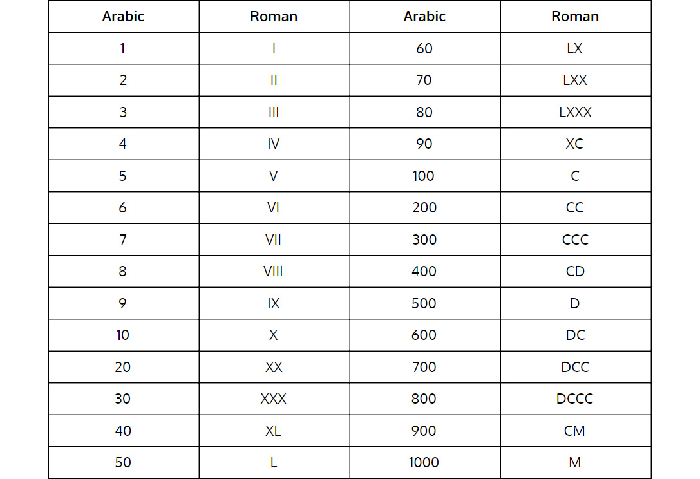
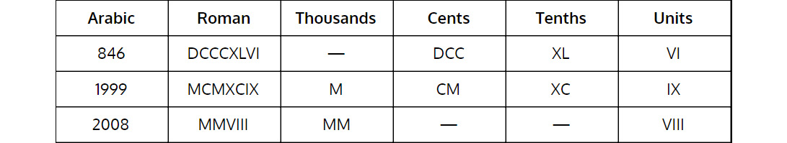
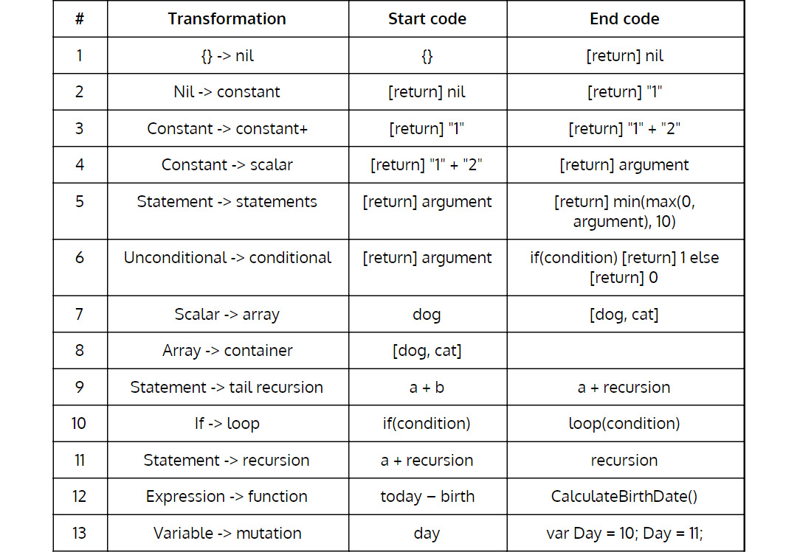
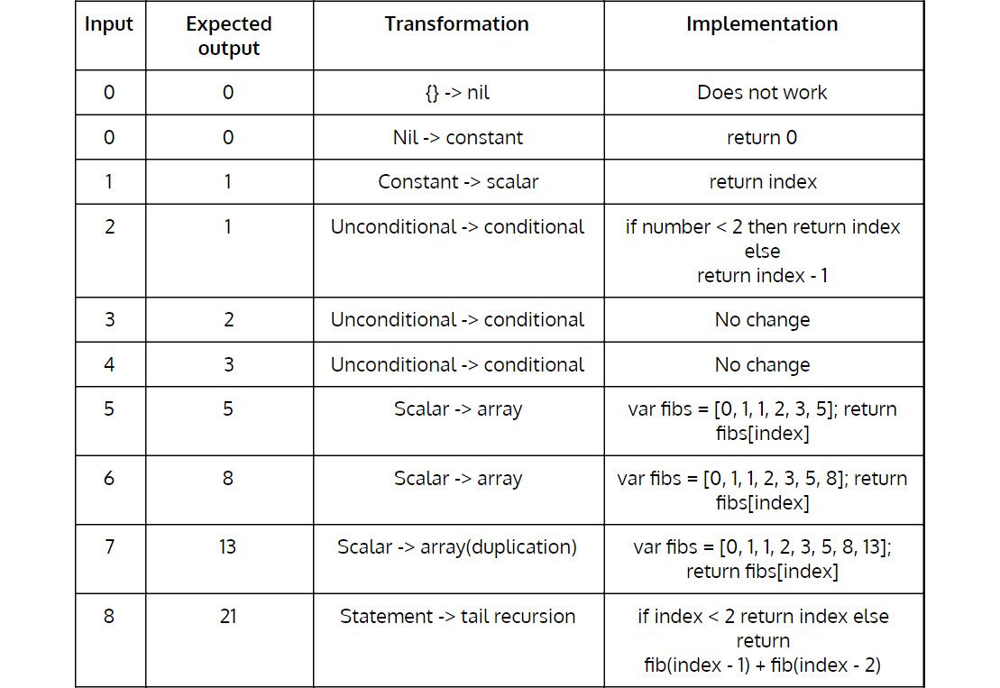
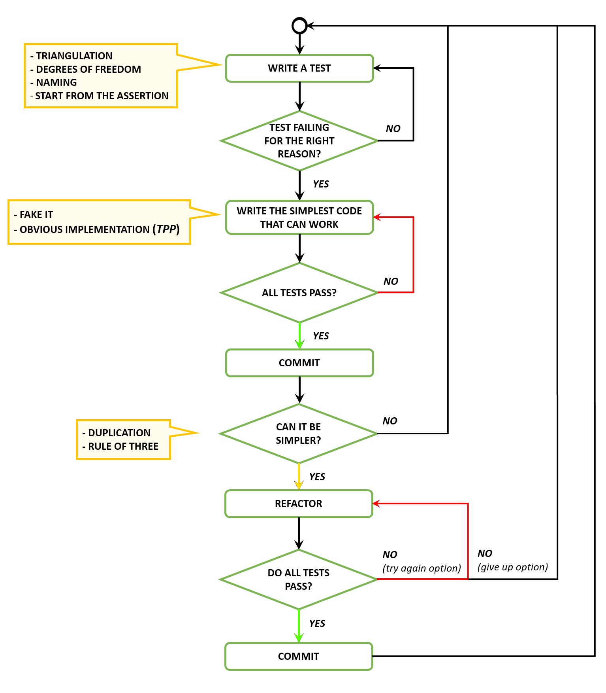
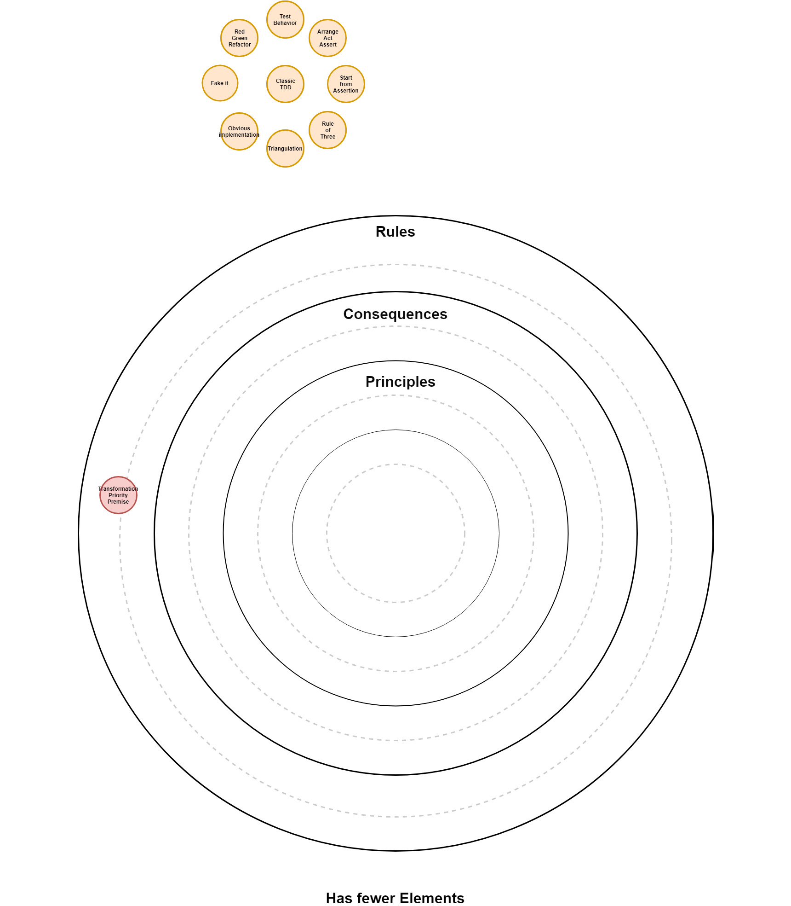

# 经典 TDD III – 转型优先前提
> 随着测试变得更加具体，代码变得更加通用。
>
> – 罗伯特·C·马丁

当一位朋友在我们在芬兰北极地区进行的一次暴民会议上提到转型优先前提 (TPP) 时，我感到很困惑。我已经实践测试驱动开发 (TDD) 多年，并认为自己是一个高于平均水平的实践者，但我从未听说过 TPP。我一和我的朋友有时间，我就向他提出问题，然后在我的小屋里过夜学习。

TPP 在 TDD 的上下文中非常重要，因为它定义了明显的实现。在了解 TPP 之前，我一直在使用本能/直觉、经验和反馈。 TPP 为不断发展的代码带来了一些过程和基本原理。

## Kata

在本课中，在介绍新材料之前，我们先从套路开始。通过TPP，我们发现最好做两次kata。

我们将首先仅使用我们迄今为止所涵盖的材料。然后，我们将使用本课中介绍的新概念。这样，你就有机会比较这两种实现并见证在你的代码上使用 TPP 的效果。

### Cyber-dojo 的罗马数字

按照我们一直在使用的 TDD 实践，编写一个函数来尽可能地将阿拉伯数字转换为罗马数字。

Cyber-dojo 基金会（见许可）：http://www.cyber-dojo.org/。

给定一个正整数（例如，42），确定其罗马数字表示为字符串（例如，XLII）。你不能像 999 一样写 IM 之类的数字。

Cyber-dojo 的罗马数字示例如下：





> 重要的
>
> 在你完成罗马数字 kata 的实现之前，抵制提前阅读的诱惑。

## TPP——定义明显的实施

如果我们回到我们如何在 TDD 中演化代码，我们遵循以下三种方法：

- 假装
- 明显的实现
- 三角测量

伪造它是一种定义明确的方法；我们只是返回一个有效的值，这通过了测试。

三角剖分也是明确定义的；我们只是编写了一个新的失败测试来强制更改代码。

然而，明显的实施是模棱两可的。这可能对一个开发人员意味着一件事，而对另一位开发人员意味着另一件事。下表中的转换是澄清这种歧义的一种方式。

据我们所知，Robert C. Martin 是第一个提出在一系列转换中演化代码的想法的人：转换优先前提，https://8thlight.com/blog/uncle-bob/2013/05/27 /TheTransformationPriorityPremise.html。

### TPP表



列表顶部的转换优先于底部的转换。将常量更改为变量比添加 if 语句更好（或更简单）。因此，在使测试通过时，更喜欢更简单（列表顶部）的转换到更复杂（列表底部）的转换。

使用 TPP 的另一种方法是使用明显的实现继续编写新代码。每当检测到重复时，重构为更简单或更复杂的转换以将其删除。重构时，首先尝试进行更简单的转换。这并不总是有效；通常，你需要进行更复杂的转换以避免重复。

### 转型

如果测试失败，请按照之前说明的 TPP 表改进生产代码，从转换 1，{} -> nil 开始。当你的测试通过时停止。

编写另一个失败的测试并（理想情况下）保持相同的转换，或者，如果需要，移动到桌子上的下一个。大多数时候，我们不需要到达 TPP 表的末尾来解决问题。这是一个好兆头。这意味着我们只使用简单的转换就解决了一个问题。

### 转换 1 – {} -> 无

这是最简单的转换。如果我们没有实现，最简单的转换是返回 nil、null 或什么都不返回。例如，返回零。

### 转换 2 – 无 -> 常数

下一个转换是进化 return nil 以返回一个常数。例如，返回 0。

### 转换 3 – 常数 -> 常数+

此转换使用更复杂的常量或常量的组合。

### 转换 4 – 常量 -> 标量

在这个转换中，我们可以在我们的方法中使用任何输入参数，我们也可以将一个常量转换为一个变量。

### 转换 5 – 语句 -> 语句

到目前为止，我们使用的唯一语句是 return。现在我们可以自由使用任何无条件语句。

### 转换 6 – 无条件 -> 有条件

到目前为止，我们一直避免拆分执行路径，因为它增加了相当多的复杂性。这是第一个允许使用 if 语句或其他条件语句或运算符的转换。通常，我们很快就会进行这种转变。一旦我们到达它，我们往往会停留在它上面，直到我们发现重复，或者代码变得太复杂。这是一个换档的转变，因为我们引入了选择的概念。

排序、选择和迭代：http://www.101computing.net/sequencing-selection-iteration/。

### 转换 7 – 标量 -> 数组

如果我们最终得到太多 if 语句，一种选择是将它们重构为一个查找表。

### 转换 8 – 阵列 -> 容器

有时数组不是最好的数据结构或不是最具描述性的。在这种转换中，如果需要，我们可以将数据结构从数组重构为更复杂的结构。

### 变换9——语句->尾递归

与无条件 -> 条件转换一样，这是另一种换档转换。我们通过使用递归来引入迭代的概念。即使我们的语言编译器没有针对尾递归进行优化，我们也想使用尾递归。过于简单化了，递归函数调用应该是我们在表达式中执行的最后一件事。

排序、选择和迭代：http://www.101computing.net/sequencing-selection-iteration/。

什么是尾递归的解释：https://stackoverflow.com/questions/33923/what-is-tail-recursion。

### 转换 10 – 如果 -> 循环

在这个转换中，我们现在可以使用我们的语言提供的任何迭代。我们可以重构代码以使用循环。

### 转换 11 - 语句 -> 递归

我们可以使用全递归而不必担心它是否是尾递归。

### 转换 12 - 表达式 -> 函数

我们可以将复杂的逻辑提取为更简单的函数。

### 转换 13 – 变量 -> 变异

最后一个转换引入了突变的概念。在达到这种转换之前，我们不应改变任何变量。这就是为什么以前的转换更喜欢递归而不是循环的原因。命令式语言中的传统循环往往依赖于变量变异。不变性是代码的一个非常重要的概念和属性，即使不使用函数式语言，我们也应该努力使一切尽可能保持不变。

> 重要的
>
> 请不要从字面上理解 TPP 表。这是一个起点。根据你的风格、编程语言和环境调整此表。目前，我们要求你按原样接受它，但是一旦你对它感到满意，我们鼓励你根据你的情况对其进行塑造。

### 在斐波那契数列上使用 TPP 的示例



TPP 的想法是在控制复杂性的同时进化代码。

## Katas

### Cyber-dojo 的罗马数字


重新启动罗马数字 kata，但这一次应用我们迄今为止看到的所有好习惯，加上 TPP。尝试仅使用 TPP 表来改进你的代码。不要考虑如何实施测试。继续沿着 TPP 表向下移动。如果你这样做，问题应该会自行解决。如果你发现自己在跳跃，请停下来考虑是否有更简单的方法来推进更简单的转换。

> 笔记
>
> 本节的解决方案可在第 369 页上找到。

### 网络道场的主要因素

使用 TDD 和 TPP 表将一个正整数分解为其质因数。

Cyber-dojo 基金会（见许可）：http://www.cyber-dojo.org/。

网络道场的主要因素的例子如下：


### Alessandro Di Gioia 的布尔计算器

实现一个布尔计算器，它获取一个字符串作为输入并将其计算为布尔结果。

这些是规格：

支持单值：

```
"TRUE" -> true
"FALSE" -> false
```

支持 NOT 运算符：

```
"NOT TRUE" -> false
```

支持 AND 运算符：

```
"TRUE AND FALSE" -> false
"TRUE AND TRUE" -> true
```

支持 OR 运算符：

```
"TRUE OR FALSE" -> true
"FALSE OR FALSE" -> false
```

支持任意数量的 AND 和 OR，优先于 NOT 然后 AND 以及最终的 OR 操作：

```
"TRUE OR TRUE OR TRUE AND FALSE" -> true
"TRUE OR FALSE AND NOT FALSE" -> true
```

支持括号：

```
"(TRUE OR TRUE OR TRUE) AND FALSE" -> false
"NOT (TRUE AND TRUE)" -> false
```

奖金：

打印代表计算的抽象语法树：

```
"(TRUE OR TRUE OR TRUE) AND FALSE"
AND
|_ OR
| |_ TRUE
| |_ OR
| |_ TRUE
| |_ TRUE
|_ FALSE
"TRUE OR TRUE OR TRUE AND FALSE"
OR
|_ TRUE
|_ OR
|_ TRUE
|_ AND
|_ TRUE
|_ FALSE
"NOT ((TRUE OR TRUE) OR (TRUE AND FALSE))"
NOT
|_ OR
|_ OR
| |_ TRUE
| |_ TRUE
|_ AND
|_ TRUE
|_ FALSE
"TRUE OR TRUE OR NOT TRUE AND FALSE"
This, because of precedence, is equivalent to:

"(TRUE OR (TRUE OR ((NOT TRUE) AND FALSE)))"
OR
|_ TRUE
|_ OR
|_ TRUE
|_ AND
|_ NOT
| |_ TRUE
|_ FALSE
```

## 好习惯
在本课中，我们介绍了一个新的好习惯。在以下列表中查看。

### 编写新测试时的注意事项

- 测试应该只测试一件事。
- 创建更具体的测试以推动更通用的解决方案（三角测量）。
- 为你的测试提供反映你的业务领域的有意义的名称（行为/面向目标的名称）。
- 查看测试是否因正确的原因而失败。
- 确保你从失败的测试中获得有意义的反馈。
- 将你的测试和生产代码分开。
- 组织你的单元测试以反映你的生产代码（类似的项目结构）。
- 在安排、行动和断言块中组织你的测试。
- 先写断言，然后逆向工作。
- 编写快速、隔离、可重复和自我验证的测试。

### 使失败的测试通过时的注意事项

- 编写最简单的代码来通过测试。
- 编写任何可以让你更快地进入重构阶段的代码。
- 使用转化优先的前提（新习惯）。

### 测试通过后的注意事项

- 使用三法则来解决重复问题。

## 经典的 TDD 流程



我们在面向对象 (OO) 软件设计的大局中处于什么位置？



我应该什么时候进入下一课？

- 何时可以应用 TPP 表来改进代码。
- 当你精通 TDD 实践时。在下一课中，我们将转向设计，因此请确保你掌握了 TDD 实践。

## 资源

### 网络

- 功能性健美操，Jorge Gueorguiev Garcia：https://codurance.com/2017/10/12/functional-calisthenics/。
- 转型优先前提，Robert C. Martin：https://8thlight.com/blog/uncle-bob/2013/05/27/TheTransformationPriorityPremise.html。
- 应用转型优先前提，Micah Martin：https://8thlight.com/blog/micah-martin/2012/11/17/transformation-priority-premise-applied.html。
- JavaScript 的转换优先前提，Carlos Blé：https://youtu.be/D2gFmSUeA3w。