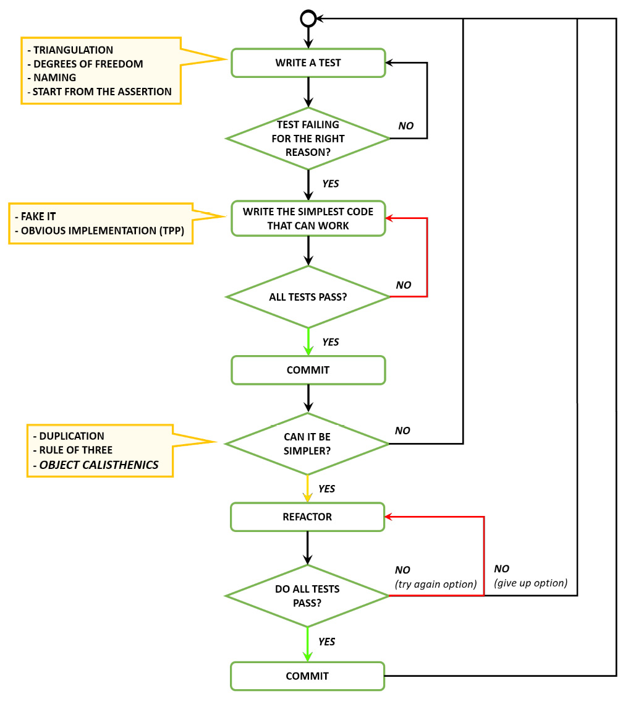
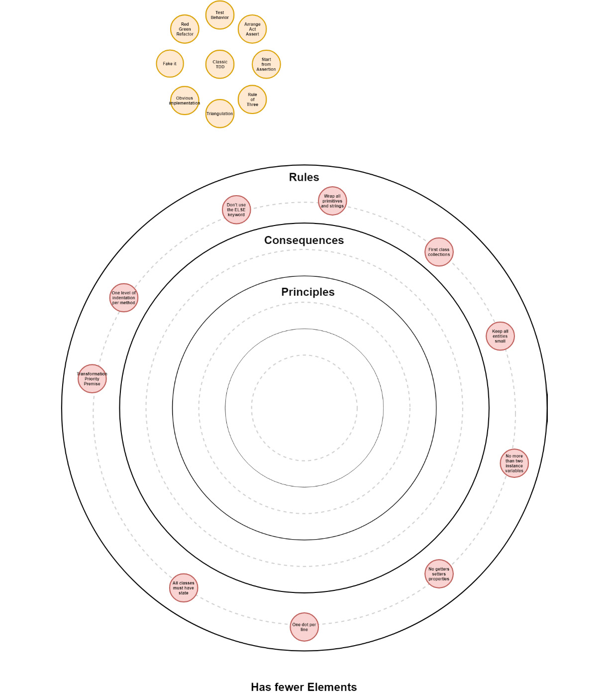

# 设计 1 – 对象健美操
> 完美（在设计中）不是在没有更多可添加的情况下实现的，而是在没有更多可删除的情况下实现的。
>
> ——安东尼·德·圣-埃克苏佩里

我第一次接触体操是在伦敦与我的朋友 Ger Mán 的一次聚会上。我们不知所措，以至于我们决定不编写任何测试以专注于理解这个概念。

大错！

在没有反馈测试的情况下，我们开始犯一些小错误，这些错误累积到一个凌乱的代码库中。第二天，没有了meetup的压力，我们再次结对，尽可能地用对象体操从容地进行练习。终于，它开始变得有意义了。

当我指导软件开发人员时，对象健美操课程通常是第一个大挑战。对象健美操迫使人们以不同的方式思考软件设计，不是通过添加任何东西，而是通过删除。对象健美操是关于约束软件设计决策；这是关于你不能做什么。

一开始，这可能会引起一些挫败感，就像我第一次接触对象健美操时感到的挫败感。然而，这是一个非常强大的设计工具。在我看来，好处远远大于痛苦。

## 是设计...

在学习了测试驱动开发的一些课程之后，我们现在将注意力转向简单的设计。为什么我们需要考虑设计？

- TDD 是不够的：TDD 会对设计产生积极的副作用，但仅仅做 TDD 本身并不能照顾设计。
- DRY（不要重复自己）是不够的：到目前为止，我们的重构工作主要集中在消除重复。这对于编写可维护的代码至关重要，但这还不够。
- 如果你不理解设计，TDD 会惩罚你：当我们发现自己编写了非常复杂的测试代码时，我们应该考虑改变实现的设计。

我们还将从使用 TDD 解决简单的算法问题转向需要更多设计决策的问题。

## Kata

在本课中，和上一课一样，我们将在介绍新材料之前开始一个套路。

### 井字游戏

遵循我们迄今为止一直在使用的 TDD 实践，尽可能地实现 Tic-Tac-Toe 游戏。

#### 井字游戏规则：

- X 总是先行
- 玩家交替在棋盘上放置 X 和 O
- 球员不能在已比赛的位置上比赛
- 连续（水平、垂直或对角线）三个 X 或 O 的玩家获胜
- 如果所有九个方格都填满并且没有玩家连续获得三个方格，则游戏为平局
    > 重要的
    在你完成井字棋套路之前，请抵制提前阅读的诱惑。

## 对象健美操——改善软件设计的 10 个步骤
对象健美操是一个简单的规则集，如果应用得当，应该会对你的设计产生重大影响。暂时遵守这些规则；我们稍后将讨论它们背后的原则：

- 每个方法只有一级缩进
- 不要使用 ELSE 关键字
- 包装所有原始类型和字符串（将原始类型包装在类中）
- 一流的集合（将集合包装在类中）
- 每行一个点
- 不要缩写
- 保持所有实体小
- 没有具有两个以上实例变量的类
- 没有 getter/setter/properties
- 所有类都必须有状态

对象健美操不会给你任何新东西；相反，它会带走东西。如果你以前从未使用过这些规则/约束，预计这些规则/约束会具有挑战性/令人沮丧。现在要严格——没有例外！改变规则的时候还没有到来。

> 重要的
>
> 特别注意不要违反以下规则。

### 每个方法只有一级缩进

#### 为什么？

- 它有助于确保一种方法只专注于做一件事
- 它减小了单元的尺寸，从而更容易重复使用

### 不要使用 ELSE 关键字

#### 为什么？

- 它促进了一个主要的执行通道，有一些特殊情况
- 它建议使用多态来处理复杂的条件情况，使代码更加明确（例如，使用状态模式）
- 我们尝试使用空对象模式来表示结果没有价值

### 包装所有原语和字符串

- 方法参数（构造函数除外）不能是原始类型（int、float、double、bool、string 和 char）。
- 方法返回值不能是原始类型（int、float、double、bool、string 和 char）。
- 对于需要传递的每个原始类型，创建一个类作为相关行为的家。
- 在类的私有成员变量中有原始类型是可以的。

#### 为什么？

- 原语是仅具有上下文含义的超类型。它们可以表达任何东西，因此我们倾向于将它们用于所有事物。
- 通过成为行为吸引器的类型表达意图，使代码更加明确。
- 对象将具有内在的意义。
- 这是原始痴迷代码气味的治愈方法。

### 一流的聚合

- 方法参数（构造函数除外）不能是集合（数组、哈希表、集合和列表...）。
- 为所有集合创建一个类，即使集合只是类中的私有成员变量。这为收集行为提供了一个家。
- 任何包含集合的类都不应包含其他成员变量。

#### 为什么？

- 将集合视为原语；这样，任何特定于你的收藏的行为都会被吸引到一个地方。
- 过滤器将成为类的一部分。
- 应用于集合元素的连接或特殊规则将包含在类中。
- 更改内部表示不会影响改善解耦的客户端。

#### 例子

如果我们想对经典的发票域建模，我们可以按照以下示例进行处理：

```c#
public class InvoiceLine
{
}
public class Invoice
{
    private List<InvoiceLine> lines;
}
// Using first-class collections, we could design the model as follows:

class InvoiceLine
{
}
// First-class collection
class InvoiceDetails
{
    private List<InvoiceLine> lines;
}
class Invoice
{
    InvoiceDetails details;
}
```

使用后一种方法，我们拥有属于集合中的所有行为的家，而不是将这些行为添加到 Invoice 类。这样，我们就可以更好地分离关注点。

### 不使用 Getters/Setters/Properties

- 特别是如果仅用于单元测试断言，不要仅仅为了使测试更容易编写而添加公共 getter/setter/properties。
- 考虑覆盖相等以克服此约束。

#### 为什么？

- 符合面向对象编程 (OOP) 的思想，即作为实体网络，通过相互传递消息（调用方法）进行协作。
- 与其向对象询问它的数据，然后再对其进行操作，不如告诉对象它应该为你做什么。
- 数据结构和对象在Java和C#中都是用class关键字表示的，但是它们的职责不同。

#### 例子

如果我们想测试一个 Person 实例，我们可以按照下面的示例来处理它：

```c++
public class Person
{
    string getFirstName()
    string getLastName()
}
public void A_Test_That_Verifies_We_Get_The_Expected_Person()
{
    // we get a person instance from somewhere
    assert.equal("Bart", person.getFirstName)
    assert.equal("Simpson", person.getLastName)
}
```

如果我们应用没有 getter/setter/properties 的约束，特别是如果仅用于测试，我们可以按照以下示例所示进行处理：

```c#
public class Person
{
    firstName
    lastName
    // Override equality
    boolean equals(Object o) {
    	// implement equality for person
	}
}
public void A_Test_That_Verifies_We_Get_The_Expected_Person()
{
    var bart = new Person("Bart", "Simpson")
    // we get a person instance from somewhere
    assert.equal(bart, person)
}
```


使用这种方法，我们不会将 getter/properties 添加到我们的类中，而是为了测试目的而扩展类接口。还有其他好处，但我们将在本书后面讨论。

### 包装所有原语和字符串

- 原语是仅具有上下文含义的超类型。它们可以表达任何东西，因此我们倾向于将它们用于所有事物。

#### 为什么？

- 它们使代码更加明确，通过成为行为吸引器的类型来表达意图，以便这些对象具有内在的意义。

####例子

与经典发票域保持一致，我们可以计算总金额并应用折扣，如以下示例代码所示：

```c#
class Invoice
{
void ApplyDiscount(decimal discount)
decimal CalculateTotal()
}
```

如果我们包装所有原语和字符串，我们可以设计总和应用折扣方法如下：

```c#
class Discount
{
}
class Money
{
}
class Invoice
{
void ApplyDiscount(Discount discount)
Money CalculateTotal()
}
```

通过这种方法，我们为所有属于货币（例如货币兑换）和折扣（例如折扣类型）的行为提供了一个家，而不是将这些行为添加到 Invoice 类。这样，我们就可以更好地分离关注点。

### 每行一个点

这段代码 dog.Body.Tail.Wag() 乍一看似乎无害，但实际上我们将代码与远离我们的类耦合在一起。我们只知道狗和它的公共接口。狗身体的界面是一个陌生的概念，我们正在与它产生耦合问题。为了解决这个耦合问题，我们可以在 dog 中创建一个对我们隐藏其依赖项的方法；例如，dog.ExpressHappiness()。

#### 为什么？

- 它公开了意图隐藏的实现，告诉一个对象为你做一些事情而不是要求它的内部表示。
- 它减少了启用行为所需的知识量。
- 这不适用于 LINQ（语言集成查询）和流畅的界面。

### 不要缩写

如果我们需要一个长名称，很可能我们缺少一个概念。让它明确。

#### 为什么？

- 缩写可能会令人困惑，所以最好是清楚的。
- 如果我们一遍又一遍地重复这个名字，也许我们就错过了删除重复的机会。

### 保持所有实体小

- 每个包 10 个文件
- 每个class50行
- 每个方法 5 行
- 每个方法 2 个参数

#### 为什么？

- 小班级往往专注于做一件事，使它们更容易重用。
- 它使类更容易理解。
- 使用包（命名空间）来聚类相关的类。
- 小包装迫使他们有明确的目的和身份。

### 没有具有两个以上实例变量的类

#### 为什么？

- 实例变量越多，类内的内聚力越低。
- 通常，具有多个实例变量的类是编排器，具有一个实例变量的类是执行器。分离职责。

### 所有类都必须有状态

- 没有静态方法和实用程序类。

#### 为什么？

- 有时，我们真的没有状态，但通常，如果我们有一个静态方法，这意味着它可以在任何地方。
- 尝试创建职责明确且需要状态维护的类。这迫使我们创建一个暴露行为和隐藏状态的合作者网络。

## 启发

告诉不要问：告诉对象执行操作，而不是要求它们提供数据并在其他地方处理它——类似于没有 getter/setter。
迪米特法则：每个组件只应该和它的朋友交谈；不要和陌生人说话——类似于每行一个点。

## Katas

### 井字游戏

再次实施井字游戏，遵循所有 TDD 实践和对象健美操规则。完成后，比较你首先提出的解决方案和使用对象健美操的解决方案。

> 提示
>
> 尝试使无效状态无法表示。让编译器为你工作。如果客户端代码试图将无效状态传递给你的代码，编译器应该发出错误信号。

### 生命游戏

使用对象健美操加上我们之前介绍的所有内容来实现生命游戏。

对于那些不熟悉这个游戏的人，这里有一段改编自维基百科的描述：康威的生命游戏，https://en.wikipedia.org/wiki/Conway%27s_Game_of_Life。

生命游戏的宇宙是一个无限的二维正交方格网格，每个方格都处于两种可能的状态之一：活着或死亡（或分别是有人居住和无人居住）。每个单元格与其八个相邻单元格相互作用，这些单元格是水平、垂直或对角相邻的单元格。在时间的每一步，都会发生以下转换：

- 任何少于两个活邻居的活细胞都会死亡，就像人口不足一样
- 任何有两个或三个活邻居的活细胞都会传给下一代
- 任何有超过三个活邻居的活细胞都会死亡，就像人口过剩一样
- 任何只有三个活邻居的死细胞都会变成活细胞，就像通过繁殖一样

初始模式构成了系统的种子。第一代是通过将前面提到的规则同时应用于种子中的每个细胞来创建的；出生和死亡同时发生，发生这种情况的离散时刻有时称为滴答声。每一代都是前一代的纯函数。这些规则不断被反复应用以创造更多的世代。

## 好习惯

在本课中，我们介绍了对象健美操。在以下列表中查看它们。

### 编写新测试时的注意事项

- 测试应该只测试一件事
- 创建更具体的测试以推动更通用的解决方案（三角测量）
- 为你的测试提供反映你的业务领域的有意义的名称（行为/面向目标）
- 查看测试失败的正确原因
- 确保你从失败的测试中获得有意义的反馈
- 将你的测试和生产代码分开
- 组织你的单元测试以反映你的生产代码（类似的项目结构）
- 在安排、行动和断言块中组织你的测试
- 先写断言然后逆向工作
- 编写快速、隔离、可重复和自我验证的测试

### 使失败的测试通过时的注意事项

- 写最简单的代码通过测试
- 编写任何可以让你更快地进入重构阶段的代码
- 使用改造优先前提
- 考虑使用对象健美操来推动设计决策（新习惯）

### 测试通过后的注意事项

- 使用三原则解决重复问题
- 不断重构设计（新习惯）
- 应用对象健美操来改善你的设计（新习惯）

## 经典的 TDD 流程



### 我们在面向对象软件设计的大局中处于什么位置？



我应该什么时候继续下一课？
我们现在已经涵盖了大部分规则。在接下来的课程中，我们将介绍更高级别的概念。确保你可以有效地应用 TDD，包括：

- 红色，绿色，重构
- 从断言开始编写测试
- 使用转换优先级的前提来保持你的代码简单
- 使用对象健美操来帮助你进行设计

你现在应该准备好走路了。 :)

## 资源

### 网络

- TDD 真的能带来好的设计吗？桑德罗·曼库索：http://codurance.com/2015/05/12/does-tdd-lead-to-good-design/。
- 使用 Object Calisthenics 提高代码质量，Diego Mariani：https://medium.com/web-engineering-vox/improving-code-quality-with-object-calisthenics-aa4ad67a61f1。
- 对象健美操，威廉杜兰德：https://williamdurand.fr/2013/06/03/object-calisthenics/。
- 对象体操论文：http://www.xpteam.com/jeff/writings/objectcalisthenics.rtf。
- 对象健美操：编写更好的面向对象代码，Fran Dieguez：http://www.frandieguez.com/blog/2012/12/object-calisthenics-write-better-object-oriented-code/。
- 维基百科，康威的生命游戏：https://en.wikipedia.org/wiki/Conway%27s_Game_of_Life。