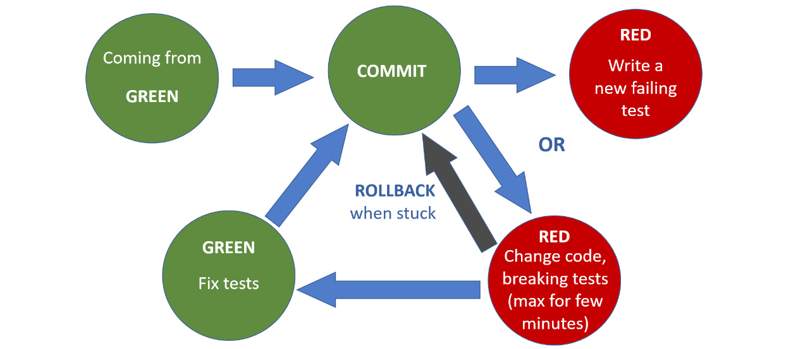

# 第六章
设计 2 – 重构

> 重构：不是因为你知道抽象，而是因为你想找到它。
>
> – 马丁福勒

对我来说，重构曾经意味着“让我带上推土机来修复所有这些代码”。我记得花了几个晚上把所有东西拆开，改变设计，然后把它们重新组合在一起。在这个过程中，当我更改设计时，很容易有数百个测试失败。这就是我所说的重构。然后，有一天，我读到一条推文，上面写着“重构是在不改变行为的情况下改变设计，只有在测试一直通过的情况下才会发生。”

在消化了那条推文的信息后，我开始练习以这种方式重构。我试图在项目中使用它，但由于我太缺乏经验而无法在实际代码中使用它，这导致了挫折。随着时间的推移和更多的练习，我终于达到了可以做到的地步。我可以在我的测试全部通过时更改设计，从而确保我没有改变我正在重构的代码的行为。这需要耐心和毅力，但任何人都可以做到。

重构的思想是在不改变代码行为的情况下改变设计。我们应该重构生产代码和测试，因为拥有可靠且设计良好的测试与生产代码一样重要。我们不应该在我们的代码库中留下损坏的窗口，因为这会鼓励其他窗口被破坏。

> 笔记
>
> 破窗理论：https://en.wikipedia.org/wiki/Broken_windows_theory

到目前为止，我们在 TDD 周期的重构阶段一直关注消除重复。然而，重构远不止于此。去除重复只是重构的第一步。重构主要是寻找抽象并塑造它们；重复只是一种症状。

> 笔记
>
> 软件开发中有一句话：所有的问题都可以通过另一层抽象来解决。重构是我们用来以安全有效的方式将代码从设计 A 移动到设计 B 的编排。

## 何时重构（暂时）

在这些情况下重构：

- 当我们在代码中发现重复时。 （不要忘记三规则。）违反 DRY。
- 当我们打破任何物体的健美操规则时。

我们将在接下来的课程中扩展这些概念。

主要重构
有五种原子重构可以应用于方法、函数、类、变量等：

- 重命名：更改类、方法、变量的名称....
- 提取：提取一个类（或方法或变量...）以创建一个新的抽象
- 内联：提取的反面——内联一个方法（或变量），解构一个抽象
- 移动：将类（或方法或变量...）移动到代码库中的其他位置
- 安全删除：删除代码库中的代码及其用法

## IDE 敏捷性（了解你的快捷方式）

尽管你可以手动执行重构，但大多数开发环境已经自动化了其中的很多。这五个原子重构得到了广泛的支持，一些更高级别的重构也得到了广泛支持。使用 IDE，如果我们相信它，可以进行非常安全和高效的自动重构，从而避免手动错误。

我们应该花一些时间来熟练掌握我们的 IDE 重构和重构快捷方式。这使我们能够对重构进行更多实验，因为我们可以快速进行和撤消重构。它还允许我们链接多个重构，以安全有效的方式将代码从 A 移动到 Z。

## Kata

重构高尔夫练习背后的想法是练习从起点到所需终点的重构，同时最大限度地减少执行更改代码所需的移动次数。

在这些 katas 中，我们获得了初始代码库和所需的最终结果。目标是应用最少的重构动作，将我们从初始代码库带到最终代码库，使用尽可能少的动作。

### 重构高尔夫

很难找到重构高尔夫练习的最初想法；单独给予一个人功劳是不可能的。一些人创建了不同的版本，例如 Ivan Moore、Dave Cleal、Mike Hill、Jason Gorman、Robert Chatley 和 David Denton。

Refactoring Golf 是一款旨在拉伸重构肌肉并让你探索 IDE 以了解使用快捷方式和自动化真正有可能实现的游戏。

这些 repos 包含几个源树，或基于不同主题的几个不同练习的编号洞。然而，所有这些练习背后的想法都是一样的。

每个洞都从最后一个洞开始，就像打高尔夫球一样。你的目标是（尽可能安全有效地）重构 Hole-X 代码，使其看起来像 Hole X+1 代码。你必须以尽可能少的笔画为目标。一次笔划本质上是对代码所做的更改，每笔划一次都会消耗你的积分。

你的配对伙伴应仔细为你评分，如下所示：

- 使用快捷方式或自动化 IDE 功能对代码进行的每一次更改都得一分；例如，自动重构、使用代码模板或执行查找/替换操作。
- 每次手动编辑两分。请注意，一次编辑可能涵盖多行代码。
- 当代码在上一次更改后无法通过测试时，每次更改都会加倍。
- 代码格式化零点；例如，删除空格或优化导入。
- 每轮最多允许自己进行两次尝试，以确定你的最佳成绩。

> 提示
>
> 你可能会发现自定义 IDE 很有用；例如，自定义代码模板甚至自定义重构。
>
> 你可以找到几个不同主题的公共存储库来重构高尔夫：https://github.com/search?utf8=%E2%9C%93&q=refactoring+golf&type=。

## 重构 80-20 规则

根据我们的经验，我们了解到重构中 80% 的价值来自于提高代码的可读性和可理解性。剩下的 20% 来自设计更改。因此，我们将专注于前 80%。

一旦我们熟悉了基本的重构动作和编排，就可以将这种新实践应用到代码中。在重构高尔夫练习中，我们得到了一个起点和一个终点。在真正的重构会话中，端点是一个虚构的点。

我们创建了一个清单来帮助你重构代码。它包括规则、提示和我们可以遵循的顺序。与往常一样，一旦我们更加精通重构和设计技能，我们就可以把这个清单抛在脑后。

## 重构指南

### 重构时保持绿色

测试应该测试行为，所以我们没有理由在重构期间破坏任何测试。如果在重构时破坏了任何测试，请撤消，返回绿色，然后重新开始。

不要更改测试未涵盖的生产代码。如果我们需要重构一些没有测试的代码，那么从添加行为测试开始。我们将在处理遗留代码的下一课中更详细地介绍这一点。

可能我们有测试，但它们以某种方式与实现结合在一起，因此不可能在不破坏测试的情况下更改实现。在这种情况下，我们从测试开始重构，一旦我们有了与实现不耦合的测试，我们就可以开始重构实现。

使用 IDE 自动重构来最小化文本编辑和风险——前提是你信任你的 IDE 自动重构。大多数 IDE 会尝试保持你的代码编译，如果它们无法实现这一点，它们会在你进行重构之前警告你。此外，通常，IDE 为重构提供撤消功能，因此如果你破坏了某些内容，只需撤消即可。

严格保持绿色。我们了解到，在重构中，一旦测试失败就立即放弃一些东西，而不是顽固地试图修复一些东西以使测试通过更有效。

请记住在每次重构后执行测试以确保我们仍然处于绿色状态。

### 尽可能多地提交

源代码控制工具使我们能够安全快速地恢复到已知的好点，前提是我们采取小步骤并经常提交。如果万一我们发现自己处于不利的位置，我们可以回到安全点并重新开始。重构应该是一系列我们可以轻松回滚的小实验。



### 在设计之前重构可读性

如果我们不能完全理解我们正在重构的代码是做什么的，那么成功的机会有多大？代码可读性的小改进可以大大提高代码的可理解性。

为了提高可读性，你应该从更好的变量、方法和类名称开始。这个想法是表达意图而不是实现细节。我们推荐 Arlo Belshee 的命名方法。

Arlo Belshee，好的命名是一个过程，而不是一个步骤：http://arlobelshee.com/good-naming-is-a-process-not-a-single-step/。

#### 格式

格式化代码——一种简单但非常有效的技术。格式一致，不要因为格式不一致而强迫读者浪费时间。

#### 例子：

前

```
if (i == 1) tempScore = m_score1;
else { score += "-"; tempScore = m_score2; }
```

后

一个简单的更改可以使代码对读者更加明显：

```
if (i == 1)
{
tempScore = m_score1;
}
else
{
score += "-";
tempScore = m_score2;
}
```

#### 改名

- 重命名错误的名称、变量、参数、实例变量、方法和类
- 使缩写明确

例子：

前

```
class TennisGame1 : ITennisGame
{
private int m_score1 = 0;
private int m_score2 = 0;
}
```


后

在这个例子中，m_score1 的含义很混乱，所以我们将其重命名为更明显的 player1Score 名称：

```
{
private int player1Score = 0;
private int player2Score = 0;
}
```

#### 删除

- 删除不必要的评论。
- 删除死代码。不要让读者浪费时间试图找出不再使用的代码。

例子：

前

```
class TennisGame : ITennisGame
{
private int player1Score = 0;
private int player2Score = 0;
private string player1Name;
private string player2Name;
public TennisGame1(string player1Name, string player2Name)
{
this.player1Name = player1Name;
this.player2Name = player2Name;
}
}
```


后

Player name 字段在构造函数中分配，但不在任何地方使用，因此我们应该删除它们和构造函数。

```
class TennisGame : ITennisGame
{
private int player1Score = 0;
private int player2Score = 0;
}
```

#### 提炼

- 来自幻数和字符串的常量
- 条件句

例子：

前

```
if (number % 3 == 0 && number % 5 == 0)
{
...
}
```

后

```
if (isDivisibleByThreeAndFive(number))
{
...
}
```

#### 重新排序

细化不正确的变量范围的范围，并确保变量的声明靠近它们使用的位置。

#### 更改设计（简单更改）

- 从深层条件中提取私有方法
- 从长方法中提取较小的私有方法，将隐秘的代码封装在私有方法中
- 尽快从方法返回
- 封装我们发现缺少封装的地方
- 删除重复

例子

前

```
string score = "";
if (player1Score == player1Score)
{
switch (player1Score)
{
case 0:
score = "Love-All";
break;
case 1:
score = "Fifteen-All";
break;
case 2:
score = "Thirty-All";
break;
default:
score = "Deuce";
break;
}
...
}
```

后

```
string score = "";
if (player1Score == player2Score)
{
score = formatScoreWhenPlayersAreTied();
...
}
string formatScoreWhenPlayersAreTied()
{
switch (player1Score)
{
case 0:
return "Love-All";
case 1:
return "Fifteen-All";
case 2:
return "Thirty-All";
default:
return "Deuce";
}
}
```

## Kata

### Emily Bache 的网球重构

我们在教练课程中一遍又一遍地使用网球游戏卡塔。它的有效性来自这样一个事实，即它不需要进行重大的设计更改来极大地改进代码库。代码有测试，所以我们可以专注于重构实现，从 TennisGame1 开始。将代码清理到人们可以轻松阅读和理解的程度。你可以在此处找到 Emily Bache 的 Tennis refactoring kata 存储库：https://github.com/emilybache/Tennis-Refactoring-Kata）。

## 并行变更（或扩展、迁移和收缩）

Parallel Change 技术是 Joshua Kerievsky 的原创想法。它在 2010 年的一次名为 The Limited Red Society 的演讲中得到了解释。 InfoQ，Joshua Kerievsky，有限红会：https://www.infoq.com/presentations/The-Limited-Red-Society。

Parallel Change，也称为扩展、迁移和收缩，是一种重构模式，用于安全地实现破坏性变更（保持绿色）。它包括三个步骤：扩展、迁移和收缩。

### 扩张

通过添加新代码而不是更改现有代码来引入新功能。如果你要扩展类或接口，请引入新方法而不是更改现有方法。如果来自外部的行为相似并且只有实现发生了变化，则复制现有测试并将它们指向新代码，而保持现有测试不变。确保对现有代码的测试仍然有效。

通过编写新测试或改编重复的旧测试，从测试开始实现新功能。确保使用 TDD 实践编写新代码。实现所有新功能后，转到迁移步骤。

### 迁移

弃用旧代码并允许客户端迁移到新的扩展代码，或更改客户端代码以指向新代码。

### 合同

将所有客户端代码迁移到新代码后，通过删除不推荐使用的代码及其测试来删除旧功能。

## Kata

### Pawel Duda 和 Carlos Blé 的 Parallel Change Kata

更改 ShoppingCart 类。该类应该能够处理多个项目，而不是它当前支持的单个项目。每次进行更改时都要运行测试。任何时候测试都不能是红色的。没有编译错误，没有失败。犯罪。请参阅 Pawel Duda 和 Carlos Blé 的 Parallel Change 代码，网址为 https://github.com/unclejamal/parallel-change。

## 好习惯
在本课中，我们介绍了一些新习惯。在以下列表中查看它们。

### 编写新测试时的注意事项

- 测试应该只测试一件事
- 创建更具体的测试以推动更通用的解决方案（三角测量）
- 为你的测试提供反映你的业务领域的有意义的名称（行为/面向目标）
- 查看测试失败的正确原因
- 确保你从失败的测试中获得有意义的反馈
- 将你的测试和生产代码分开
- 组织你的单元测试以反映你的生产代码（类似的项目结构）
- 在安排、行动和断言块中组织你的测试
- 先写断言然后逆向工作
- 编写快速、隔离、可重复和自我验证的测试

### 使失败的测试通过时的注意事项

- 写最简单的代码通过测试
- 编写任何可以让你更快地进入重构阶段的代码
- 使用改造优先前提
- 考虑使用对象健美操来推动设计决策

### 测试通过后的注意事项

- 使用三原则解决重复问题
- 不断重构设计
- 应用对象健美操来改进你的设计
- 重构时保持绿色（新习惯）
- 使用IDE快速安全地重构（新习惯）
- 首先重构代码以提高可读性/可理解性（新习惯）

### 我应该什么时候继续下一课？

- 当你对使用 IDE 进行高效重构感到自在时
- 当你可以自信地执行原子重构同时保持绿色时

我们现在已经涵盖了大部分规则。在接下来的课程中，我们将介绍更高级别的概念。确保你可以有效地应用 TDD。

## 资源

### 网络

- 好的命名是一个过程，而不是一个步骤，Arlo Belshee：http://arlobelshee.com/good-naming-is-a-process-not-a-single-step/。
- 有限红会，Joshua Kerievsky：https://www.infoq.com/presentations/The-Limited-Red-Society。
- 并行变更代码，Pawel Duda 和 Carlos Blé：https://github.com/unclejamal/parallel-change。
- 重构序列：安全展开，Carlos Blé：https://youtu.be/DpGk34Lqo-A。
- 重构技术，SoureMaking.com：https://sourcemaking.com/refactoring/refactorings。
- 用类型替换字符串常量——变体 II，Carlos Blé：https://youtu.be/o8PVNrfl1p8。
- Smells to Refactorings Cheatsheet，工业逻辑：https://www.industriallogic.com/blog/smells-to-refactorings-cheatsheet/。
- 整理什么，肯特贝克：https://medium.com/@kentbeck_7670/what-to-tidy-28cb46e55009。
    图书
- 重构：改进现有代码的设计，Martin Fowler、Kent Beck、Don Roberts、Erich Gamma：https://www.goodreads.com/book/show/44936.Refactoring。
- 重构工作簿，William C. Wake：https://www.goodreads.com/book/show/337298.Refactoring_Workbook。