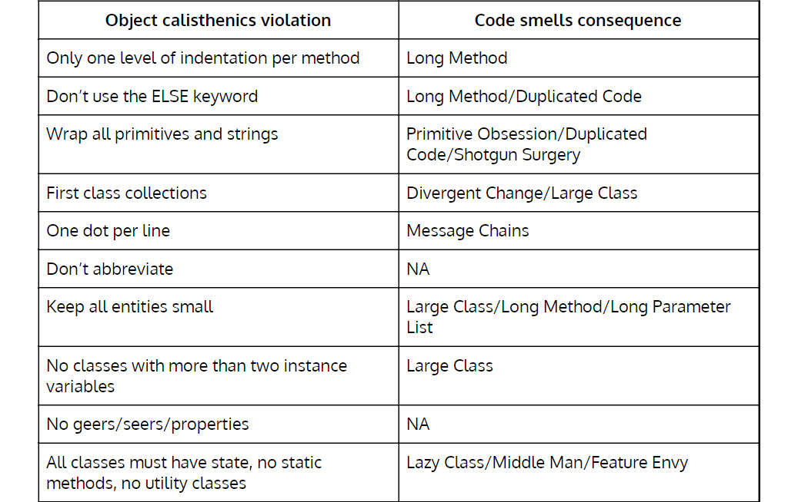
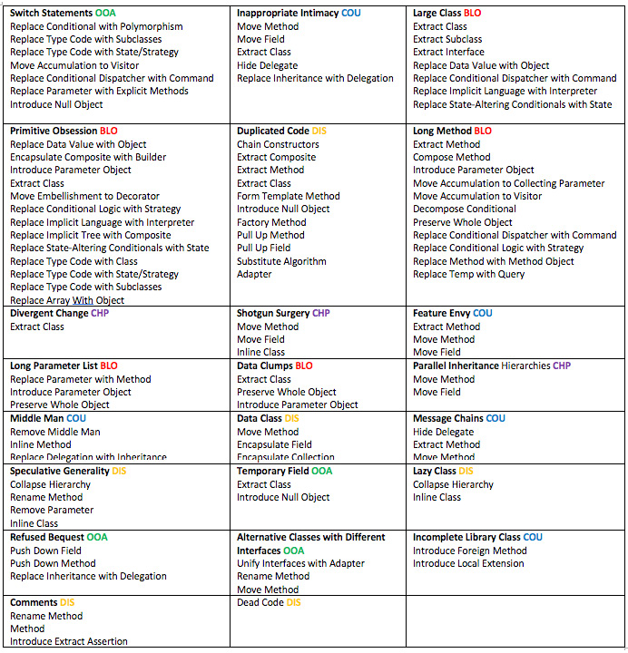
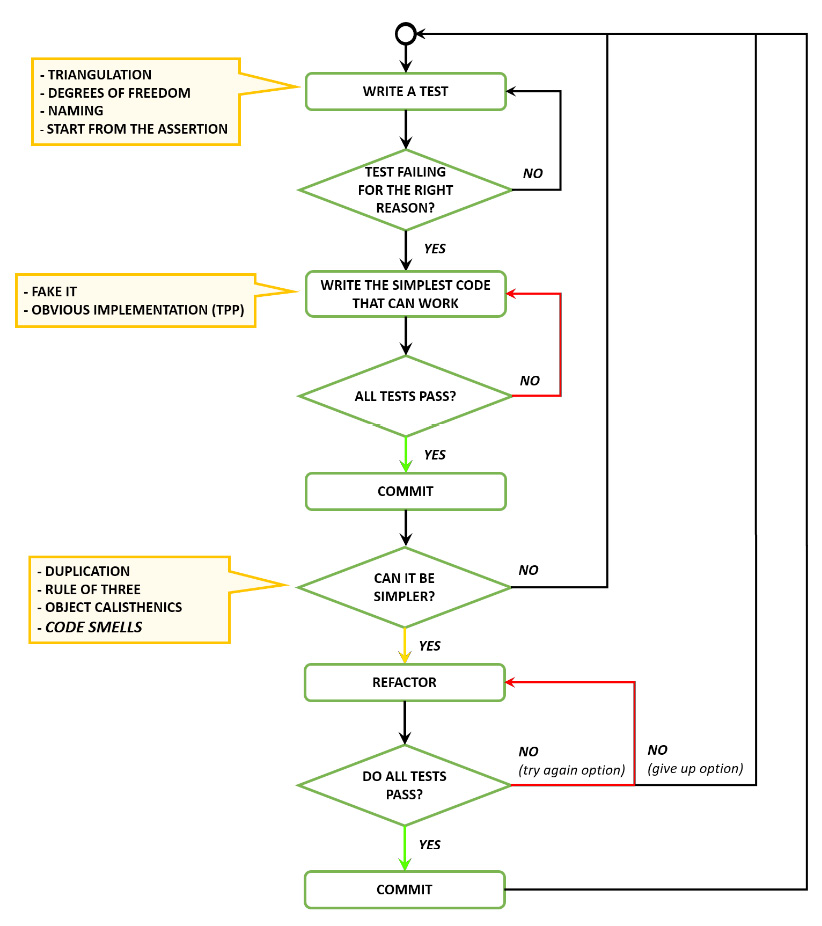
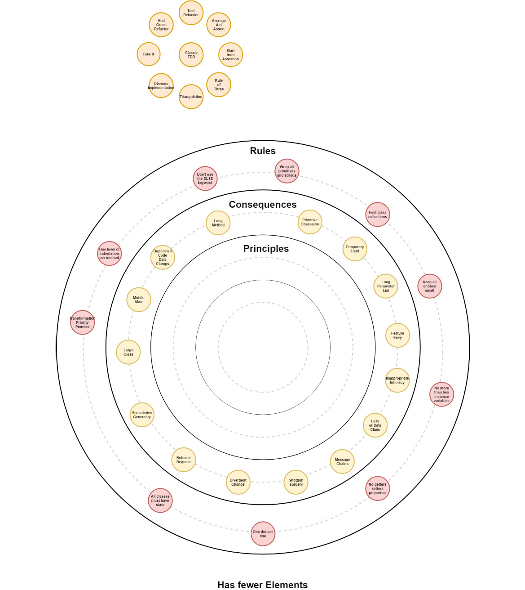

# 设计 3 – 代码异味
> 设计就是选择失败的方式。
>
> — 罗恩·费恩

当我开始我的职业生涯时，我的大部分学习努力都是为了研究特定的技术，试图尽可能深入地理解它们。随着岁月的流逝，我开始意识到，从长远来看，这是一条没有结果的道路。技术不断被大肆宣传和毁灭。对我来说，游戏的一部分曾经是猜测接下来会发生什么。有时我做对了，有时没有。最终，我不再追求特定的技术，而是开始更多地了解多年来一直相关和基本的事物。

在过去的 20 到 30 年中，面向对象的设计并没有发生太大变化——甚至可能更长。我不知道的是，走这条路是要付出代价的。突然之间，我不再是团队中最了解特定技术的人。有时，我因不了解框架中的某些细节而感到沮丧，但最终我接受了它，因为这不再是我的道路。

代码异味是面向对象设计中最重要的概念之一。一旦我能够发现它们，我的内部反馈循环就会显着改善。

设计是关于妥协。我不相信完美的设计；总有妥协的地方。对我来说，代码味道是关于在设计上做出有意识的妥协。

我们通过讨论对象健美操开始了我们的面向对象软件设计之旅。这些是一套非常强大的规则，如果应用得当，会对设计产生巨大的影响。遵循规则有利也有弊。主要优点是一旦你开始应用它们就会立即生效。最大的缺点是他们通常没有提供明确的理由来说明他们为什么工作。在本课中，通过查看代码异味，我们将深入研究对象健美操规则为何有效的第一层次。 （在后续课程中，我们将深入探讨这些原因。）

名字气味很重要。气味不被称为错误的重要原因是：

- 气味是问题的症状而不是问题本身，就像疾病的症状不是疾病本身一样。
- 气味为我们的决定提供反馈，我们应该注意它们，因为它们可能表明更深层次的问题。
- 设计软件是一种不断的妥协，有时我们不得不接受代码气味作为一种妥协，只要它是一种有意识的妥协。作为软件开发人员，我们应该非常注意我们的设计和代码决策，并对我们做出的每一个决策都有自己的看法。
- 气味还不是规则背后的原则或价值；他们介于两者之间。如果我们违反规则，我们最终会遇到设计和代码问题。代码异味是这些问题的明显症状。

在本课中，我们将介绍软件中的两大类气味：设计气味和代码气味。

## 设计气味
这些是高级气味——冰山一角。我们应该将这些气味视为闪烁的警告信号。他们肯定会提醒我们注意大问题，尽管他们提供的关于这些问题的真正原因的信息很少。

如果我们发现一种设计味道，可能是时候停下来反思我们过去的设计决策，并决定我们是否需要重新审视这些决策。设计气味的问题在于它们往往需要时间来体现，有时为时已晚。

以下是设计气味的列表：

- 刚性：系统很难改变，因为每次改变都会迫使系统的其他部分发生许多其他变化。
- 脆弱性：更改导致系统在与更改的部分没有概念关系的地方破裂。
- 固定性：很难将系统分解为可以在其他系统中重复使用的组件。
- 粘性：做对的事情比做错的事情更难。
- 不必要的复杂性：设计包含不会增加直接好处的基础设施。
- 不必要的重复：设计包含可以在单一抽象下统一的重复结构。
- 不透明度：难以阅读和理解。它没有很好地表达其意图。

## 代码异味

代码异味是更细粒度的异味，通常比设计异味更容易修复且成本更低。代码异味分为四类：

### 臃肿者

已经变得如此之大以至于无法有效处理的东西：

- 长方法：方法应该只做一件事。违反单一职责原则 (SRP)。一层抽象。 “保持所有实体小”对象的健美操规则违反。
- 大类：班级应该只有一个职责。可能违反 SRP。每班不超过50行。 “保持所有实体小”对象的健美操规则违反。
- Primitive Obsession：不要使用原始类型作为类的替代品。如果数据类型足够复杂，请使用类来表示它。 “包装所有基元和字符串”对象体操规则违规。
- 长参数列表：“保持所有实体小”对象体操规则违规。
    - 理想：0 参数—尼拉迪奇方法
    - 好的：1 个参数——monadic 方法
    - 可接受：2 个参数——二元法
    - 有争议的：3 个参数——三元法
    - 避免特殊理由：超过 3 个参数——多元方法
- 数据块：相同的数据项一起出现在很多地方（即参数、DTO、变量集等）。重复代码的特殊情况。 DRY 违规。有一个缺失的概念可以表示为一个引入抽象级别的类。

### 耦合器

导致不同模块过度耦合的东西：

- Feature Envy：过度使用另一个类的方法或属性的类。 “所有课程都必须有状态”对象违反健美操规则。
- 不适当的亲密关系：一个类依赖于另一个类的实现细节。 Feature Envy 的特例。
- 消息链：点太多：Dog.Body.Tail.Wag() 应该是：Dog.ExpressHappiness()。 “每行一个点”对象违反体操规则。
- 中间人：如果一个类正在委派它的所有工作，请去掉中间人。当心包装其他类或现有功能的类。 Lazy Class 的特例。 “所有课程都必须有状态”对象违反健美操规则。

### 面向对象滥用者

解决方案没有充分利用面向对象设计的可能性的情况：

- Switch 语句：可能导致相同的 switch 语句分散在不同的地方。可能导致 DRY 违规。
- 临时字段：类包含仅在某些情况下设置的实例变量。可能“没有具有两个以上实例变量的类”对象健美操规则违规。
- 拒绝遗赠：未实施投掷。通常意味着层次结构是错误的。违反 Liskov 替换原则 (LSP)。
- 具有不同接口的替代类：如果两个类内部相似，但外部不同，也许可以修改它们以共享公共接口。

### 改变预防器

阻碍改变或进一步开发软件的东西：

- 不同的变化：一个班级通常因不同的原因以不同的方式发生变化。开放/封闭原则 (OCP) 和/或 SRP 违规。神级。可能由原始痴迷和/或特征嫉妒引起。
- 霰弹枪手术：与不同的变化相反。一个变化会迫使不同的类发生很多小的变化。 DRY 违规。可能由 Primitive Obsession、Feature Envy 或复制粘贴驱动的开发引起。
- 并行继承层次结构：Shotgun Surgery 的特例。创建一个类的子类会强制创建另一个类的子类。

### 可有可无

应该从源代码中删除一些不必要的东西：

- 懒惰类：做的太少的类。可能仅充当中间人或数据类，或者可能由推测的普遍性引起。
- 数据类：具有字段、属性和其他任何内容的类。不包含任何行为的贫血类。 Lazy Class 的特例。可以是“所有类都必须有状态”对象健美操规则违规或“没有具有两个以上实例变量的类”对象健美操规则违规。
- 重复代码：相同或非常相似的代码（或重复的知识）存在于多个位置。 DRY 违规。
- 死代码：没有引用的代码。注释或无法访问的代码。
- 推测的普遍性：违反 YAGNI（你不需要它）或只有方法或类的用户是测试用例。
- 注释：努力创建表达意图的代码，而不是添加注释。

## 突出显示的代码味道

根据我们的经验，我们发现最危险的代码异味是：重复、原始痴迷、特征嫉妒和消息链。出于这个原因，我们决定强调它们，尤其是最后三个，因为我们在之前的课程中已经对重复给予了足够的关注。

### 代码气味层次结构

原始痴迷、功能嫉妒和消息链会导致许多其他代码异味，因此应尽快处理。

#### 原始痴迷

- 重复代码
- 霰弹枪手术
- 发散性变化
- 长参数列表

#### 特征嫉妒/不适当的亲密关系

- lazy class
- 数据类
- 中间人
- 数据块
- 长方法
- Large class
- 重复代码
- 霰弹枪手术
- 发散性变化
- 长参数列表

#### 消息链

- 数据块
- 重复代码

### 原始痴迷

不要使用原始类型作为类的替代品。如果数据类型足够复杂，请使用类来表示它。

例如，如果我们需要表示货币，很容易使用 int、float 或十进制原始类型。这看起来非常良性。当我们需要引用货币时，我们用一个原始类型来表示它。但现在企业需要以多种货币表示的资金。我们需要改变多少地方？如果我们将汇率而不是货币价值传递给方法会怎样？如果我们有一个类型，代码甚至不会编译，使错误的状态无法表示！

原始痴迷的另一个后果是对验证的过度需求。同样，如果货币由原始类型表示，我们如何处理负值？

这种代码异味会导致 Shotgun Surgery 代码异味，因为行为往往会在许多地方传播，从而导致一连串的变化。

### 功能羡慕

过度使用另一个类的方法或属性的类。一个例子是类 A 只包含状态，而类 B 使用来自类 A 的状态来执行一些操作。我们说 B 类具有 A 类的 Feature Envy，因为 B 类包含应该在 A 类中的行为。作为一般规则，行为应该接近它使用的状态。

Feature ENVY 通常意味着被嫉妒的类是一个惰性类。这种气味也可能导致Shotgun Surgery，因为行为可以分散在许多地方，或者也可能导致分歧变化，因为一个班级可能会成为一个神级（知道的太多）。

#### 例子

PositionUpdater 使用来自 Coordinate 的数据，导致 Feature Envy 的味道，而 Coordinate 是一个数据类：

```
public class Coordinate
{
public int X {get; set}
public int Y {get; set}
}
public class PositionUpdater
{
public Coordinate MoveUp(Coordinate coordinate)
{
return new Coordinate{X = coordinate.X, Y = coordinate.Y + 1};
}
}
After removing the Feature Envy code smell, Coordinate looks like this:

public class Coordinate
{
public int X {get; private set}
public int Y {get; private set}
public void MoveUp()
{
coordinate.Y += 1;
}
}
```

### 消息链

消息链代码异味代表耦合（本书稍后将介绍），也会导致 Shotgun Surgery 代码异味或发散更改代码异味。我们必须避免这种代码味道像瘟疫一样。在我们的辅导课程中，我们使用清单来帮助避免这种气味。这种代码异味也被称为得墨忒耳定律。

#### 更正式的清单

在以下情况下，消息应该只发送到一个对象（方法应该只在对象上调用）：

- 本身
- 包含在自身或超类的属性中的对象
- 作为参数传递给方法的对象
- 方法创建的对象
- 存储在全局变量中的对象。我们不使用全局变量，对吗？

#### 更非正式的清单

我们只能玩以下玩具：

- 我们拥有
- 我们建造
- 我们被赋予

## 防止代码异味的对象健美操

对象健美操是一组帮助我们避免一些代码异味的规则。如果我们决定违反规则，我们将产生的后果会随着代码异味而具体化。在设计中，遵循规则并不总是最好的方法；有时我们需要弯曲或打破规则。只要我们意识到这一点，这很好；即后果和好处。软件设计应该是一系列决策。我们最大的敌人是由于无意识的设计决策而导致的意外复杂性。

Quora：https://www.quora.com/What-are-essential-and-accidental-complexity。



## 何时重构（针对代码异味进行了扩展）

在这些情况下重构：

- 当我们在代码中发现重复时。 （不要忘记三规则。）违反 DRY。
- 当我们打破任何物体的健美操规则时。
- 当代码表现出我们没有预料到的代码气味时。

### 重构代码异味

Martin Fowler 在其出色的开创性著作《重构：改进现有代码的设计》中为许多重构创建了分类和术语。我们不会深入探讨这一点，因为它在他的书中有所涉及。术语经常被忽视，但它在有效沟通中发挥着重要作用。在下表中，我们列出了可用于去除特定代码异味的最常见重构。此表中的重构也取自 Fowler 的书：



BLO – 膨胀器，CHP – 改变防止器，COU – 耦合器，DIS – 可有可无，OOA – 面向对象滥用

对于那些有兴趣深入了解重构世界的人，请参阅本课程资源部分中的 Web 链接和书籍。

## Kata
### 臭井字游戏

我们在 Code Smells 中创建了一个非常臭的 Tic-Tac-Toe 实现：https://github.com/AgileTechPraxis/CodeSmells 开源存储库。实现中有不少代码异味：

- 评论
- 数据类
- 数据块
- 发散性变化
- 重复代码
- 功能羡慕
- Large class
- Lazy class
- Long method
- 长参数列表
- 消息链
- 原始痴迷
- 霰弹枪手术

从识别气味开始，然后慢慢重构代码。请记住在重构期间始终保持测试通过。可以随时恢复到以前的工作状态。

> 笔记
>
> 有关示例（部分）解决方案，请参阅第 385 页上的附录部分。

## 好习惯
在本课中，我们介绍了新习惯。在以下列表中查看。

编写新测试时的注意事项

### 测试应该只测试一件事

- 创建更具体的测试以推动更通用的解决方案（三角测量）
- 为你的测试提供反映你的业务领域的有意义的名称（行为/面向目标）
- 查看测试失败的正确原因
- 确保你从失败的测试中获得有意义的反馈
- 将你的测试和生产代码分开
- 组织你的单元测试以反映你的生产代码（类似的项目结构）
- 在安排、行动和断言块中组织你的测试
- 先写断言然后逆向工作
- 编写快速、隔离、可重复和自我验证的测试

### 使失败的测试通过时的注意事项

- 写最简单的代码通过测试
- 编写任何可以让你更快地进入重构阶段的代码
- 使用改造优先的前提
- 考虑使用对象健美操来推动设计决策

### 测试通过后的注意事项

- 使用三原则解决重复问题
- 不断重构设计
- 应用对象健美操来改进你的设计
- 重构时保持绿色
- 使用 IDE 快速安全地重构
- 首先重构代码以提高可读性/可理解性
- 注意代码异味并相应地重构代码（新习惯）

## 经典 TDD 流程



## 大图



我应该什么时候继续下一课？

- 当你了解健美操和代码气味之间的联系时
- 当你可以使用气味作为反馈来设计代码时

## 资源

### 网络

- 代码气味，SourceMaking.com：http://sourcemaking.com/refactoring/bad-smells-in-code。
- 没有银弹——软件工程的本质和意外，小弗雷德里克·P·布鲁克斯：http://worrydream.com/refs/Brooks-NoSilverBullet.pdf。
- 走出焦油坑，Ben Mosley 和 Peter Marks：https://github.com/papers-we-love/papers-we-love/blob/master/design/out-of-the-tar-pit.pdf。
- Simple Made Easy, Rich Hickey：https://www.infoq.com/presentations/Simple-Made-Easy。
    软件开发反模式，SourceMaking.com：https://sourcemaking.com/antipatterns/software-development-antipatterns。

### 图书

- 重构：改进现有代码的设计，Martin Fowler 等：https://www.goodreads.com/book/show/44936.Refactoring。