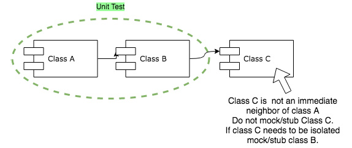

# 测试双打
> 改变状态的函数不应返回值，返回值的函数不应改变状态。
>
> – Bertrand Meyer，面向对象的软件构建

我还记得我加入第一个硬核 XP 团队的时候。它在那家公司仍处于试验阶段，一开始我们没有资金用于工具，除了 IDE 重构助手。我们无法在没有官僚要求的情况下引入框架——一个麻烦的授权过程持续数周。然而，我们的积压需要及时交付。这就是我必须学习手动注入依赖项并手动开发所有测试替身的地方。我们称其为“穷人依赖注入”和“穷人嘲笑”，强调了我们因预算原因被迫重新发明轮子的事实。

尽管有一点阻力，我们还是成功地按时交付了积压工作，并且几乎没有错误。公司最终允许我们引入优化未完成工作量所需的框架。

然而，我始终记得那些“穷人的方式”最有趣的日子；我从手动实施测试替身中学到了很多！如果你从未亲自尝试过，我建议你尝试一下。这是一个非常有趣的练习！

**Marco**

如果你阅读过四人组 (GOF) 一书《设计模式》，介绍中提到的指导原则之一是“编程到接口，而不是实现”。一个优势是它为使用测试替身打开了大门。

测试替身借用了电影中特技替身的名称和用法。 Gerard Meszaros 在他的书 xUnit 测试模式中引入了这个术语。测试替身是用于代替真实对象用于测试目的的任何类型的对象。

Martin Fowler 在他的博文中也提到了双打。

## 原则
一开始，Test Doubles 作为一种将测试与第三方库隔离的工具变得流行起来。尽管这是它的用例之一，并且仍然非常有用，但它不是唯一的，也许不是最重要的。

为了获得良好的面向对象设计，Test Doubles 技术通过指导代码库中一致、封装良好的类型系统的组合来利用测试驱动开发。通过关注行为而非数据，Test Doubles 引导开发人员尽早考虑对象交互，首先识别公共接口。这种创建测试方式的焦点切换对于找到最佳对象组合至关重要。

### 命令查询分离

命令-查询分离或 CQS 是一种原则，它指出软件接口抽象是用两种类型的方法设计的。一种方法类型称为命令方法，另一种方法类型称为查询方法：

> 笔记
>
> Vaughn Vernon，真正简单的 CQRS，Kalele 博客：https://kalele.io/blog-posts/really-simple-cqrs/。

Command 方法修改或改变接口下的状态，但不响应该状态的任何部分。
Query 方法回答界面下的当前状态，但在回答之前不得修改该状态。
牢记这一原则，我们可以描述测试替身的使用模式。

### 查询

查询是一种返回数据的方法调用，不应对对象的状态产生任何影响。 （它应该是幂等的。）

> 信息
>
> 在排列部分使用存根进行查询

Stubs 的主要任务是“制造快乐的声音”。实现这一点的一种方法是，当需要返回数据时，从依赖项中返回罐头数据——非常适合查询。


### 命令

命令是改变系统状态的方法调用；因此，它有副作用，它应该返回无效。

> 信息
>
> 在 Assert 部分使用 Mocks for Commands

命令都是关于系统其他部分的副作用，而 Mocks 都是关于验证行为的发生（即，副作用的触发器发生了）。


## 不同类型的测试替身
### 虚拟对象

虚拟对象仅用于完成方法的参数列表，但从不实际使用。它们在设计良好的系统中并不常见，因为它们通常表明设计改进的空间。

### 存根

存根响应测试期间发出的调用，并为每个测试提供一些特定的预编程输出。这意味着它们需要为每次测试专门设置。

存根用于为在测试对象的协作者上调用的查询提供合成替换。

### 假对象

假货是手工制作的存根（有时称为穷人存根）。

### 模拟

Mocks 是根据他们预期收到的调用设置的。如果他们收到他们不期望的调用和/或在断言阶段被查询以验证他们收到了他们期望的所有调用，则他们可以抛出异常。

Mocks 用于提供一种方法来确认测试对象是否正确触发了命令。

### 间谍

间谍是手工制作的 Mocks（有时称为穷人 Mocks）。


## 测试双打指南

### 仅对你拥有的课程使用测试替身

使用测试替身是一种软件设计技术。这就是为什么只使用属于团队代码库的模拟/存根类型很重要的原因。这里的关键概念是，如果测试替身与外部接口耦合，则它们无法更改设计以响应流程中出现的需求。

这同样适用于固定类型，例如由运行时或外部库定义的类型。那么，我们如何测试与外部库的交互呢？这里的技巧是编写一个瘦包装器来实现底层基础设施的抽象。这些包装器是属于团队代码库的组件，它们：

从行为至上的位置生成（公共接口定义在前）
可以用测试替身代替
我们发现这是理解该技术的重要洞察力。它恢复了使用 Mock/Stub Objects 的设计优势，而 Mock/Stub Objects 经常被它在测试与第三方库的交互方面的流行所掩盖。

那么，如果外部库发生变化怎么办？我们如何测试它？使用集成测试可以做到这一点，但我们稍后会详细介绍。


### 在测试中尽可能少地验证

使用 Mock/Stub 对象时，重要的是要在受测试对象行为的规范和允许代码库轻松演化的灵活测试之间找到平衡。 TDD 的风险之一是测试变得脆弱——也就是说，由于应用程序代码的无关更改而失败。通常，当它们被过度指定以检查实现的功能时，会发生这种情况，而不是对象中某些要求的表达。

包含大量脆弱测试的测试套件会减慢开发速度并损害重构能力。解决方案是审查脆弱的测试，看看是否应该削弱规范，或者对象组合不是最佳的，应该改变。 “规范应该尽可能精确，但不能更精确。”解释爱因斯坦：

一切都应该尽可能简单，但不能更简单。一般归因于阿尔伯特·爱因斯坦。

### 不要对孤立的对象使用测试替身

如果一个对象与系统中的其他对象没有协作，则不需要使用 Mock/Stub Objects 对其进行测试。对此类对象的测试只需要通过从其方法返回的值对其状态进行断言。通常，这些对象存储数据、执行计算或表示原子值。虽然这似乎是一件显而易见的事情，但我们已经看到大量使用 Test Doubles 的地方实际上并不需要它们。


### 不要在测试替身中添加行为

模拟对象也可能是存根，但不应给测试环境增加任何额外的复杂性。他们的行为应该是显而易见的和不言自明的。我们注意到，当真正的行为被添加到 Mock 对象时，它通常是错位责任的强烈症状。

一个常见的例子是当一个 Mock 必须解释它的输入以返回一个值时，可能是通过解析一个事件消息。这会导致测试测试基础设施而不是测试对象，因为原始对象的更改将强制更改存根对象，使其成为 Shotgun Surgery 代码异味的经典示例。

例如：

```
// Too much logic in the test
var username = new Random().Next(1, 11) % 2 == 0
? "Pedro"
: string.Empty;
var pedro = new User("Pedro");
userServiceMock
.Setup(service => service.GetUser(username))
.Callback((userName) => //Called before the service gets the user
{
//Change input parameters behavior
if(userName = string.Empty)
{
userName = "Default";
}
Console.WriteLine($"args before returns {userName}");
})
.Returns(pedro)
.Callback((user) => // Called after the service returned the user
{
//Change returned value behavior
if(user == null)
{
user = new User("Default");
}
Console.WriteLine($"arg after returns {user.Name}");
});
```

与其这样，不如编写两个独立的、更有针对性的测试。

### 仅对你的近邻使用测试替身

以必须导航对象树来完成其任务的方式实现的对象很可能是脆弱的，因为它具有太多依赖项并跨越多个抽象层。这个问题的一个明显症状是排列阶段需要相当大的复杂性，这通常会导致可读性的急剧下降。它通常可以通过设置嵌套 Mock/Stub 对象网络的需要来识别。

在这种情况下，我们很有可能通过寻找诸如 Feature Envy、Independent Intimacy 和 Message Chain 之类的代码气味来改进代码库的设计，并采取相应的行动。通常，泄漏的抽象是由于违反了德米特法则而引起的。 （迪米特法则与消息链代码气味是相同的概念。）

当单元测试专注于一次只测试一种行为，一次只测试一个受测对象，并且只对最近邻居的对象设置期望时，单元测试效果最好。

解决方案首先评估被测行为。一旦确定，如果我们仍然有问题，可能是时候对合作者的受测对象设计采取行动了。可以通过以下方式解决：

在邻居上引入一个公共方法，封装对自己的依赖的调用

或者

创建一个新类来隐藏对象与其邻居之间的复杂性



### 太多的测试替身

当测试必须将太多 Mock/Stub 对象传递给被测对象时，会出现类似的问题，即使它们都是直接邻居。即使不违反迪米特法则，这种情况也往往是长参数列表、大类或长方法代码异味的表现。同样，测试很可能有一个很长的安排阶段，从而导致可读性差。同样，解决方案可能是对未对齐的职责采取行动，引入中间类，或将对象分解为更小的实体，具体取决于已识别的代码异味。

### CQS 原则权衡

当我们有一个复杂的过程来设置和断言同时是存根和模拟的对象时，就会出现这个问题的另一种风格。有时在特定情况下不遵循 CQS 原则是可以的；但是，在你的测试中拥有这样一个对象清楚地表明你应该考虑根据你的设计采取行动并分担责任。

一般来说，违反CQS原则的可能有两种：

- 返回命令的结果（弱违规）
- 更改查询的状态（严重违规）

我们知道，在特定环境中，并不总是可以处理引发异常的不成功命令（想想大规模的高度事务性环境或非常特殊的情况）。在这种情况下，返回一个包含有关结果的最少重要信息的自包含数据结构是一个可以接受的权衡。 （想想 HTTP 协议请求/响应返回 HTTP 状态代码。）

相反，当查询具有更改系统任何状态的副作用时，应该避免的是我们所说的强违规事件。这明显违反了最小惊讶原则。

请参阅 DESIGN VI – SOLID PRINCIPLES++ 第 3 节中有关 PoLA 的部分。

## Katas

### Urs Enzler 的字符复印机

我们在 Urs Enzler 的网站上找到了这些 katas：https://www.planetgeek.ch。

字符复制器是一个简单的类，它从源读取字符并将它们一次一个字符地复制到目标。

在复制器上调用 Copy 方法时，它应该从源读取字符并将它们复制到目标，直到源返回换行符 (\n)。

练习是使用测试替身为源和目标实现字符复制器（尝试使用 Spies – 手动编写的 Mocks – 和使用模拟框架编写的 Mocks）。从这些定义开始：


```
public class Copier
{
public Copier(ISource source, IDestination destination) {...}
public void Copy() {}
}
public interface ISource
{
char GetChar();
}
public interface IDestination
{
void SetChar(char character);
}
```

### Urs Enzler 的仪器处理器

在 Instrument Processor kata 中，我们将实现一个类，该类从 TaskDispatcher 获取任务并在 Instrument 上执行它们。

InstrumentProcessor 必须实现以下接口：

```
public interface IInstrumentProcessor
{
void Process();
}

```

任务调度器必须具有以下接口：

```
public interface ITaskDispatcher
{
string GetTask();
void FinishedTask(string task);
}
```

GetTask 方法返回要在仪器上执行的下一个任务。

在仪器上成功执行任务后，必须由 InstrumentProcessor 调用 FinishedTask 方法，将已完成的任务作为方法参数传递。

InstrumentProcessor 具有以下接口：

```
public interface IInstrument
{
void Execute(string task);
event EventHandler Finished;
event EventHandler Error;
}
```

Execute 方法启动仪器，仪器将开始执行传递给它的任务。该方法将立即返回（我们假设仪器实现是异步的）。

如果传入的任务为空，Execute 方法将抛出 ArgumentNullException。

当仪器完成执行时，会触发 Finished 事件。

当仪器在执行过程中检测到错误情况时（注意 Execute 方法由于其异步实现已经将控制流返回给调用者），它会触发 Error 事件。


练习是通过以下方式实现 InstrumentProcessor：

- 当 Process 方法被调用时，InstrumentProcessor 从任务调度器中获取下一个任务并在仪器上执行
- 当仪器的 Execute 方法抛出异常时，该异常将传递给 Process 方法的调用者
- 当仪器触发完成事件时，InstrumentProcessor 使用正确的任务调用任务调度程序的 FinishedTask 方法
- 当仪器触发 Error 事件时，InstrumentProcessor 将 Error发生的字符串写入控制台

## 好习惯
在本课中，我们介绍了新习惯。在以下列表中查看。

### 编写新测试时的注意事项

- 测试应该只测试一件事
- 创建更具体的测试以推动更通用的解决方案（三角测量）
- 为你的测试提供反映你的业务领域的有意义的名称（行为/面向目标）
- 查看测试失败的正确原因
- 确保你从失败的测试中获得有意义的反馈
- 将你的测试和生产代码分开
- 组织你的单元测试以反映你的生产代码（类似的项目结构）
- 在安排、行动和断言块中组织你的测试
- 先写断言然后逆向工作
- 编写快速、隔离、可重复和自我验证的测试
- 考虑使用测试替身来隔离测试的副作用（新习惯）

### 使失败的测试通过时的注意事项

- 写最简单的代码通过测试
- 编写任何可以让你更快地进入重构阶段的代码
- 使用改造优先的前提
- 考虑使用对象健美操来推动设计决策

### 测试通过后的注意事项

- 使用三原则解决重复问题
- 不断重构设计
- 应用对象健美操来改进你的设计
- 重构时保持绿色
- 使用 IDE 快速安全地重构
- 首先重构代码可读性/可理解性
- 注意代码异味并相应地重构代码

### 我应该什么时候继续下一课？
当你了解不同的测试替身（存根、模拟、假冒和间谍）时
当你了解查询和命令方法之间的区别时
何时可以使用 Mocks 和 Stubs 来测试生产代码
当你可以编写自己的假冒和间谍时

## 资源

### 网络

- The Little Mocker, Robert C. Martin：http://blog.cleancoder.com/uncle-bob/2014/05/14/TheLittleMocker.html。
- 嘲笑 katas，PlanetGeek.ch：https://www.planetgeek.ch/?s=mocking+kata。
- 模拟不是存根，Martin Fowler：https://martinfowler.com/articles/mocksArentStubs.html。
- Mocks、Fakes、Stubs 和 Dummies，Gerard Meszaros：http://xunitpatterns.com/Mocks,%20Fakes,%20Stubs%20and%20Dummies.html。
- 马克西曼的命令模拟，查询存根：http://blog.ploeh.dk/2013/10/23/mocks-for-commands-stubs-for-queries/。
- 真正简单的 CQRS，Vaughn Vernon，Kalele 博客：https://kalele.io/blog-posts/really-simple-cqrs/。
- 测试替身，杰拉德·梅萨罗斯：http://xunitpatterns.com/Test%20Double.html。

### 图书

- Growing Object-Oriented Software, Guided by Tests，Steve Freeman 和 Nat Pryce：https://www.goodreads.com/book/show/4268826-growing-object-oriented-software-guided-by-tests。
- xUnit 测试模式：重构测试代码，Gerard Meszaros：https://www.goodreads.com/book/show/337302.xUnit_Test_Patterns。