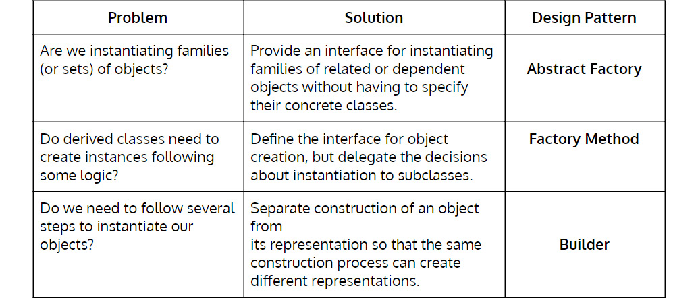
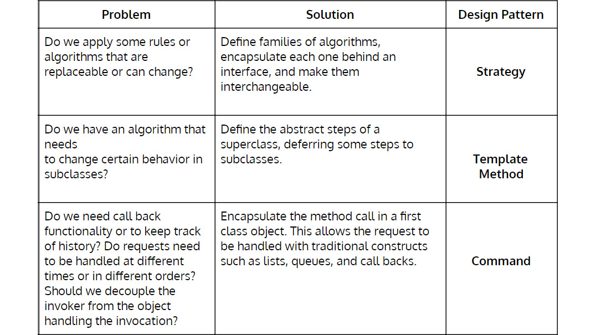
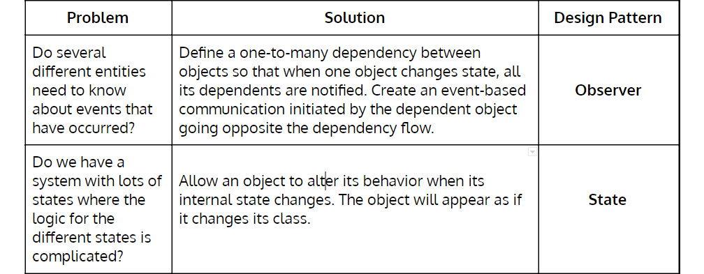
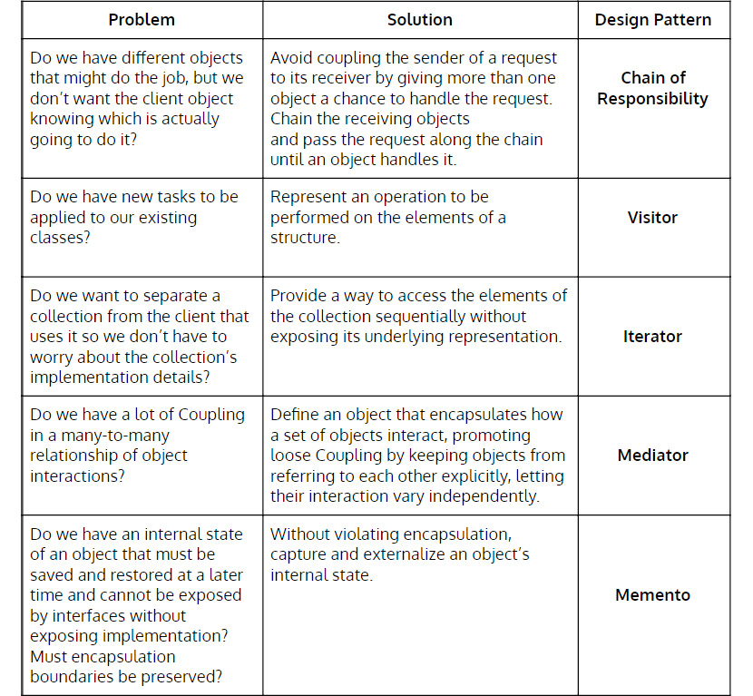
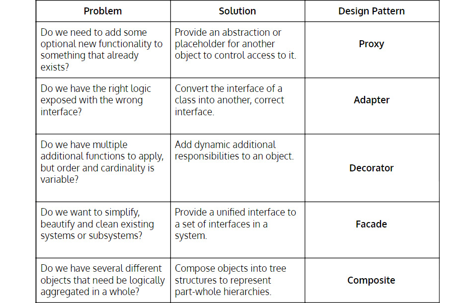

# 设计四——设计模式
> 宇宙的基本规律很简单，但由于我们的感官有限，我们无法掌握它们。创造中有一种模式。
>
> -- 艾尔伯特爱因斯坦

我第一次听说设计模式时，我还在意大利，在我的第一份工作中。一位同事谈到之前的一次采访，“当他们开始问我设计模式时，我知道我注定要失败！Ciaone！”

在大家大笑之后（我的同事，Matteo 是一位伟大的开发人员，也是一位了不起的讲故事的人！），我脑海中闪过一个异国情调的术语：设计模式。我什至不知道这些图案是什么。在这样的采访中，我也注定要失败。我必须知道更多。

我在谷歌上快速搜索并随机阅读了几页，然后我意识到这不是一个你可以轻松掌握的主题。当记忆不是一个人最好的品质时，它可能看起来是一项艰巨的任务。几个月后，我在下一份工作的办公室的书架上发现了 Head First Design Patterns。

这本书让我终于把点点滴滴联系起来。常见问题的常见解决方案。抽象。一开始我无法理解它，因为我是从实现方面接近它的（年轻开发人员的典型偏见）。现在，当我想到设计模式时，我什至不记得解决方案——我只记得它们要解决的问题。对于其他任何事情，我们都有 Google（或 DuckDuckGo）。

设计模式的主题是有争议的。我们争论是否将它包括在这个旅程中。我们将其包含在内是因为我们认识到它们在正确应用时产生的解决方案的巨大有效性，以及它们在有关如何解决编码任务的某些技术讨论中带来的价值。

> 笔记
>
> 并非所有人都知道，在 1999 年的 OOPSLA 上，四人帮（在他们的全力合作下）接受了模拟审判（首席检察官显然是肯特·贝克）。最后，他们被指控犯有许多违反计算机科学的罪行，包括在模式的全部内容上误导世界，并欺骗他人认为他们可以像专家一样编写代码，只是因为他们可以提及其中的一些。

问题是，根据我们的经验，我们已经看到许多由本书广泛应用设计模式驱动的软件过度工程的例子。我们通常称这种设计模式为金锤或设计模式痴迷。

设计模式主题完全符合规则、原则和价值观的考虑。记住它们就像学习规则：它们为你提供解决特定问题的捷径。但真正的价值在于掌握它们所基于的原则。你可以将它们混合到特定场景中，从而增强最终代码的表现力和可重用性。最终，当你遵循正确的设计原则并以自己的方式解决问题时，你的设计可能会自然地包含一些模式，甚至无需查找它们。

## 设计模式优势

- 它们为你提供了一系列已经解决的反复出现的问题的场景，你可以从中寻找灵感。
- 它们为你提供了用于讨论解决方案的可能实现的词汇，因此无需详细说明。
- 如果问题适合，它们会为你提供可能的解决方案实施的快速参考。
- 所使用的实现基于已被广泛接受的基本软件设计原则。

## 设计模式陷阱

- 它们几乎从不开箱即用，但需要根据特定场景进行塑造和定制。
- 在表达业务概念和领域词汇时，他们失败了，专注于实现细节而不是行为。

> 警告
>
> 如果可能，请避免在代码中泄露模式的名称。命名应始终关注与你正在实现的业务功能相关的行为。炫耀你使用抽象工厂和命令实现了访问者模式并不能表达你的代码的功能目标。它也不会让你看起来更聪明。

## 快速参考目录
### 创建型设计模式

创建模式都是关于创建对象的实例，因为对象创建的基本过程可能会导致设计问题或增加复杂性：

### 行为设计模式

行为模式是那些与对象之间的通信有关的模式。它们识别对象之间的常见通信模式，增加行为灵活性：

### 结构设计模式

这些模式是关于类和对象组合的。它们的目的是通过确定一种实现实体之间关系的简洁方法来简化设计：

## 重温重构指南
### 重构设计

在第 6 课重构中，我们提到了简单的设计重构。我们现在可以用设计模式扩展这些。一旦我们知道如何正确使用模式，我们将能够在有意义的时候针对它们重构代码：

- 从深层条件中提取私有方法。
- 从长方法中提取较小的私有方法，并将隐秘的代码封装在私有方法中。
- 尽快从方法中返回。
- 封装我们发现缺少封装的地方。
- 删除重复。
- 重构为模式（新）。

## Kata
### 将生命游戏 Kata 重构为模式

在 Object Calisthenics 课程中，我们介绍了生命游戏作为练习规则的练习。如果你已经完成了这个练习，你应该把它保存在某个地方，这将是这个练习的起点。如果你还没有这样做，我们建议你试一试。一旦你完成了你的实施，你就可以继续了。

此练习包括重构你当前的 Game of Life 并使用不同的设计模式解决它。在这种情况下有趣的实现可能是：

- 命令模式
- 状态模式
- 策略模式

选择一种模式并使用之前课程中的重构建议对其进行重构。完成后，选择另一个模式并重构它。冲洗并重复。

> 警告
>
> 这个练习旨在帮助内化一些模式的实现，并证明有很多方法可以使用模式来解决问题。实际上，你应该根据功能上下文以及你的代码与系统其他部分进行交互的方式来推导出模式选择。

## 好习惯
在本课中，我们引入了一个新习惯。在以下列表中查看。

### 编写新测试时的注意事项

- 测试应该只测试一件事。
- 创建更具体的测试以推动更通用的解决方案（三角测量）。
- 为你的测试提供反映你的业务领域的有意义的名称（行为/面向目标）。
- 查看测试是否因正确的原因而失败。
- 确保你从失败的测试中获得有意义的反馈。
- 将你的测试和生产代码分开。
- 组织你的单元测试以反映你的生产代码（类似于项目结构）。
- 将你的测试组织成安排、行动和断言块。
- 先写断言，然后逆向工作。
- 编写快速、隔离、可重复和自我验证的测试。
- 考虑使用对象健美操来推动设计决策。
- 考虑向遗留代码添加测试。

### 使失败的测试通过时的注意事项

- 编写最简单的代码来通过测试。
- 编写任何可以让你更快地进入重构阶段的代码。
- 使用转换优先的前提。

### 测试通过后的注意事项

- 使用三法则来解决重复问题。
- 不断重构设计。
- 应用对象健美操来改进你的设计。
- 重构时保持绿色。
- 使用 IDE 快速安全地重构。
- 首先重构代码以提高可读性/可理解性。
- 注意代码异味并相应地重构代码。
- 在上下文合适时重构模式（新习惯）。

### 我应该什么时候进入下一课？

- 你能重构一些模式而不在你的代码中使用模式名称吗？
- 你能抵制在任何地方应用设计模式的冲动吗？
- 当你对之前的所有问题都回答“是”时，你就可以继续前进了。

## 资源

### 网络

以下是一些你可以参考的网络资源以获取更多信息：

- 设计模式，重构大师：https://refactoring.guru/design-patterns。
- 设计模式，SourceMaking.com：https://sourcemaking.com/design_patterns。

### 图书

以下是一些书籍资源，你可以参考以获取更多信息：

- Design Patterns: Elements of Reusable Object-Oriented Software，Erich Gamma 等：https://www.goodreads.com/book/show/85009.Design_Patterns?from_search=true。
- Head First Design Patterns: A Brain Friendly Guide，Eric Freeman 等：https://www.goodreads.com/book/show/85009.Design_Patterns?from_search=true。
- 企业应用程序架构模式，Martin Fowler 等：https://www.goodreads.com/book/show/70156.Patterns_of_Enterprise_Application_Architecture。
- 重构为模式，Joshua Kerievsky：https://www.goodreads.com/book/show/85041.Refactoring_to_Patterns?from_search=true。