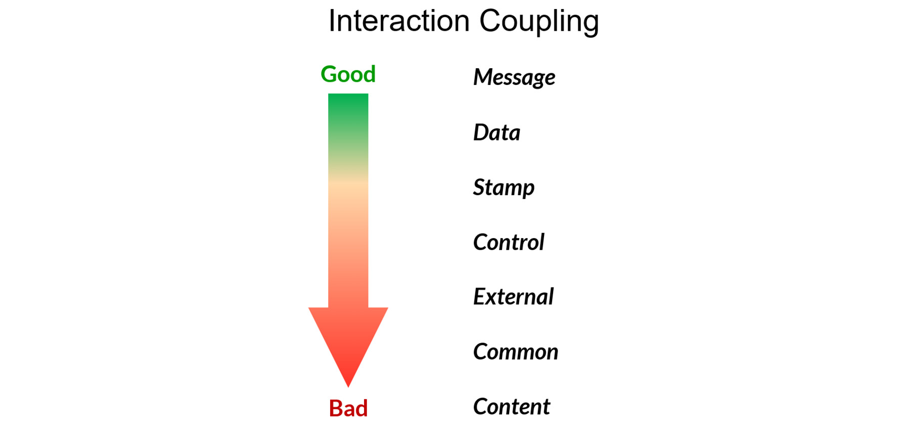
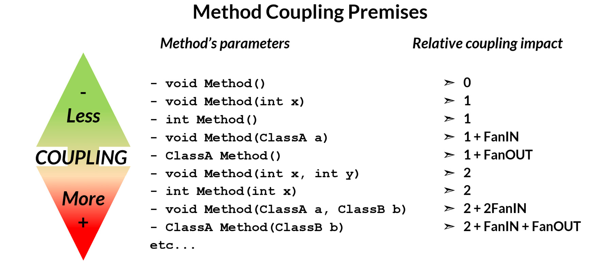
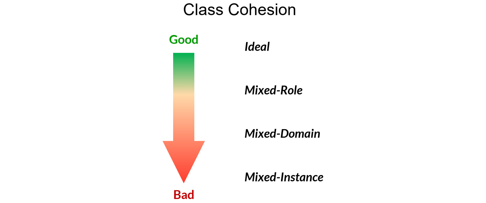
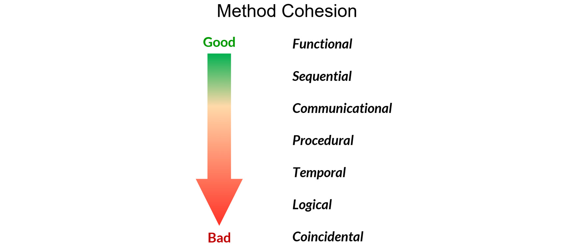
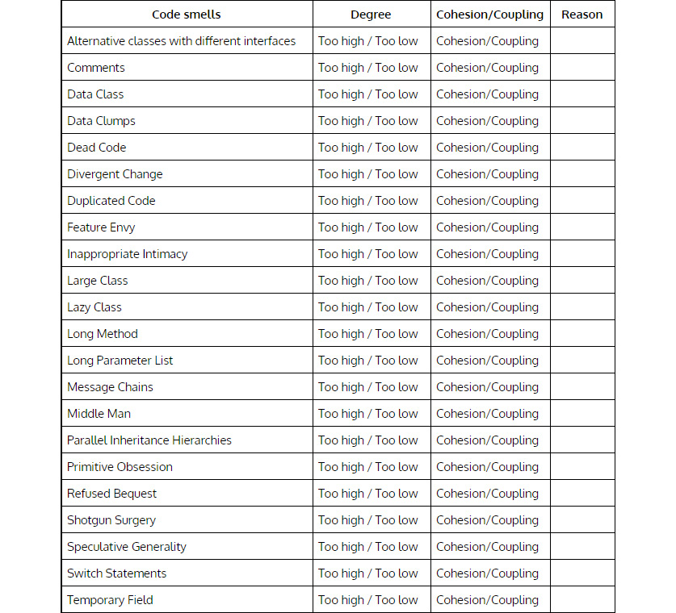
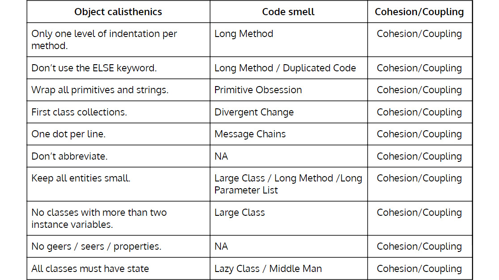
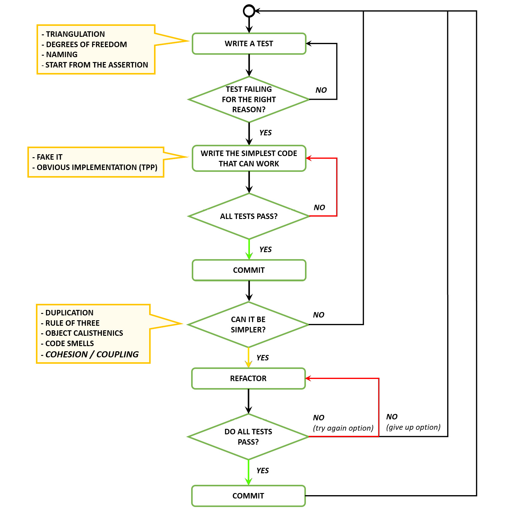
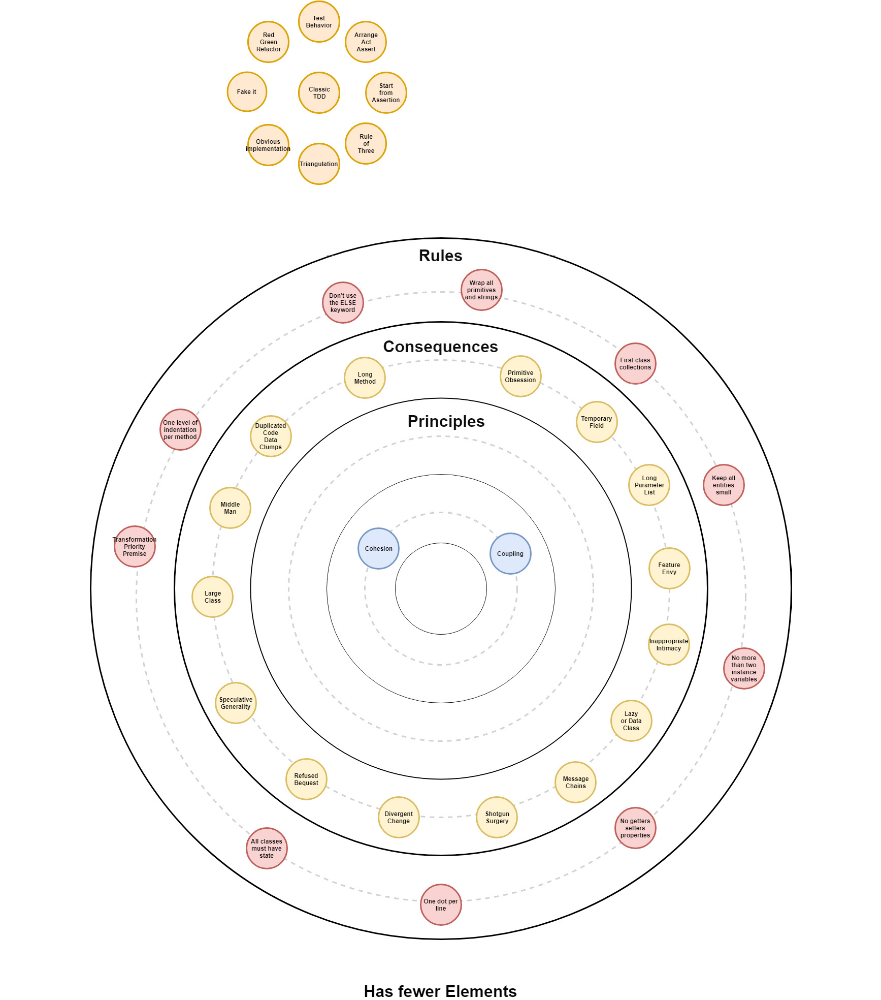

# 设计 V – 内聚和耦合

> A 和 B 之间的耦合定义为：
>
> '如果我更改元素 A，我也必须更改元素 B [...]
>
> 元素 A 的内聚力定义为：
>
> “如果我更改子元素 A.1，是否必须更改所有其他子元素 A.2-n？”
>
> 因此，内聚是元素内的耦合。
>
> -肯特贝克

## 耦合

耦合衡量软件组件之间的相互依赖程度。在面向对象的设计中，我们希望耦合尽可能低，但不是更低，否则我们最终会得到很少做的软件。这使我们可以在不影响其他组件的情况下对组件进行更改。

耦合表示组件之间的独立性。可能高耦合的一些指标是以下代码异味：

- 不同的变化
- 功能羡慕
- 不适当的亲密
- 消息链
- 中间人
- 霰弹枪手术

当我们谈论面向对象设计中的组件时，我们指的是库、程序、包/命名空间/模块、类、方法等。

耦合类型对我们如何连接组件以及一个组件对其他组件的了解程度进行了分类。

### 联轴器的类型

由于非常不同的原因，有两种主要类型的耦合会产生相互依赖：

- 交互耦合：当依赖基于一个组件调用另一个组件的方法时
- 继承耦合：当依赖基于从另一个继承的组件时

### 交互耦合

这是迄今为止最常见的耦合类型。根据方法调用的性质、位置和交换的参数，我们可以进一步识别几种不同类型的交互耦合：

- 消息耦合
- 数据耦合
- 邮票联轴器
- 控制耦合
- 外部耦合
- 普通联轴器
- 内容耦合

#### 消息耦合

组件通过消息进行通信。这是最好的耦合类型，因为不同的组件只共享一条消息。

#### 数据耦合

组件通过参数共享数据；在另一个组件上调用方法是一种非常常见的做法。与消息传递相比，一个组件需要了解其他组件的更多细节才能执行方法调用。我们可以重构消息传递来降低耦合。

#### 邮票联轴器

组件共享一个公共数据结构。我们应该避免在组件之间传递数据结构。还记得 Object Calisthenics 中的第一类集合规则吗？它有助于减少这种类型的耦合到数据耦合。

#### 控制联轴器

一个组件负责控制另一个组件的流程。重构到诸如状态或策略之类的设计模式可以帮助修复这种类型的耦合。

#### 外部耦合

组件共享外部数据格式或协议。抽象外部数据的知识使我们能够消除这种类型的耦合。

#### 普通联轴器

组件共享全局数据；此全局数据格式的任何更改都会产生连锁反应，破坏多个组件（Shotgun Surgery 代码异味）。我们可以抽象公共数据以最小化这种耦合或移除全局数据并转向数据耦合或消息传递。

#### 内容耦合

组件依赖于其他组件的内部元素数据。这是最糟糕的耦合形式，因为一个组件可以改变另一个组件的数据。这使得系统非常脆弱并且非常难以改变。使用封装和抽象是最小化此类耦合的有效策略。

### 得墨忒耳定律

迪米特定律有助于避免耦合组件。这是一个非常简单但有效的法律。它说对象 O 上的方法 M 只能调用以下对象的方法：

1. 在 O 本身
2. 在自身 (O) 或超类 (O) 的属性中包含的对象上
3. 在作为参数传递给方法 M 的对象上
4. 在由方法 M 创建的对象上
5. 在存储在全局变量中的对象上（过时）

通信是耦合的主要原因。得墨忒耳定律可以看作是邻里定律：“只与靠近你的组件交谈”。这样做的目的是保持对象的通信范围有限，避免暴露内部复杂性和合作者。这鼓励了正确的封装，因为要实现它，类必须持有并使用与其拥有的数据紧密结合的逻辑，并将其隐藏在公共方法之后。

### 方法耦合前提

交互耦合的另一个重要方面是传递给方法的参数的数量和种类，我们可以将其视为该方法对整体耦合的影响。需要始终牢记的是，有一种最佳方法可以将我们的方法设计为最小影响。为了帮助做出这些选择，我们确定了高级方法耦合前提。

重要的是要注意迪米特定律对于 FanIN 和 FanOUT 对消息传递耦合影响的相关性。虽然他们可能会向系统添加一个大的耦合组件，但遵守迪米特法则可以限制这种影响，保持较低的影响，从而使消息耦合非常有效。

### 继承耦合

继承耦合是最强的耦合类型，每次一个类从另一个类继承时都会发生。发生这种情况时，子类将自己完全绑定到超类。如果修改超类定义，所有子类都会受到影响。

当你试图理解一个很长的继承层次链时，你有没有感到迷茫？高度的继承耦合可能不是一个好主意。

理想情况下，我们应该小心并仅将继承用于泛化/特化语义（A-Kind-Of 关系）。正如我们将要看到的，这正是下一课 Liskow 替换原则的目标。

对于任何其他情况，我们应该真正使用组合而不是继承。

## 内聚

内聚（名词）：当一个团体或社会的成员团结在一起时。

Cohesive（形容词）：团结并有效地合作。

> 笔记
>
> 剑桥词典：https://dictionary.cambridge.org/us/dictionary/english/cohesion#dataset-cald4。

内聚力是衡量一个软件模块的各种职责之间的关联程度和集中程度的衡量标准，它“指的是一个模块的元素属于一起的程度”。

内聚无处不在，而不仅仅是在代码中。例如，公司试图创建高度凝聚力的团队，由跨职能角色（开发人员、业务分析师、设计师等）紧密合作以实现特定目标，例如软件产品更新。

一个组件应该实现单一的行为或责任，并且组件的所有部分都应该为它的实现做出贡献。仅当组件组合的所有部分协同工作以实现行为或责任时，才应创建组件。内聚力表明一个组件的功能强度以及它对单个点的关注程度。

低内聚导致行为分散而不是存在于单个组件中。一些可能的低内聚指标是以下代码异味：

- 数据类
- lazy class
- 中间人
- 原始痴迷
- 霰弹枪手术

### 设计中可能存在低内聚度的其他指标

- 类中的静态方法
- 助手类
- 对事物进行分组的标准（例如，在具有帮助程序、核心和实用程序等名称的文件夹中）
- 相当于垃圾抽屉的命名空间、包和模块

我们并不是说我们永远不应该有静态方法，但我们应该意识到它们是低内聚的特性。这同样适用于辅助类或模块。设计是关于选择的，但这种选择应该是深思熟虑的，我们应该意识到我们选择的后果。看看 Java.util：https://docs.oracle.com/javase/8/docs/api/java/util/package-summary.html。这个包的内聚力是什么？

内聚力应该尽可能高，但不能更高。我们应该争取高内聚的组件；然而，过度凝聚会产生不良后果。一个很好的例子是一个 God 类，它集中了所有的行为。内聚度过高的一些潜在指标是以下代码异味：

- 数据块
- 发散性变化
- Duplication
- Large class
- Long method
- 长参数列表

### 内聚的类型

内聚的类型对我们如何将元素分组为类和组件进行分类。我们在软件设计中对元素进行分组有不同的原因；有些更好，有些更糟。凝聚力最糟糕的情况就像是让建筑物上的窗户被打破——他们邀请其他人打破剩余的窗户，因为似乎没有人在意。

此外，对于凝聚力，有两个主要的不同类别：

- 类的内聚：作为从领域、方法及其相互作用中扣除的班级层面的整体凝聚力
- 方法的内聚：作为个体方法的凝聚力，关注他们的专一性

### 类内聚

- 理想：当一个类没有表现出任何其他类型的混合内聚时，它就有一个理想的内聚。
- 混合角色：类有一个或多个字段，这些字段将类的对象与同一抽象层上的其他对象相关联，但这些字段与类的底层语义无关。
- 混合域：类具有一个或多个字段，这些字段将类的对象与不同抽象层上的其他对象相关联。因此，字段与类的底层语义完全无关。
- 混合实例：该类代表两种不同类型的对象，应拆分为两个单独的模块。通常，不同的实例仅使用类的字段和方法的子集。

### 方法内聚

内聚不仅是数据和与数据交互的问题，还应该考虑方法的语义以及它们预期表现出的行为。让我们看看不同的种类，从最好的开始，然后移到最差的。

- 功能内聚：功能内聚是理想的场景，当一个方法执行特定功能与属于组件的元素交互时，因为它们都需要执行相同的功能和责任，和/或共享相同的关注点。
- 顺序内聚：在顺序内聚中，元素以相同的方法分组，因为它结合了两个功能，其中一个元素的输出用作另一个元素的输入。一个元素使用另一个组件的输出作为输入这一事实本身并不是将它们组合在一起的原因。
    一个例子是 JSON 解串器和一些使用解串器结果的服务的分组。
- 通信/信息内聚：这是当一个方法组合两个函数时，仅仅因为它们访问相同的数据字段来执行。
    组件对元素进行分组，因为它们使用相同的输入类型或生成相同的输出类型。这是将元素分组在同一组件中的一个弱理由，因为它们可能在系统中执行非常不同的功能。例如，将 Web 控制器使用的 JSON 序列化程序和存储库使用的 JSON 序列化程序进行分组。
- 程序内聚：这是一种方法支持多个弱相关功能的情况。元素属于组件，因为它们按特定顺序执行。在功能方面，这些元素可能属于其他组件。
    例如，可能有一个用于格式化输出的元素和一个打印到控制台的元素可以按顺序执行，但这并不意味着它们彼此具有凝聚力。它们不应该属于同一个组件，因为它们需要在同一个方法中按顺序执行。
- 时间内聚：这是当一个方法执行多个仅与它们执行的时间相关的功能时。创建一个组件只是为了公开在同一时间跨度内执行所有元素的方法。
    例如初始化和终结。
- 逻辑内聚：这是当一个方法支持多个功能时，但具体执行的选择由作为输入传入的控制参数决定。通常，元素被捆绑到一个组件中，因为它们执行相同的逻辑操作，但它们在系统中执行的功能却大不相同。
    例如，创建一个捆绑磁盘 IO、网络 IO 等的 IO 操作组件。都执行 IO，但功能方面可能属于其他地方。
- 巧合内聚：这是当方法没有明确定义的目的时，或者它执行多个不相关的功能。
    不相关的元素将无缘无故地捆绑到一个组件中。可读性和可理解性很难，复用性很低。这是凝聚力最糟糕的情况。
    示例包括 util、core 和 helper（无论它们是模块、包、命名空间还是文件夹）。

## Katas
### 将代码气味与内聚/耦合联系起来

在下表中，我们对与耦合或内聚过度相关的代码异味进行了分组。因为内聚和耦合是更抽象的概念，我们可以利用代码气味来帮助我们检测不平衡。

对于 degree 列和 Cohesion/Coupling 列中的每一行，突出显示正确的概念，然后在原因列中添加一个原因。在表格之后，我们列出了几个使用的示例原因。在某些情况下，耦合和内聚都适用。

> 笔记
>
> 有关答案，请参阅第 388 页的附录部分。

#### Reason 列的一些想法

- 该方法可能做得太多了。
- 这门课可能做得太多了。
- 一个类对非直接邻居了解太多。
- 该类只是委托行为，没有行为或状态。
- 类层次结构可能是错误的。
- 该类错过了状态或行为。
- 应该在类型中的行为是分散的。
- 不同地方的数据和行为。
- 复制而不是封装。
- 如果语句重复。
- 该字段实际上并不是类状态的一部分。

### 将对象健美操与代码气味和内聚/耦合联系起来

如上表所示，我们可以参考对象健美操和其他启发式方法，以避免在编写代码时产生代码异味。这对耦合和内聚也有影响。

对于内聚/耦合列中的每一行，突出显示正确的概念……内聚或耦合。

> 笔记
>
> 有关答案，请参阅第 389 页上的附录部分。

## 何时重构（针对内聚/耦合进行了扩展）

在以下情况下重构：

- 当我们在代码中发现重复时；即，DRY 违规。 （不要忘记三定律。）
- 当我们打破任何物体的健美操规则时。
- 当代码出现代码异味时。
- 当代码具有低内聚或高耦合时。

## 经典 TDD 流程

## 大图

## 我应该什么时候进入下一课？
- 当你了解内聚、耦合和代码异味之间的联系时。
- 当你可以以平衡的方式使用内聚和耦合来设计代码时。

## 资源
### 网络

- 内聚——软件设计的基石，Sandro Mancuso，Codurance：https://codurance.com/software-creation/2016/03/03/cohesion-cornerstone-software-design/。
- 耦合和内聚，C2 维基：http://wiki.c2.com/?CouplingAndCohesion。
- 得墨忒耳定律，维基百科：https://en.wikipedia.org/wiki/Law_of_Demeter。
- 软件复杂性：走向耦合和内聚的统一理论，David P. Darcy 和 Chris F. Kemerer：http://misrc.umn.edu/workshops/2002/spring/Darcy_020802.pdf。

### 图书

- 结构化系统设计实用指南，Meilir Page-Jones：https://www.goodreads.com/book/show/1441004.Practical_Guide_to_Structured_Systems_Design。