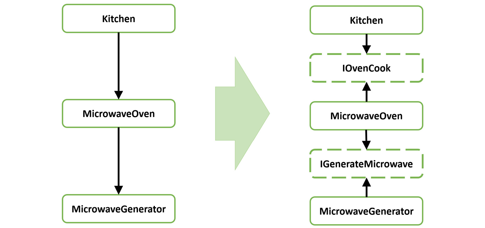
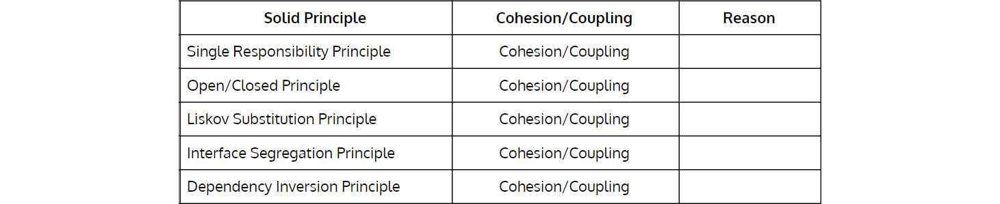
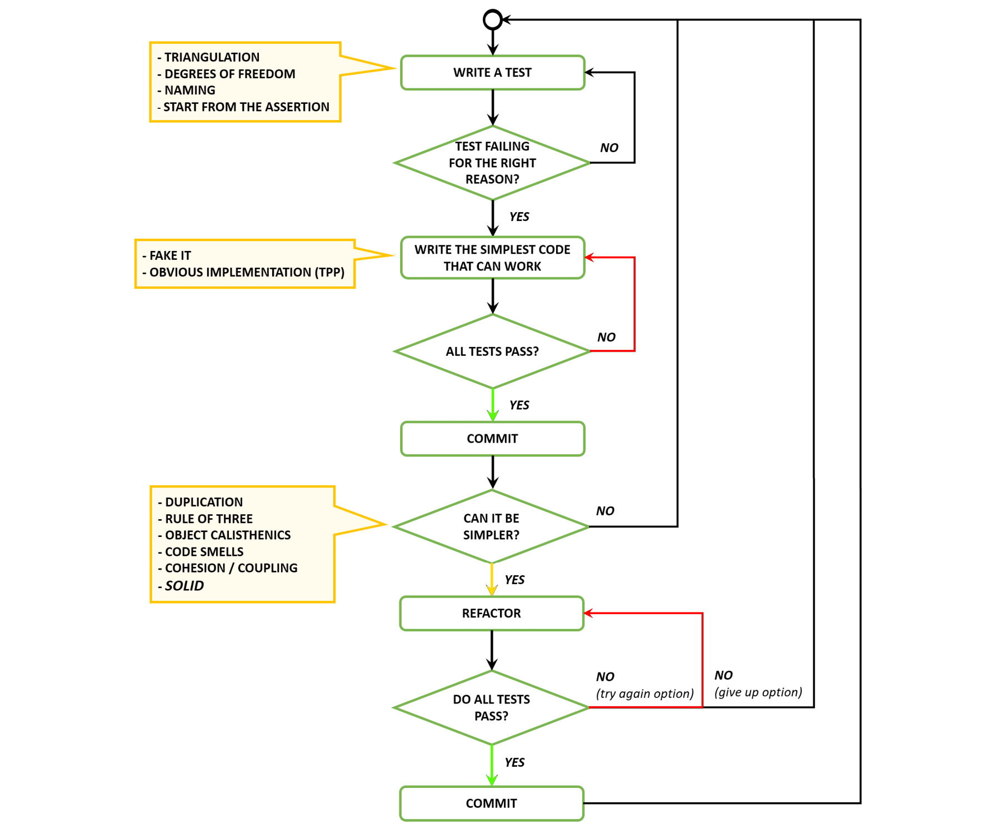
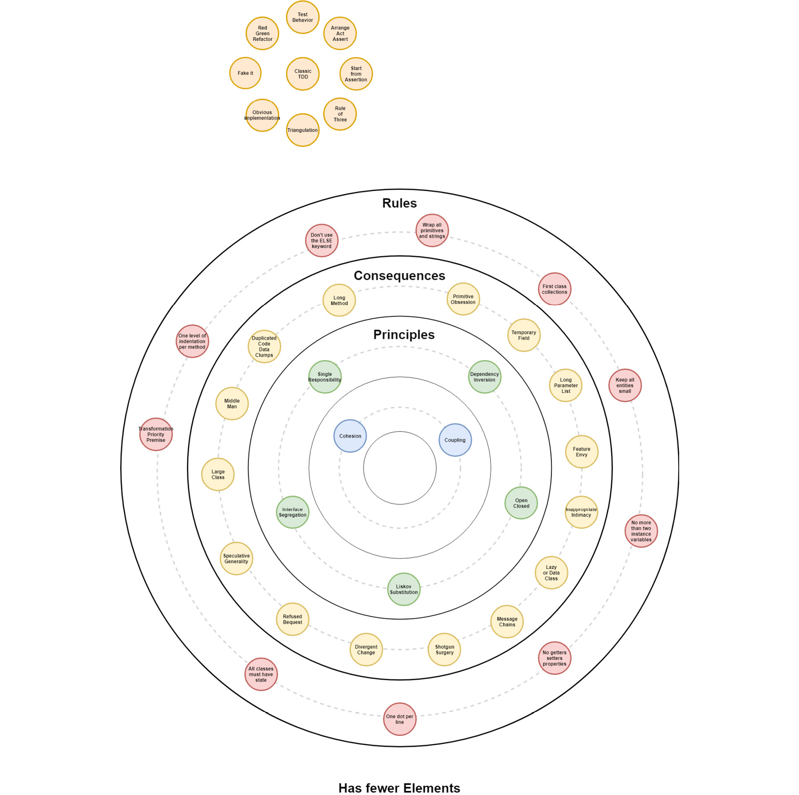

# 设计 VI – 坚实的原则 ++
> “一切都应该尽可能简单，但不能更简单。”
>
> – 一般归功于阿尔伯特·爱因斯坦

## 单一职责原则
在面向对象编程中，单一职责原则 (SRP) 规定每个对象都应该具有单一职责，并且该职责应该完全由类封装。它的所有服务都应该严格地与该职责保持一致。

该术语由罗伯特·C·马丁 (Robert C. Martin) 引入。 Martin 将其描述为基于内聚原则，正如 Tom DeMarco 在他的《结构化分析和系统规范》一书中所描述的那样。内聚力是衡量模块内部元素关联强度的指标。一个高度内聚的模块是一组语句和数据项的集合，它们应该被视为一个整体，因为它们是如此密切相关。任何将它们分开的尝试只会导致耦合增加和可读性降低。

格伦范德堡说：

*“这也是为什么我们将合理的推理称为连贯的原因。例如，思想契合，它们融合在一起，它们相互关联。这正是使其连贯的类的特征：所有部分似乎是相关的，它们似乎属于一起，将它们分开会感觉有些不自然[......]。这样的类表现出内聚。”*

把那些因相同原因而改变的东西聚集在一起，把那些因不同原因而改变的东西分开。这是 SRP 的另一个方面。简而言之，它表示一个子系统、模块、类，甚至一个函数不应该有多个改变的理由。 Peter H. Salus 总结了 UNIX 哲学的一部分，他写道：“编写只做一件事并且做得很好的程序。编写一起工作的程序。”

> 笔记
>
> Salus 在他的 A Quarter-Century of Unix (1994) 一书中总结了 Doug McIllroy 在 Bell System Technical Journal (1978) 中记录的 Unix 哲学。

让我们看一个简单的例子并考虑以下代码：

```c#
public class Car{
    public int CurrentMileage(){...}
    public void TravelTo(Location location){...}
    public void Save(){...}
}
```

在这个 Car 课上你有没有发现什么奇怪的地方？

我们可以清楚地看到 CurrentMileage 和 TravelTo 方法是相关联的，并且一起变化。

保存方法呢？这种方法显然与其他两种方法无关，作用于不同的抽象层次。 save 动作泄露了与持久层协作的意图——与旅行和显示当前里程完全不同的职责。在这里，甚至无需查看这三个方法的实现，我们就可以预测该类至少有两个职责；因此，它违反了 SRP。

SRP 的一个很好的启发是我们能够在不使用 and 或 or 的情况下描述一个类的作用。

## 开闭原则

> “原则上说一个好的模块结构要么是开放的，要么是封闭的。封闭的，因为客户需要模块的服务来进行自己的开发，一旦他们确定了模块的一个版本，就不应该受到引入的影响他们不需要的新服务。开放，因为不能保证我们会从一开始就包含对某些客户可能有用的每项服务。”
>
> – Bertrand Meyer，面向对象的软件构建

相对于 X 关闭意味着如果 X 更改，客户端不会受到影响。马丁福勒指出：

> 笔记
>
> 发布接口是一个术语，我用 [...] 指代在定义它的代码库之外使用的类接口。发布和公共之间的区别实际上比公共和私有之间的区别更重要。原因是，对于未发布的接口，你可以更改它并更新调用代码，因为它都在一个代码库中。 [...] 但是任何发布的内容都需要更复杂的处理，因此你无法访问调用代码。
>
> http://martinfowler.com/bliki/PublishedInterface.html。

理想情况下，我们应该识别预测变化的点并在它们周围创建一个稳定的界面。问题是，如果我们预测的变化比实际需要的多，我们就会浪费精力在对错误的抽象进行过度设计上。但是，如果我们无法识别常见行为模式的变化，我们通常最终会进行大量破坏性更改，并且很可能会引入代码异味，例如 Shotgun Surgery 或 Divergent Change。

同样在这里，错误抽象规则是有效的，所以我们发现在重构为开/闭原则之前使用三原则是一个好主意。如果我们正在构建一个全新的系统并且我们不确定预测变化，情况尤其如此。当三个组件显示一种行为模式时，通常更容易构建正确的抽象。

正确实施开放/封闭原则的一大优势是，未来新功能的开发将比以前更快地实现。这通常是通过识别常见行为并将其建模为更高的抽象层来实现的。为了引入新的行为，只需实现一个新的具体组件即可插入。

公共行为的责任被推到了它自己的组件（一个接口或一个抽象类）上，把执行它们特定任务的唯一责任留给了具体的奇点。如果我们以这种方式仔细观察开放/封闭原则，我们可以将其视为在更高抽象级别上应用单一责任原则的特例。最终解决方案通常显示更少的代码和更少的重复，并具有最佳的代码重用水平。

插件能力创建了一个足够灵活的系统，允许你扩展它而不会太通用。你不需要它（YAGNI）的概念和插件能力之间应该有一个平衡；他们是对立的力量。 YAGNI 告诉你有足够的代码来表达所需的行为； plugin-ability 告诉你你需要有扩展点来允许新功能而不需要太多代码更改。

这些力之间的平衡就是拐点。拐点定义了我们在给定时刻对所需类型的灵活性进行的最大投资额。超过这一点，投资就不值得了。

“我会告诉你问题是什么，伙计，”Majikthise 说，“分界，这就是问题所在！

[…]

“没错，”Vroomfondel 喊道，“我们要求严格定义的怀疑和不确定领域！

——道格拉斯·亚当斯，银河系漫游指南

让我们看一个使用我们心爱的 Car 域的简单示例：

```c#
public class CarEngineStatusReportController{
    public View DisplayEngineStatusReport(){
        var webView = new CarEngineWebView();
        webView.FillWith(carEngineViewModel);
        return webView;
    }
    public View PrintEngineStatusReport(){
        var printView = new CarEnginePrintView();
        printView.FillWith(carEngineViewModel);
        return printView;
    }
}
```

例如，如果我们必须添加另一种方式在替代显示器上可视化引擎状态报告以增强访问能力，会发生什么？显而易见的方法是添加这样的方法：

```c#
public View AlternativeDisplayEngineStatusReport(){
    var webView = new EnhancedAccessCarEngineWebView();
    webView.FillWith(carEngineViewModel);
    return printView;
}
```

每次我们添加新视图时，我们都必须修改控制器，添加更多代码。因此，此控制器不会关闭以进行修改。此外，由于控制器是为每个请求创建和销毁的，因此它每次使用的方法不会超过一种。我们绝对可以做得更好。

让我们看看如果我们识别和提取变化点会发生什么，在控制器中只留下常见的抽象行为：

```c#
public class CarEngineStatusReportController{
    IDisplayEngineStatusReport _carEngineView;
    public CarEngineStatusReport(IDisplayEngineStatusReport carEngineView){
        _carEngineView = carEngineView;
    }
    public View EngineStatusReport(){
        _carEngineView.FillWith(carEngineViewModel);
        return _carEngineView;
    }
}
```

在这里，IDsiplayEngineStatusReport 类似于：

```c#
public interface IDisplayEngineStatusReport {
	void FillWith(CarEngineViewModel viewModel);
}
```

我们现在需要三个具体的实现：

```c#
public class CarEngineWebView : IDisplayEngineStatusReport{
    void FillWith(CarEngineViewModel viewModel) {
        ...
    }
}
public class CarEnginePrintView : IDisplayEngineStatusReport{
    void FillWith(CarEngineViewModel viewModel) {
        ...
    }
}
public class EnhancedAccessCarEngineWebView : IDisplayEngineStatusReport{
    void FillWith(CarEngineViewModel viewModel) {
        ...
    }
}
```

这里的技巧是通过在创建控制器时传递正确的视图实例来实现的。

我们现在可以继续添加更多视图；这只是创建 IDisplayEngineStatusReport 的更具体实现的问题，确保它们在用例中正确插入。这就是为什么这个解决方案可以扩展的原因。此外，我们可以看到我们将不再需要修改 CarEngineStatusReportController 来添加新视图。这就是为什么我们可以说它已关闭以进行修改。

## 里氏替换原则
> “类型层次结构由子类型和超类型组成。子类型的直观想法是其对象提供另一种类型（超类型）对象的所有行为以及额外的东西。这里想要的是类似于以下替换性质：如果对于每个 S 类型的对象 o1 都有一个 T 类型的对象 o2 使得对于所有用 T 定义的程序 P，当 o1 替换 o2 时 P 的行为不变，则 S 是 T 的子类型.”
>
> – Barbara Liskov，数据抽象和层次结构

如果你不明白这一点，请不要担心。我们也不行！相反，让我们从一个不那么学术的、纯粹的凡人的角度来看它。

简单来说，Liskov 替换原则 (LSP) 说派生类应该遵守基类做出的承诺。这也适用于接口，这意味着实现某个接口的类应该遵守该接口做出的承诺。

对于一个类来说，它应该遵守基类的承诺是什么意思？关于 LSP 的一切都与类的行为有关。因此，面向对象编程（OOP）中的 is-a 关系必须从暴露的行为的角度来看，而不是从内部结构或抽象含义的角度来看。

想象一下，按照 Bertrand Meyer 的契约设计中的解释，通过它们的不变量、前置条件和后置条件来描述类。在合同设计方面遵循LSP，这意味着：

- 先决条件再严格不过了。
- 后置条件的限制不能更少。
- 必须保留不变量。

> 笔记
>
> 维基百科，合同设计：https://en.wikipedia.org/wiki/Design_by_contract。

表述这一原则的另一种方式是说子类应该是被重写方法输入类型的逆变器和被重写方法输出类型的协变，或者，派生类应该对输入的限制更少或同等，而对被重写的输出的限制应该更多或同等。方法。 （迈克詹姆斯，协方差和逆变——一个简单的指南）https://www.i-programmer.info/programming/theory/1632-covariance-and-contravariance-a-simple-guide.html。

请记住，异常可以是隐藏的返回值；相同的一致性规则仍然适用。不要从派生类抛出与基类抛出的异常不同类型或子类型的异常。还记得 Refused Bequest 代码的味道吗？继承是一种独一无二的关系，其中子类是基类的特化；他们不会改变行为——而是让行为变得更具体。

一个很好的例子是著名的矩形和方形。在这种情况下，当我们从 Rectangle 继承 Square 时，我们创建了一个更严格的前提条件；更改一个大小会将另一个大小设置为相同的值，但这在基类 Rectangle 上没有发生。

验证你的类是否遵循 LSP 的一个简单测试是将其基类型替换为子类；如果程序的含义没有改变，那么你就是在遵循 LSP。

一个常见的错误是从类型继承以访问其状态或公开其某些行为。起初这似乎是一个合理的想法，因为它是一种重用代码的方式。这种方法的问题在于它倾向于忽略 OOP 中继承所隐含的 is-a 关系的含义。

让我们考虑一下需要公开一些与 Money 相关的行为的 Person 类，因此继承自 Wallet 类型。如果我们允许 Person 从 Wallet 继承，Person 就可以访问 Wallet 公开的行为。

问题在于，从语义上讲，我们声明 Person 是钱包，并且在我们程序的任何地方，我们都可以使用一个来代替另一个，而不会改变我们软件的含义。这就是为什么通常说这种方法更倾向于组合而不是继承的原因。

组合表达了 has a 的概念，更适合这个例子。说一个人有一个钱包肯定比一个人是一个钱包更有意义。因此，在考虑 OOP 中的继承时，请记住继承表示的是 is-a 关系，子类型细化了基类型的行为，但保持了含义。

在下面的示例中，我们打破了 Chef 类的 Cook 方法中的 LSP，因为在不改变 Oven 为 Chef 实现的含义的情况下，你无法将 Oven 替换为其任何子项。

```c#
public class Oven {
    void Cook()
}
public class Microwave : Oven{
    void CookMicorwaving(){...}
    // If you replace Oven with Microwave and call Cook
    // it will change the meaning because this method
    // is throwing an exception, as a Microwave in this context
    // IS NOT an Oven
    void Cook(){throw ...}
}
class GrillOven : Oven{
    void CookGrilling(){...}
}
class FanOven : Oven{
    void CookHeating(){...}
}
public class Chef {
    public void Cook(Oven oven){
        switch(oven)
            case Microwave m:
        m.CookMicorwaving();
        case GrilOven g:
        g.CookGrilling();
        case FanOven f:
        f.CookHeating();
        default o:
        o.Cook();
    }
}
```

## 接口隔离原则
接口隔离原则 (ISP) 规定，不应强迫客户端依赖它们不使用的接口。 ISP 的目标是通过将软件拆分为多个按功能分组的较小的独立部分来减少系统中所需的副作用和更改量。

> 笔记
>
> Robert C. Martin，接口隔离原则，工程笔记本，C++ 报告，1996 年 11 月至 12 月。

依赖应该在接口上，整个接口上，除了接口什么都没有。例如，我们将合理的推理路线称为连贯的。思想契合，它们融合在一起，它们相互关联。这正是界面的特性，使其具有连贯性；这些碎片似乎都是相关的，它们似乎属于一个整体，将它们分开会感觉有些不自然。这样的界面表现出内聚。

让我们看一个例子：

```c#
public class Car : IAmACar{
    ...
}
public interface IAmACar{
    void GoTo(Location location);
    void RefillGasoline(int gallons);
    int CurrentMileage();
}
```

这看起来非常好。

现在，让我们假设一种新型汽车即将问世。这辆车不用汽油；这是一辆电动汽车。如果我们只是将它添加到当前界面会发生什么，像这样：

```c#
public interface IAmACar{
    void GoTo(Location location);
    void RefillGasoline(int gallons);
    void RefillElectricity(decimal kiloWatts);
    int CurrentMileage();
}
```

这样，我们刚刚破解了 ISP，这就是为什么我们现在有拒绝遗赠代码气味的原因。由于这两种 refill 方法在用法上是相互排斥的，我们现在的接口总是不适合代表真正的汽车类别。两者之一总是必须通过 throw new NotImplementedException(); 来实现。一点都不好看。

我们应该如何处理这个问题呢？好吧，通过隔离接口！

```c#
public interface IAmACar{
    void GoTo(Location location);
    int CurrentMileage();
}
public interface IUseGasoline : IAmACar{
    void RefillGasoline(int gallons);
}
public interface IUseElectricity : IAmACar{
    void RefillElectricity(decimal kiloWatts);
}
```

现在我们可以让汽车正确地接受汽油或电力，而无需未实施的方法。接口正确地映射了真实的功能，并正确地继承了基本接口的通用行为。

## 依赖倒置原则

在面向对象的编程中，依赖倒置原则是指一种特定的解耦形式，将常规的依赖关系从高层的策略设置模块到低层的依赖模块进行倒置，目的是使高层模块独立低级模块实现细节。

为了实现这一点，你需要引入一种抽象，将高级和低级模块彼此解耦。所以：

高级模块不应该依赖于低级模块。两者都应该依赖于抽象。
抽象不应该依赖于细节。细节应该取决于抽象。
因此，高级和低级模块都依赖于抽象。正如你可能从其名称中所期望的那样，设计原则并不仅仅改变了依赖关系的方向。它通过在高级模块和低级模块之间引入抽象来拆分高级模块和低级模块之间的依赖关系。所以，最后，你会得到两个依赖项：

- 高层模块依赖于抽象。
- 低级依赖于相同的抽象。

让我们看一个简单的例子：

```c#
public class Kitchen{
    private Microwave _oven;
    public Kitchen(){
        _oven = new MicrowaveOven();
    }
    ...
}
public class MicrowaveOven{
    private MicrowaveGenerator _heater;
    public Microwave(){
        _heater = new MicrowaveGenerator();
    }
    ...
}
public class MicrowaveGenerator{
    ...
}
```

这是正常依赖层次结构的外观：

- Kitchen 类依赖于 MicrowaveOven 类。
- MicrowaveOven 类依赖于 MicrowaveGenerator 加热器组件。

在下图中，我们有一个从 Kitchen 到 MicrowaveOven 以及从 MicrowaveOven 到 MicrowaveGenerator 的依赖箭头。

让我们看看当我们应用这个原则时会发生什么：

```c#
public interface IOvenCook{ ... }
public interface IGenerateMicrowaves{ ... }
public class Kitchen{
    private IOvenCook _oven;
    public Kitchen(IOvenCook oven){
        _oven = oven;
    }
    ...
}
public class MicrowaveOven : IOvenCook{
    private IGenerateMicrowaves _heater;
    public Microwave(IGenerateMicrowaves heater){
        _heater = heater;
    }
    ...
}
public class MicrowaveGenerator : IGenerateMicrowaves{
    ...
}
```

为了应用该原则，我们以接口的形式引入了抽象层。它们充当依赖关系的催化剂，吸引依赖关系图中箭头的方向。

下图显示了依赖流如何通过这种简单的调整而发生变化。



## 平衡抽象原则

Sandro Mancuso 在他的博客中将平衡抽象原则定义如下：

平衡抽象原则定义了由更高级别构造分组的所有代码构造应处于同一抽象级别。这意味着：

- 一个方法中的所有指令都应该处于同一抽象级别。
- 一个类中的所有公共方法都应该处于同一抽象级别。
- 所有类都应该在包/命名空间内。
- 所有同级包/命名空间都应该在父包/命名空间内。

Sandro Mancuso，平衡抽象原则，https://codurance.com/2015/01/27/balanced-abstraction-principle/。

让我们看看它与前面的一个例子有何关系。在以下代码段中，Save 方法不在同一抽象级别：

```c#
public class Car{
    public int CurrentMileage(){...}
    public void TravelTo(Location location){...}
    public void Save(){...}
}
```

Save 方法意味着将与外部持久性机制进行一些协作，而其他方法则意味着处理与 Car 类相关的业务逻辑。这显然是两个不同的抽象层。这是一个违反平衡抽象原则也违反 SRP 的例子。

让我们看一个应用于符合 SRP 但不符合平衡抽象原则的方法的原理示例：

```c#
public class LeapYear{
    public bool IsLeapYear(int year){
        if((year % 4 == 0) && !year.IsMultipleOf(100))
        {
            ...
        }
        ...
    }
}
```

在 IsLeapYear 方法中，year % 4 == 0 与 year.IsMultipleOf(100) 不在同一抽象级别。一个更好的实现，在解决问题的同时保持抽象的平衡水平和提高清晰度，可能是以下几点：

```c#
public class LeapYear{
    public bool IsLeapYear(int year){
        if(year.IsMultipleOf(4) && !year.IsMultipleOf(100))
        {
            ...
        }
        ...
    }
}
```

## 最小惊讶原则
最小惊讶原则（也称为 WTF 原则）指出“人是系统的一部分。设计应该与用户的体验、期望和心理模型相匹配。”

> 笔记
>
> 维基百科，最小惊讶原则：https://en.wikipedia.org/wiki/Principle_of_least_astonishment。

最不令人惊讶的行为的选择取决于预期的受众，因此取决于上下文。

我们是软件开发人员，所以原则是我们不应该用与结构内部行为不一致的名称误导将来处理代码的开发人员。

例如：

```c#
int Multiply(int a, int b)
{
    return a + b;
}
int SaveFile(string filename, string text)
{
    Console.WriteLine(text);
}
public class SomethingFactory {
    //returning void???? for a factory????
    public void DoSomething()
    {
        //write on Database
    }
}
```

## Kata

连接内聚/耦合和 SOLID 原则

对于 Cohesion/Coupling 列中的每一行，突出显示正确的概念，然后在 Reason 列中添加一个原因。我们创建了一些你可以使用的示例原因。在某些情况下，耦合和内聚都适用：



> 笔记
>
> 有关答案，请参阅第 389 页的附录部分。

Reason 列的一些想法如下：

- 一致性/使用
- 改变
- 继承树级别

## 何时重构（针对 SOLID 原则进行了扩展）

在这些情况下重构：

- 当我们在代码中发现重复时；即，DRY 违规。 （不要忘记三定律。）
- 当我们打破任何物体的健美操规则时。
- 当我们的代码出现代码异味时。
- 当代码具有低内聚或高耦合时。
- 当我们的代码不遵循 SOLID 原则时。

## 经典 TDD 流程



## 大图



## 我应该什么时候进入下一课？

- 当你了解 SOLID 原则的含义时
- 当你了解内聚、耦合、代码异味和 SOLID 原则之间的联系时

## 资源
### 网络

- 亚型的行为概念，Barbara H. Liskov 和 Jeannette M. Wing：https://www.cs.cmu.edu/~wing/publications/LiskovWing94.pdf。
- 内聚，格伦范德堡：https://vanderburg.org/blog/2011/01/31/cohesion.html。
- 协方差和逆变——一个简单的指南，迈克詹姆斯：https://www.i-programmer.info/programming/theory/1632-covariance-and-contravariance-a-simple-guide.html。
- 数据抽象和层次结构，Barbara Liskov：https://dl.acm.org/citation.cfm?doid=62138.62141。
- 合同设计，维基百科：https://en.wikipedia.org/wiki/Design_by_contract。
- 拐点，桑德罗·曼库索：https://codurance.com/2015/06/17/inflection-point/。
- SOLID 解构幻灯片：http://yowconference.com.au/slides/yow2013/Henney-SOLIDDeconstruction.pdf。
- SOLID 设计原则解释——依赖倒置原则和代码示例，Thorben Janssen：https://stackify.com/dependency-inversion-principle/。

### 图书

- 整洁代码：敏捷软件工艺手册，Robert C. Martin：https://www.goodreads.com/book/show/3735293-clean-code。
- 面向对象的软件构建，Bertrand Meyer：https://www.goodreads.com/book/show/946106.Object_Oriented_Software_Construction。
- 结构化分析和系统规范，Tom DeMarco：https://www.goodreads.com/book/show/123719.Structured_Analysis_and_System_Specification。