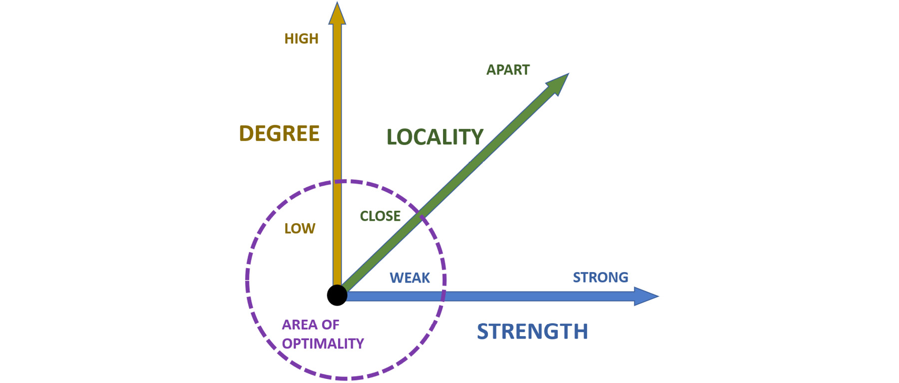
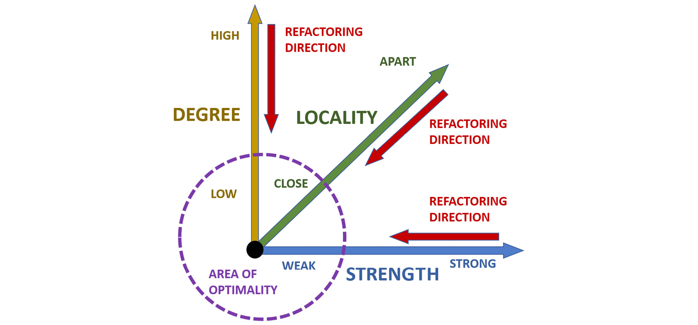
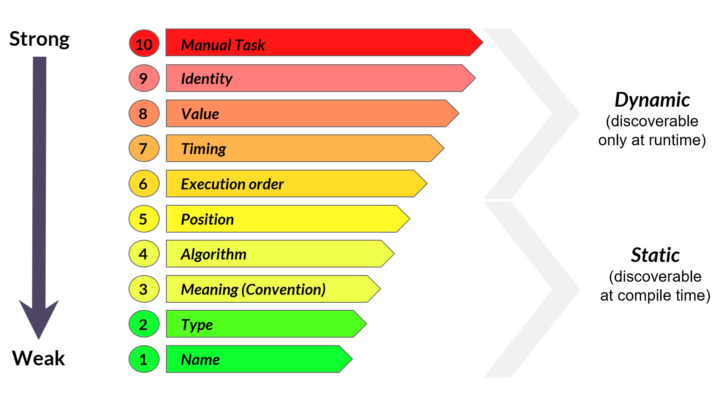
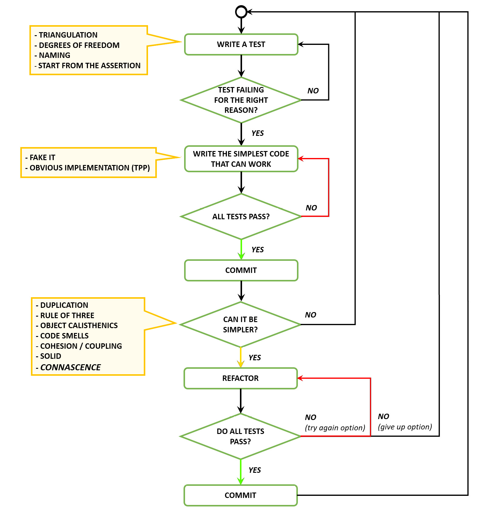
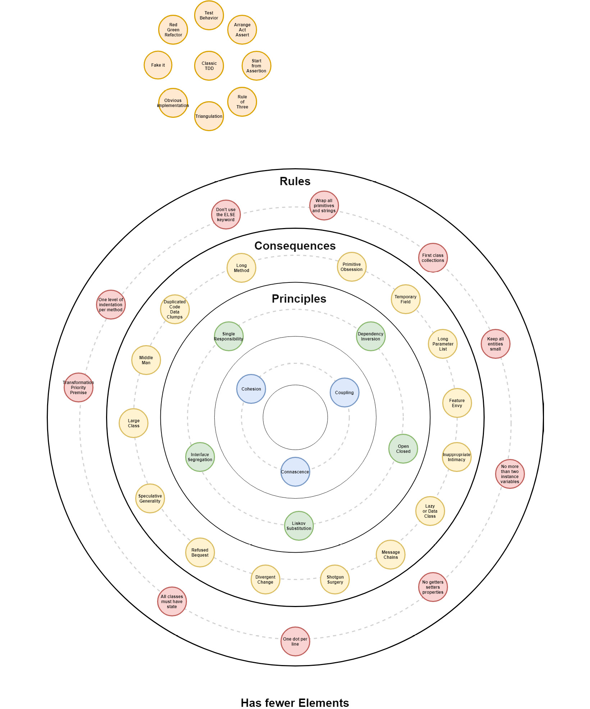

# 设计七 – 初心
> 伟大的事情是由一系列小事情聚集在一起完成的。
>
> 文森特 - 梵高

## 定义
connascence 一词源自拉丁语：co + nascence。

“co”的意思是在一起，“nascence”来源于nascentem，意思是年轻的、不成熟的。出生是 nasci 的现在分词，因此定义如下：

> 笔记
>
> 两个或多个事物同时诞生和成长。
>
> 在软件开发中，如果一个元素的更改也需要更改，我们可以说两个或多个元素（字段、方法、类、参数、变量，还有构建步骤、任何类型的过程等）是一致的在其他人中，以便系统保持正常工作。
>
> Connascence 概括了内聚和耦合的概念，使用适当的分类法将它们组合成更详尽的分类。 2009 年，Jim Weirich 在一次会议上的一次精彩演讲中，将 connascence 定义为软件开发的大统一理论，因为它在信息系统的分析和改进中具有广泛的适用性。

> 笔记
>
> James Nolan Weirich（1956 年 11 月 18 日 – 2014 年 2 月 19 日）作为开发人员、演讲者、教师和 Ruby 编程语言社区的贡献者，在软件行业享有盛誉。他的演讲是本课的主要灵感来源。谢谢，詹姆斯！
>
> Connascence 为系统中的多个级别的封装提供了论据，通常称为信息隐藏。

- 一级封装是指通过将代码行组合成一个方法所获得的封装，它通过方法内聚和交互耦合来解决。
- 二级封装是指通过创建类，结合方法和字段实现的封装，通过类内聚和继承耦合来解决。

Connascence 作为内聚和耦合的概括，解决了级别 1 或级别 2 的封装。



## 维度

每一种意念都可以通过三个维度来衡量：程度、位置和强度。

### 程度

程度是根据发生次数和它影响的实体数量估计的影响大小。 connascence的可接受性与其程度密切相关：程度越高，需要修改时的痛苦就越大。我们应该以尽可能低的学位为目标。

### 地域性

局部性是受影响实体在抽象方面彼此之间的接近程度。越接近越好，越容易接受（导致内聚）。另一方面，彼此相距很远的实体的一致性通常表明设计或架构存在缺陷。我们应该尽量保持先天元素尽可能接近。如果你还记得迪米特定律，它的目的是限制方法调用的距离，从而作用于局部性。

### 强度

强度是先天需要补偿先天元素变化的可能性，以及进行这些变化的难度。初心的形式越强，重构关系中的元素就越困难，成本也越高。我们应该尽量只使用最弱的形式：



正如你可能已经注意到的那样，这些定义意味着存在不同类型的 connascence，因此让我们通过澄清示例更详细地了解它们。

## 名称和类型的一致性（CoN 和 CoT）

当我们从事软件开发时，connascence 的概念无处不在。每行代码都将其中的一些元素显示为程序的逻辑构建块。

要了解 connascence 的概念如何影响我们在代码中所做的事情，让我们看一个例子：

```c#
public class Time {
    int _hour;
    int _minute;
    int _second;
    public Time(int hour, int minute, int second){
        _hour = hour;
        _minute = minute;
        _second = second;
    }
    public string Display(){
        return _hour + ":" + _minute + ":" + _second + ":";
    }
}
```

我们可以看到我们代码的每一行都重复了两次或更多次。通过查看变量的名称及其类型，你可以发现多少个 connascence 实例？

- \_hour、\_minute 和 \_second 字段的名称一致性（每个字段三个出现）。
- 小时、分钟和秒参数的名称（每个出现两次）。
- 小时、分钟和秒参数以及相应字段 _hour、_minute 和 _second（每个出现两次）的类型的一致性。

这些是很好的意志类型，应该是我们在系统中找到的唯一类型。我们将看到，其他类型的静态意识总是可以简化为这种形式。

如果该代码片段中的元素只出现一次，它们将毫无用处：它们在代码中的重复出现使数据成为一些用于转换信息并使其流动的逻辑结构的一部分。这个概念代表了软件开发的构建块，优化它会带来更好的设计、更简单的代码和最小的浪费。

我们能在那个例子中找到其他类型的 connascence 吗？还有另外两个——不是很好的那种：

- 小时、分钟和秒参数的定位。
- 小时、分钟和秒参数的值的一致性。

正如你在下图中所看到的，最后两种 connascence 得分在我们的弱到强列表的顶部。在接下来的部分中，我们将解释原因。



## 地位的执着

当多个组件必须相邻或必须以特定顺序出现时，通常会在位置结构（例如数组或元组）中传递时，会发生位置一致性 (CoP)。它是最强大的静态意识形式，必须小心避免，尤其是对于更高的度数。

让我们看一个例子：

```c#
public class NotificationSystem {
    public void SendEmail(string recipient, string sender, string message) {
        Email email = new Email();
        email.To(recipient);
        email.From(sender);
        email.Body(message);
        _smtpService.SendEmail(email);
    }
}
_notificationSystem.SendEmail("recipient@email.com", "sender@email.com", "text");
```

在这里，位置的重要性是关于 SendEmail 方法参数的顺序，因为我们必须确保我们以确切的顺序传递这些参数，否则我们的消息将无法到达它应该去的地方，这可能是灾难性的。

这个例子对于 Ruby 或 C# 等语言很容易解决，因为当我们调用方法时，我们可以使用命名参数构造来解耦参数的顺序。

在其他语言中，我们发现使用表示参数含义的自定义类型是一种有效的解决方法：

```c#
public class NotificationSystem {
    public void SendEmail(Recipient recipient, Sender sender, Message message) {
        Email email = new Email();
        email.To(recipient.Address);
        email.From(sender.Address);
        email.Body(message.Body);
        _smtpService.SendEmail(email);
    }
}
public class Recipient {
    public Address => _address;
    private string _address;
    public Recipient(string address){
        _address = address;
    }
}
public class Sender {
    public Address => _address;
    private string _address;
    public Sender(string address){
        _address = address;
    }
}
public class Message {
    public Body => _body;
    private string _body;
    public Message(string body){
        _body = body;
    }
}
_notificationSystem.SendEmail(
    new Recipient("recipient@email.com"),
    new Sender("sender@email.com"),
    new Message("notification text"));
```

我们走了 - CoP 已被移除并替换为较弱的 CoT。

你是否注意到此示例中与代码异味相关的其他内容？ CoP 通常与 Primitive Obsession 代码气味有关。这正是我们在这里清理的内容；我们现在不再使用字符串来表达接收者、发送者和消息的概念，而是使用更具表现力的结构来表示它们。

解决类似情况的另一种方法是使用自定义类型来封装传入此方法的信息。该解决方案的优点是减少了整体耦合方法，并且符合第 11 课，内聚和耦合中提到的方法耦合前提：

```c#
public class NotificationSystem {
    public void SendEmail(Notification notification) {
        Email email = new Email();
        email.To(notification.Recipient);
        email.From(notification.Sender);
        email.Body(notification.Message);
        _smtpService.SendEmail(email);
    }
}
```

我们已经解决了 NotificationSystem 类上的 Connascence，但是新的 Notification 类呢？本质上，我们现在只是将问题推给了合作者。我们如何在没有相同类型的 connascence 的情况下构建通知？在这种情况下，构建器模式的简化版本可能会有所帮助：

```c#
public class Notification {
    public string Recipient => _recipient;
    public string Sender => _sender;
    public string Message => _message;
    private string _recipient;
    private string _sender;
    private string _message;
    public Notification To(string recipient){
        _recipient = recipient;
        return this;
    }
    public Notification From(string sender){
        _sender = sender;
        return this;
    }
    public Notification WithMessage(string message){
        _message = message;
        return this;
    }
}
_notificationSystem.SendEmail(
    new Notification()
    .To("recipient@email.com")
    .From("sender@email.com")
    .WithMessage("notification text"));
```

当在消息传递中使用位置结构时，会发生位置一致性的另一个常见示例（鉴于代码表达能力的立即下降，它更容易识别）。

让我们看看这个例子：

```c#
public class OrderProcessor {
    public void ProcessOrder(Tuple<Order, bool> orderInfo)
    {
        ProcessOrder(order.Item1);
        if (order.Item2)
            SendInvoice(order.Item1);
    }
    public void ProcessOrder(Tuple<Order, bool, int, datetime, string, bool> orderInfo)
    {
        ProcessOrder(order.Item1);
        if (order.Item2)
            SendInvoice(order.Item1);
        NotifyEmployee(orderInfo.Item1,orderInfo.Item3,orderInfo.Item4,orderInfo.Item5);
    }
}
```

在定义方法时，这里的元组结构显然允许灵活性。但是当另一个类必须调用这个方法时会发生什么？让我们来看看：

```c#
_orderProcessor.ProcessOrder(new Tuple(order, true));
_orderProcessor.ProcessOrder(new Tuple(order, true, 12345, DateTime.UtcNow, "Jack", false));
```

如果我们从 Order Processor 类内部的角度来看这一点，使用元组似乎不是一个坏主意。但是，当我们走出课堂尝试使用该方法时，问题就变得明显了。

第一个调用显示了 2 级的 CoP，而第二个是 6 级。很容易看到这两个调用的表现力逐渐减弱。在度 2 调用中，我们已经完全失去了第二个布尔值的含义，即使我们稍微努力也可以解决它（但无论如何它并不好）。

第二个电话呢？对于 6 级 CoP，我们只剩下一系列明显任意的信息需要传入，这使得猜测正确用法绝对是一场噩梦！

好消息是，通过快速重构很容易回到正轨；我们可以引入一个消息传递类，重写调用方法如下：

```c#
public class InvoiceableOrder{
    Order Order;
    bool IsInvoiceable;
}
public void ProcessOrders(InvoiceableOrder invoiceableOrder){
    ProcessOrder(invoiceableOrder.order);
    if(invoiceableOrder.IsInvoiceable)
        SendInvoice(invoiceableOrder.order);
}
```

## 价值意识 (CoV)

当两个或多个组件的值相关或在其输入中具有内在有效性范围而不是由其原始类型表达时，就会发生价值重生 (CoV)。

让我们考虑最初的例子：

```c#
public class Time {
    int _hour;
    int _minute;
    int _second;
    public Time(int hour, int minute, int second){
        _hour = hour;
        _minute = minute;
        _second = second;
    }
    public string Display(){
        return _hour + ":" + _minute + ":" + _second + ":";
    }
}
```

如果我们像这样实例化它会发生什么：

```c#
var myTime = new Time (27, 76, 82);
```

这显然不是一个有效的时间。依靠用户对时间概念的了解是否明智？为了改进我们的设计，我们可以做的最好的事情是通过使无效状态不可表示来尝试消除它。

如果我们做这样的事情会怎样：

```c#
public enum Hour {
    Midnight = 0,
    OneAm = 1,
    TwoAm = 2,
    ThreeAm = 3,
    FourAm = 4,
    FiveAm = 5,
    ...
        TenPm = 22,
    ElevenPm = 23
}
public class Time {
    Hour _hour;
    int _minute;
    int _second;
    public Time(Hour hour, int minute, int second){
        _hour = hour;
        _minute = minute;
        _second = second;
    }
    public string Display(){
        return _hour + ":" + _minute + ":" + _second + ":";
    }
}
```

我们可以看到，现在我们的参数采用了一个名为 Hour 的枚举，基本上不可能错误地传递一些东西。然而，由此产生的枚举变得很长，在这种情况下感觉有点矫枉过正。分秒呢？那些会更长。

在这条道路上的前面显然取决于在其上下文中如何使用该类。如果将有很多手动实例化，则可能值得这样做。 （记住，打字不是瓶颈！）否则，对于这种形式的执着，有一个最小可行的解决方案。

CoV 的真正问题在于它只能在运行时被发现，因此我们应该尽量减少负反馈的响应时间并尽快验证输入。通过这种方式，当且仅当其状态有效时，我们才能确保该类参与信息流。

```c#
public class Time {
    int _hour;
    int _minute;
    int _second;
    public Time(int hour, int minute, int second){
        _hour = hour;
        _minute = minute;
        _second = second;
        Validate()
    }
    public string Display(){
        return _hour + ":" + _minute + ":" + _second + ":";
    }
    private void Validate(){
        if(_hour < 0 || _hour > 23)
            throw new InvalidHourException();
        if(_minute < 0 || _minute > 59)
            throw new InvalidMinuteException();
        if(_second < 0 || _second > 59)
            throw new InvalidSecondException();
    }
}
```

让我们看另一个 CoV 示例，其中验证的需要不是那么直观：

```c#
public class Triangle {
    int SideA;
    int SideB;
    int SideC;
    public Triangle(int sideA, int sideB, int sideC){
        SideA = sideA;
        SideB = sideB;
        SideC = sideC;
    }
}
```

边的值需要满足特定关系才能成为三角形，如图所示。所以，这里我们有同样的验证问题，验证也必须发生在构造函数中：


如何使无效状态不可表示？我们能做到吗？
稍微研究一下三角形的特性，我们就可以为我们的类创造另一种设计。让我们看看这个例子中的角度。我们可以使用它来使我们的构造函数不那么脆弱吗？


好吧，实际上很有趣的是，如果我们只有两条边及其连接角度的数据，我们就可以计算出第三条边！

所以一个替代类可能如下：

```c#
public Triangle(int sideA, int sideB, Angle x){
    SideA = sideA;
    SideB = sideB;
    SideC = CalculateSide(sideA, sideB, x);
}
```

我们仍然需要验证角度才能在我们的情况下有效，但我们删除了数据之间的关系。

鉴于角度有效，我们总是可以计算第三边。

## 意义的回归

当两个或多个组件必须就特定值的含义达成一致时，我们有含义的一致性 (CoM) 或约定，因此使用约定。这种执着不算强，但它特别烦人，因为它很常见，易于修复，并且在调试模式下会变得非常乏味。

假设我们正在编写一个简单的网页，用于调查人们如何工作。我们可能需要一个与此类似的复选框：

```html
<input type='checkbox' name='transport' value='1' />
I travel by bike <br />
<input type='checkbox' name='transport' value='2' />
I travel by car <br />
<input type='checkbox' name='transport' value='3' />
I travel by train <br />
<input type='checkbox' name='transport' value='4' />
I travel by bus <br />
```

在我们的控制器中，我们可能需要这样的东西：

```c#
private SetTransport(string transport){
    switch(transport){
        case "1":
            AddBike();
        case "2":
            AddCar();
        case "3":
            AddTrain();
        case "4":
            AddBus();
            break;
    }
}
```

假设我们已经部署了我们的网站，但我们注意到统计数据没有加起来。我们调试我们的控制器，我们看到传输是 3。这没有帮助。我们总是需要多一步（或记住映射）才能确定 3 的正确含义。

在这种情况下，仅使用文本值自行车、汽车、火车和公共汽车就可以避免此类问题。但是，如果我们真的需要保留整数，因为我们必须提供一个非常、非常、非常喜欢整数的遗留系统呢？我们注定了吗？

不。正如我们所说，修复很容易！我们可以只引入一些常量：

```c#
const string BIKE = "1";
const string CAR = "2";
const string TRAIN = "3";
const string BUS = "4";
<input type="checkbox" name="transport" value="<%= BIKE %>" />
    I travel by bike <br />
    <input type="checkbox" name="transport" value="<%= CAR %>" />
    I travel by car <br />
    <input type="checkbox" name="transport" value="<%= TRAIN %>" />
    I travel by train <br />
    <input type="checkbox" name="transport" value="<%= BUS %>" />
    I travel by bus <br />
    private SetTransport(string transport){
    switch(transport){
        case BIKE:
            AddBike();
            AddCar();
        case CAR:
        case TRAIN:
            AddTrain();
        case BUS:
            AddBus();
            break;
    }
}
```

我们走了。与往常一样，我们用更具表现力的 Name 和 Type Connascence 替换了 CoM。

## 算法的初心

当两个或多个组件必须就使用特定算法达成一致时，就会出现算法一致性 (CoA)。

或许这种 connascence 最流行的例子是用于文件验证的校验和；远程应用该算法可以提供文件未更改的数学证明。

不幸的是，如果我们在我们的代码中有这种执着，结果是没有用的。让我们看一个愚蠢的校验和实现的例子，它假设我们想用一个简单的逻辑来构建它，该逻辑包括在整数的末尾添加一个字符，以便单个数字的总和可以被 10 除：

```c#
AddChecksum("32143") => "321437"
Check("321437") => true
Check("321432") => false
```

让我们看看这个片段实现它：

```c#
public string AddChecksum(string inputData){
    var sum = SumCharsOf(inputData);
    var difference = sum % 10;
    return inputData + difference;
}
public bool Check(string inputData){
    var sum = SumCharsOf(inputData);
    return sum % 10 == 0;
}
```

你看有什么问题吗？如果在某个时候我们必须改变算法怎么办？会发生什么？那么，在这种情况下，我们将被迫修改这两种方法中的代码；一个由书本示例的发散更改代码气味。

这里的问题来自于我们的算法没有被封装到它的抽象层中；因此，它不能重复使用。例如，查看 sum % 10。这可能很简单，但在这种情况下，这就是我们的算法。它以两种不同的方法出现两次。它尊重 DRY 吗？不，它没有。这是 CoA 的经典示例。

这种执着一旦被确定，通常不难解决。诀窍只是将逻辑推入另一个可重用的结构中。如果算法足够复杂，这通常是一个类。在我们的示例中，一个方法就足够了（假设这是唯一的用法）：

```c#
public string AddChecksum(string inputData){
    return inputData + Checksum(inputData);
}
public bool Check(string inputData){
    return Checksum(inputData) == 0;
}
private int Checksum(string inputData){
    var sum = SumCharsOf(inputData);
    return sum % 10;
}
```

与往常一样，我们将其转换回 Name 的 connascence，以便在维护时间时处于更好的位置。你有没有注意到这么简单的东西如何帮助这个小代码的表现力这么多？想象一下，如果算法更加复杂。将重用的、复杂的逻辑封装在其自己的抽象级别背后总是一个好主意！

## 执行令的诞生

当组件的调用者必须对要调用的方法的正确顺序有一些未表达的知识时，就会发生执行顺序 (CoEO) 重生。它在命令式语言和最弱的 connascence 动态形式中很常见。然而，它可能会成为维护阶段的一个深重痛苦的根源，因为通常仅通过阅读代码来解决它是非常困难和耗时的。

让我们看一个应该发送和存档收据的类的简短示例：

```c#
public void SendReceipts(){
    var receiptSender = new ReceiptSender();
    var receiptId = NextUnsentReceiptId();
    while(receiptId != null){
        receiptSender.SendToCustomer(receiptId);
        receiptSender.Archive(receiptId);
        receiptId = NextUnsentReceiptID();
    }
}
```

如果在对 ReceiptSender 的调用中，我们反转订单并在具有相同receiptId 的 SendToCustomer 之前调用 Archive 方法，会发生什么情况？如果这会导致第二次调用失败，我们有 CoEO。

如果这是 ReceiptSender 类的唯一用法，我们显然在其行为中有一个泄漏的抽象。 Archive 方法旨在始终在 SendToCustomer 之后调用。那么为什么这两种方法都是公开的，而将错误的用法留给机会呢？到这里，一种方法应该就够了，正确的执行顺序隐藏在里面并强制执行。

然而，有时这种形式的自恋是存在的，因为我们的环境的性质。例如，想想建造者模式。构建器模式本质上是一种优雅的使用 CoEO 的方式，通过按照约定表达正确的用法；我们首先必须以某种方式设置构建器，然后调用 Build() 方法。

让我们看看这个小汽车制造商的例子：

```c#
public class CarBuilder : IBuildCars {
    public IBuildCars WithBrand(Brand brand){
        _brand = brand;
        return this;
    }
    public IBuildCars WithEngine(Engine engine){
        _engine = engine;
        return this;
    }
    public IBuildCars OfColor(Color color){
        _color = color;
        return this;
    }
    public Car Build(){
        return new Car(_brand, _engine, _color)
    }
}
The interface is as follows:

public interface IBuildCars {
    IBuildCars WithBrand(Brand brand);
    IBuildCars WithEngine(Engine brand);
    IBuildCars WithColor(Color brand);
    Car Build();
}
```

如果我们现在需要强制执行命令，并且出于某种原因必须按照特定顺序指定品牌、引擎和颜色，该怎么办？甚至可以没有执行命令的诞生吗？

在我们看来，一种非常优雅的方式是利用界面隔离。

让我们看看如何分解我们的接口：

```c#
public interface IBuildCarsWithBrand{
    IBuildCarsWithEngine WithBrand(Brand brand);
}
public interface IBuildCarsWithEngine{
    IBuildCarsWithColor WithEngine(Engine engine);
}
public interface IBuildCarsWithColor{
    IBuildCars WithColor(Color color);
}
public interface IBuildCars{
    Car Build();
}
```

现在，只需对我们的具体类稍作修改即可解决问题：

```c#
public class CarBuilder : IBuildCarsWithBrand, IBuildCarsWithEngine, IBuildCarsWithColor, IBuildCars {
    private CarBuilder(){}
    public static IBuildCarsWithBrand New(){
        return new CarBuilder();
    }
    public IBuildCarsWithEngine WithBrand(Brand brand){
        _brand = brand;
        return this;
    }
    public IBuildCarsWithColor WithEngine(Engine engine){
        _engine = engine;
        return this;
    }
    public IBuildCars WithColor(Color color){
        _color = color;
        return this;
    }
    public Car Build(){
        return new Car(_brand, _engine, _color)
    }
}
```

我们将构造函数设为私有，以便我们可以强制调用工厂方法以将具体实例化为 IBuildCarsWithBrand。这个接口现在只有 WithBrand 方法，所以它正确地强制序列的开始。此外，它这次返回具体为 IBuildCarsWithEngine，它返回 IBuildCarsWithColor。

以这种方式链接接口将准确地导致我们想要的序列。只有最后一个会返回 IBuildCars，最终可以调用 Build() 方法并返回具体的汽车。我们基本上使用链式接口来强制执行对具体类的方法的调用序列。

请注意，执行顺序的 Connascence 仍然存在，因为它是我们要求的一部分。然而，我们取得了一些非常有趣的成果；我们已经把它的位置完全推到了代码中！当我们让程序员去找出正确的执行顺序时，我们就会有危险的信息丢失。一个 connascent 元素变得无证（直到我们最终运行时失败）。

以这种方式使用接口隔离可以让我们表达正确的执行顺序，使预期的用法非常容易理解。还记得墨菲定律吗？任何可能出错的事情都会出错。

关于墨菲定律的起源，存在着如此多的归因和回忆，这是不可能确定的。

## 时机的把握

当两个或多个调用的成功取决于它们发生的时间时，就会发生时序一致性 (CoTm)。这个概念与 CoEO 没有太大区别，但在这里我们与调用执行的时间点有明确的关系，而不仅仅是之前或之后。

CoT 最经典的事件之一是多线程中的竞争条件。当你在代码中看到诸如 Wait、Sleep 或 Timeout 之类的内容后跟实际的任意显式时间跨度时，你会发现另一个示例。

CoTm 的问题在于我们通常无法控制时间，因此它显然有可能在系统中引入很大的脆弱性。间歇性问题通常最难识别和解决。这就是为什么我们认为在可能的情况下尽量避免像痘痘一样避免 CoTm 总是一个好主意。

然而，有时我们无法真正摆脱它。例如，想想服务总线的一些集成测试。我们总是在这样的异步测试中使用 CoTm。我们需要决定等待消息的任意时间，对吗？

让我们看一个例子，为了简单起见，假设我们的消息处理程序在收到消息后在内部对消息进行排队：

```c#
[TestFixture]
public class ServiceBusMessageHandler_Should{
    var messageHandler = new MessageHandler();
    [Test]
    public void ReceiveMessages(){
        var expectedMessage = new TestMessage();
        SendMessageToIntegrationTestBus(expectedMessage);
        Thread.Sleep(1000);
        var receivedMessage = messageHandler.ReadLastMessage();
        Assert.That(receivedMessage, Is.Equal(expectedMessage))
    }
}
```

在发送消息和读取消息之间，我们需要等待一些任意的时间。如果我们不等待，我们将在收到消息之前检查消息，并且我们的测试无法通过。这里的时机至关重要。我们无法逃避这一点。但是我们能不能做得更好？

好吧，如果我们记住时间就是金钱，我们就可以。

我们可以优化它，这样我们就不会总是依赖任意数量的它。让我们看看另一个片段：

```c#
[TestFixture]
public class ServiceBusMessageHandler_Should{
    var awaiter = new AutoResetEvent(false);
    var messageHandler = new MessageHandler();
    messageHandler.OnNewMessage += ()=>awaiter.Set();
    [Test]
    public void ReceiveMessages(){
        var expectedMessage = new TestMessage();
        SendMessageToIntegrationTestBus(expectedMessage);
        awaiter.WaitOne(1000);
        var receivedMessage = messageHandler.Read();
        Assert.That(receivedMessage, Is.Equal(message))
    }
}
```

这个实现有什么区别？我们在消息处理程序中使用了一个事件来通知外部世界有一条新消息已排队。假设没有人在生产中监听事件，对行为没有影响。

这对我们的测试有何影响？它为我们提供了在该事件上直接连接等待者的选项，以便当消息到达目的地时，我们知道我们可以出列它！只有当消息没有在一秒钟内传递时，行为才会完全相同，因为 awaiter.WaitOne(1000) 将触发超时并且测试将失败。在这里，我们已经有效地删除了 CoTm 以用于我们测试的快乐路径！

我们知道有些读者会争辩说我们实际上是为了测试而修改了我们的生产代码。显然，这是一种权衡，我们一直很欣赏这种批判性思维。但是，请考虑当且仅当有处理程序附加到事件时才会触发该事件——因此生产行为根本不会改变。

归根结底，是什么让它值得与我们在运行测试时节省的时间有关！如果有许多集成测试或延迟可能会有所不同（希望你经常运行它们），那么移除此 CoTm 的优势很快就会显现出来。

## 身份认同
当一个或多个组件必须准确引用另一个实体的一个特定实例才能正常工作时，我们就有了身份认同 (CoI)。

这是代码中最强烈的意识形式，通常不容易发现。代码看起来不错，但在某些情况下会出错。这种情况下的依赖关系在特定实体的创建上下文中。鉴于现代系统的分布式特性，依赖任何对象的特定实例几乎从来都不是一个好主意。

让我们看一个简单的例子（让我们忘记线程安全）：

```c#
public class GlobalCounter{
    int count = 0;
    public void Increment(){
        count++;
    }
    public int CurrentCount(){
        return count;
    }
}
public class Controller{
    GlobalCounter _counter;
    public Controller(GlobalCounter counter){
        _counter = counter;
    }
    public ActionResult Home(){
        _counter.Increment();
    }
}
```

当且仅当控制器共享相同的 GlobalCounter 实例时，这样的实现才能正常工作。在这种情况下，更好的解决方案是使用一些外部持久性机制，以便计数器仅发送增量命令而不依赖共享状态。

## 手工任务的初衷

connascence 概念的强大之处在于它不仅限于代码！让我们看看这个真实的故事，以更好地理解最糟糕的执念。

我曾经在一个团队中工作，该团队正在构建一个新服务来使用来自新队列的消息。他们使用的“经典”方式是在配置中配置消息列表，并为每条消息配置一个处理程序。因此，对于每条新消息，他们不仅要添加处理程序，还要在配置中添加一个条目；于是，两人心甘情愿。

虽然有时这是不可避免的，但我总是尽量减少 connascence，并试图将其删除。所以我决定让新服务略有不同，足够智能，可以在启动时自行配置，并删除配置行的初始步骤。在本地测试的时候结果很好，但是当代码提升到集成环境时，我发现它因为某种我无法理解的原因在那里不起作用。我对团队比较陌生，所以在快速调查之后，我向一位经验丰富的团队成员寻求帮助。

他也看不出有什么明显的错误。我们决定进一步调查，打开部署脚本，并在那里找到了罪魁祸首：部署级别的更多关注！对于处理的每条新消息，他们都必须在部署过程中添加一个步骤，指示脚本为其创建一个新订阅，并依赖于消息类型。

你看到那里的大问题了吗？这个初心所在的地方太远了，连队伍里的老队员都记不得了。我们必须打开构建脚本才能意识到在它可以工作之前还有一个额外的手动步骤要做！ “添加足够多的像这样的隐藏步骤，团队将花费更多的时间来尝试使事情正常工作，烦躁的脚本和配置，而不是真正专注于编写干净、设计良好的代码。”

这种执着远比其他任何东西都要糟糕，因为它违背了我们想要 CI 和 DevOps 的第一个原因。最终，我们编写软件来自动化信息流，因此我们的心态应该专注于在我们的物理（或云）基础设施上实现部署过程的完全平滑的自动化。任何手动任务都会阻碍实现该目标。我们将这种类型的认知称为手动任务的认知。

我们解决它的方法很简单。与服务能够在启动时自行配置的方式相同，我们添加了检查订阅是否在环境中设置的功能，在丢失时进行设置。很容易做到，一旦你想到了！

## 经典 TDD 流程



## 大图



## 我应该什么时候进入下一课？

- 当你理解了connascence的概念并能识别它时。
- 当你理解了 connascence、内聚、耦合、代码味道和可靠原则之间的联系时。

## 资源
### 网络

- 关于 Connascence，Codesai：https://www.codesai.com/2017/01/about-connascence。
- 模块化的构建块，Jim Weirich：https://www.youtube.com/watch?v=l780SYuz9DI。
- 通过封装和 Connascence 比较技术，Meilir Page-Jones：http://wiki.cfcl.com/pub/Projects/Connascence/Resources/p147-page-jones.pdf。
- 经检查，吉姆·韦里奇：https://www.youtube.com/watch?v=HQXVKHoUQxY。
- 大统一理论，Jim Weirich：https://www.youtube.com/watch?time_continue=2890&v=NLT7Qcn_PmI。
- Page-Jones 重构算法，Kevin Rutherford：https://silkandspinach.net/2016/06/09/the-page-jones-refactoring-algorithm/。
- 了解耦合和内聚，Corey Haines 等：https://www.youtube.com/watch?v=hd0v72pD1MI。

### 图书

- UML 中面向对象设计的基础，Meilir Page-Jones：https://www.goodreads.com/book/show/179210.Fundamentals_of_Object_Oriented_Design_in_UML。
- 结构化系统设计实用指南，Meilir Page-Jones：https://www.goodreads.com/book/show/1441004.Practical_Guide_to_Structured_Systems_Design。
- 结构化设计：计算机程序和系统设计学科基础，Edward Yourdon 和 Larry L. Constantine：https://www.goodreads.com/book/show/946145.Structured_Design。
- 关于面向对象设计，每个程序员都应该了解的内容，Meilir Page-Jones：https://www.goodreads.com/book/show/1694645.What_Every_Programmer_Should_Know_about_Object_Oriented_Design。