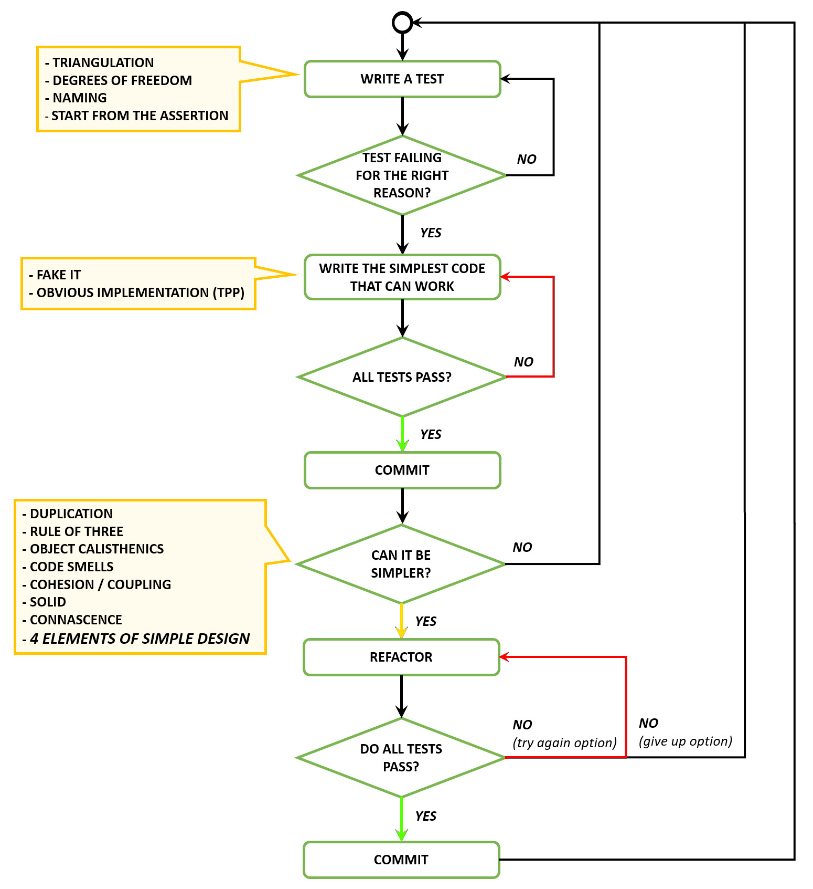
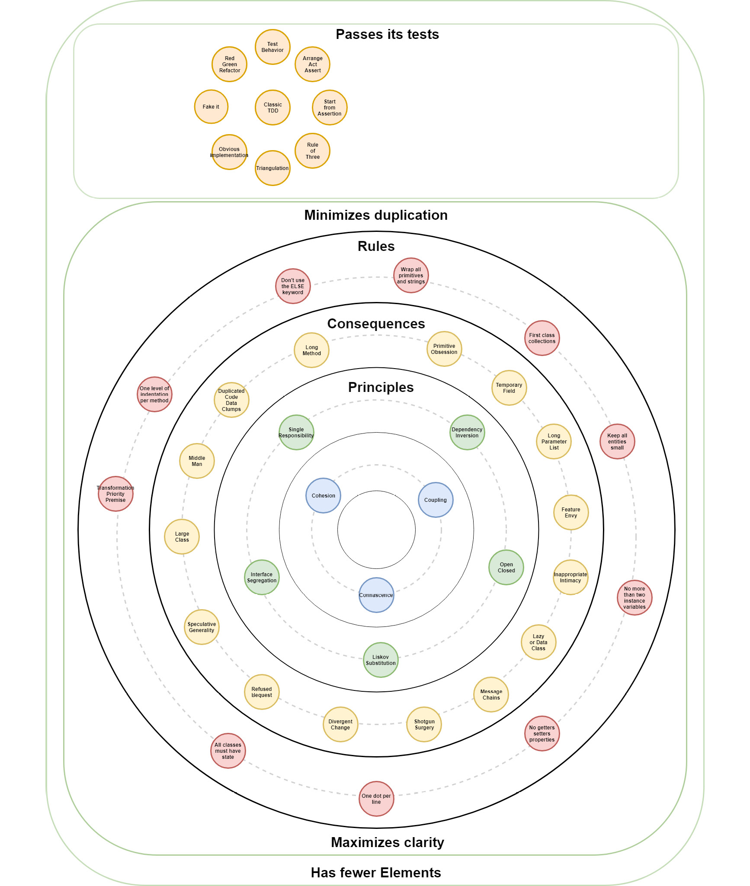

# 设计八——简单设计的四要素
> 简单是终极的精致。
>
> – 一般归功于列奥纳多·达·芬奇

我个人喜欢简单设计的四个要素。它是最高级别的原则集，更像是一组具有明确优先级的目标，而不是应用或打破的严格规则。这与我的个性非常吻合，但当你必须在重构设计时做出权衡决定时，它也非常有效。

在我看来，该系列的关键元素是对表现力的关注，这被认为是优秀设计的基本属性之一。虽然其他三个要素非常重要，我们也看到了许多支持它们的实践和原则，但我觉得对于表达其意图的代码通常没有足够的考虑。

对我作为一名开发人员来说，在一个非常干净和富有表现力的代码库上工作是最令人满意的技术体验。知道我可以轻松找出特定事物发生的位置或我们应该在何处添加类以扩展行为是无价的。通常这也意味着让故事飞越看板，让利益相关者高兴。我只在编写富有表现力的代码的团队中经历过这种情况。

## 简单设计的四大要素是什么？

- 通过其测试。
- 尽量减少重复。
- 最大化清晰度。
- 元素较少。

> 笔记
>
> JB Rainsberger，简单设计的四要素：http://www.jbrains.ca/permalink/the-four-elements-of-simple-design。

按照规定的顺序遵守规则是有意义的。应用这些规则，我们可以创建正确、紧凑、富有表现力和简洁的代码。简单设计的四个规则定义了好的设计是什么样的。

## 每个元素是什么意思？

### 通过测试

TDD 是限制我们编写的代码量的一种非常有效的方法，因为我们只编写了足够的代码来使失败的测试通过。测试有助于证明系统正在实现预期的行为。如果不能实现预期的行为，那么拥有一个设计精美的系统就毫无意义。这就是为什么通过测试是第一条规则。

测试还使我们能够谨慎地重构设计，使我们能够安全有效地解决设计问题。最后，测试作为文档来提高系统的清晰度。

### 最大限度地减少重复

重复是我们在本书中检查的第一个代码味道。这是我们可以用来检测代码中问题的重要指标。删除重复通常会导致我们创建新的抽象，更清楚地表达代码的意图，从而增加清晰度。

代码重复会导致设计中的许多问题。这就是为什么这是第二条规则的原因。每次测试后，我们应该寻找重复项并将其从我们的系统中重构出来。

### 最大化清晰度

在编写代码时，我们应该始终以读者为中心。清晰可以通过命名来实现，也可以通过创建封装细节的有意义的抽象来实现。通常，对新抽象的需求源于必须解决的重复问题。

“...通常名称往往会经历四个阶段：无意义的、准确但模糊的、精确的，然后是有意义的或意图揭示的，正如肯特贝克所描述的那样。我集中精力逐渐将名称移到右边频谱。而不是为名字的选择而苦恼，我只是选择一个名字，相信我总是在寻找机会让名字变得有意义。”

> 笔记
>
> JB Rainsberger，简单设计的四要素：http://www.jbrains.ca/permalink/the-four-elements-of-simple-design。
>
> “许多人试图同时想出一个伟大的名字。这很难，而且很少奏效。问题在于命名是设计：它为每件事选择正确的位置并创建正确的抽象。完美地做到这一点第一次不太可能。”
>
> – 阿洛·贝尔希

你经常听到必须编写可读代码才能使其更易于维护。让它可读是不够的；尝试编写明显的代码。如果你认为“我真的需要如此明确吗？”，那么你就达到了目标。

清晰不仅来自好名字，还来自表达设计意图的良好抽象。代码异味、严重违规、低内聚、高耦合和高内涵会降低清晰度。

### 元素较少

如果我们能有一个通过测试、减少重复、增加清晰度的系统，我们就已经完成了一个精美的设计。下一步是检查我们是否可以通过使用更少的元素来保持上述设计特征。最后一条规则是锦上添花。

## 简单设计的替代定义
由于简单设计的四个元素表达的是高级目标而不是低级规则，因此它们在表达方式上具有很大程度的个性化。这是因为每个人都使用自己最喜欢的一套原则和价值观来表达实现这些目标的关键。因此，我们发现了几个不同版本的元素，每个版本都不同，但都表达了相同的目标。这里有几个：

### 定义#1

- 通过测试
- 透露意图
- 无重复
- 最少的元素
    马丁福勒，贝克设计规则：https://martinfowler.com/bliki/BeckDesignRules.html。

### 定义#2

- 通过所有测试
- 表达我们需要表达的每一个想法
- 一切只说一次
- 没有多余的部分

### 定义#3

- 单元测试告诉你什么时候完成
- 自记录代码
- 一次且只有一次，不要重复自己，冗余是惯性
- 你不需要它，最少的类和方法

### 定义#4

- 运行所有测试
- 最大化凝聚力
- 最小化耦合
- 一切只说一次

### 定义#5

- 运行所有测试
- 不包含重复（一次且仅一次）
- 表达你想表达的所有想法：
    - 不要把不相关的想法的实现放在同一个方法中
    - 类应该以易于理解的方式组织想法
    - 使用适当的名称，这样你就不必用附加文档来解释方法、成员或类名称
    - 方法和类应该被实现，以便可以从它们的公共接口中完全理解它们。这不仅允许预先测试，而且减少耦合。
- 最小化类和方法。这实际上是多余的，但它提醒我们，我们正在努力使其简单明了。

### 定义#6

- 通过所有测试
- 清晰、富有表现力且一致
- 不复制任何行为或配置
- 最少的方法、类和模块

> 笔记
>
> 定义#2 - #6：Xp，简单规则：http://wiki.c2.com/?XpSimplicityRules。

## 我们对简单设计的个人定义

让我们也看看我们自己对简单设计的个人定义：

### Pedro

- 正确和可证明的行为
- 有利于读者
- 平衡的内聚和耦合
- 最少的元素

### Marco

- 通过测试证明业务正确性
- 表达功能行为
- 最小化熵

### Alessandro

- 正确和可证明的行为
- 明显的代码
- 行为吸引子
- 最少的移动部件

## Kata

### Elevator Kata by Marco Consolaro

考虑以下要求，为电梯系统实施控制器。

出于评估目的，假设将电梯从一层移动到另一层需要 1 秒钟，并且门在每次停靠时保持打开状态 3 秒钟。

#### 第一部分

该建筑共有五层，包括地下室和底层。电梯只有在不使用时，才能通过一个呼叫按钮在任何楼层呼叫。

鉴于电梯位于一楼：

3楼有去地下室的电话时

一楼有个电话叫去地下室

2楼有个叫去地下室

并且有一个从 1 楼到 3 楼的呼叫

然后门应该按顺序在3楼、地下室、地面、地下室、2楼、地下室、1楼和3楼打开

#### 第二部分

电梯不够快，所以作为一个加速它的实验，这个想法是让电梯对请求进行排队并优化行程。

电梯现在可以对来自楼层的停止请求进行排队并沿途收集人员，但一旦启动就不能改变方向，直到所有同方向的呼叫都得到满足。

鉴于电梯位于一楼：

3楼有去地下室的电话时

一楼有个电话叫去地下室

2楼有个叫去地下室

并且有一个从 1 楼到 3 楼的呼叫

然后门应该按顺序在3楼、2楼、一楼、地下室、1楼和3楼打开。

非功能性要求：第二部分过程所花费的总时间应小于第一部分算法所花费的时间。

## 经典 TDD 流程

## 大图

## 我应该什么时候进入下一课？

- 当你将健美操、代码异味、重构、稳固、内聚和耦合的各个点联系起来后。

## 资源
### 网络

- 贝克设计规则，马丁福勒：https://martinfowler.com/bliki/BeckDesignRules.html。
- 简单设计的四要素，JB Rainsberger：http://www.jbrains.ca/permalink/the-four-elements-of-simple-design。
- 好的命名是一个过程，不是一个步骤，Arlo Belshee：http://arlobelshee.com/good-naming-is-a-process-not-a-single-step。
- JB Rainsberger 将一场古老的战斗搁置一旁：http://blog.thecodewhisperer.com/2013/12/07/putting-an-age-old-battle-to-rest。
- Simple Made Easy, Rich Hickey：https://www.infoq.com/presentations/Simple-Made-Easy。
- XP 简单规则：http://c2.com/cgi/wiki?XpSimplicityRules。

### 图书

- 理解简单设计的四个规则，Corey Haines：https://leanpub.com/4rulesofsimpledesign。