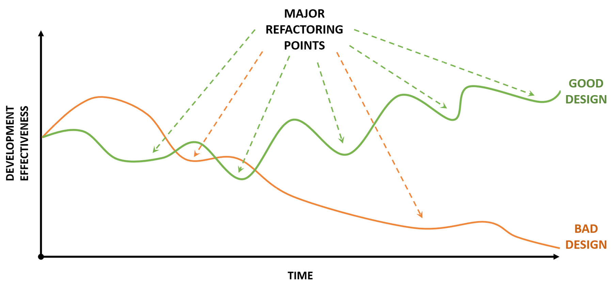
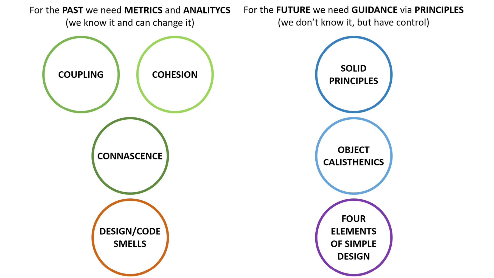
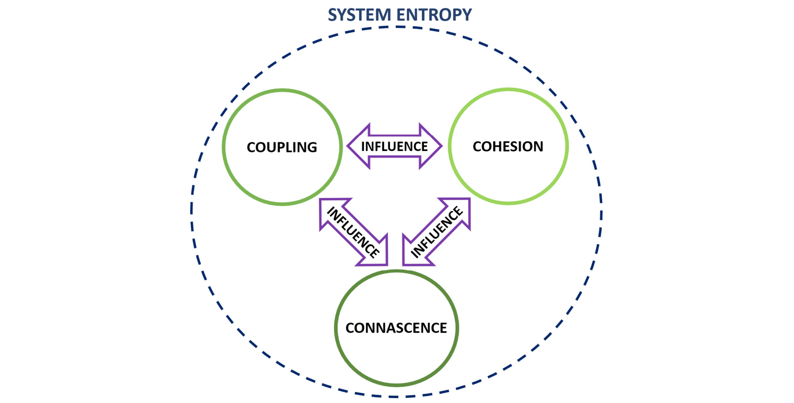
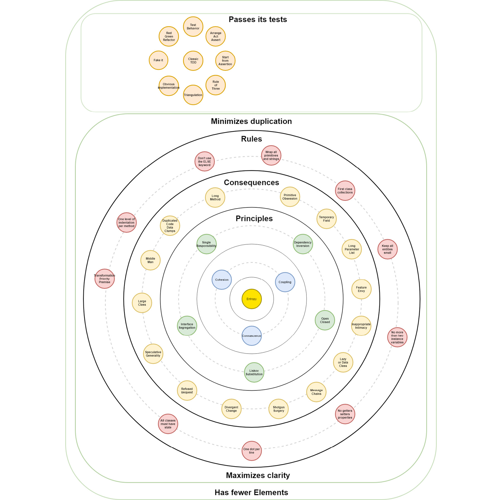

# 结论
> “我们知道过去但无法控制它。我们控制未来但无法知道它。”
>
> -克劳德·香农

克劳德·香农 (Claude Shannon) 的这句话颇具争议，通常会引发有趣的对话。主要观察结果是：我们并没有真正完全控制未来。如果我们在更高的哲学水平上考虑关于未来的引文的后半部分（我们无法改变过去的争议不大），那实际上是一个有意义的观察。

如果我们将引用的后一部分应用于软件开发会怎样？从理论上讲，在软件开发中，我们完全控制了未来，因为这是我们编写下一段代码的方式。我们拥有的控制量与我们对代码库的理解程度和有效程度成正比。在你的代码中，你对未来的控制与你过去的构建方式密切相关。

你也可以争论（也有争议）说我们无法控制过去并不是绝对正确的。如果不是改进过去编写的代码，重构是什么？这是尽快重构的另一个原因，不要拖延到未来——将代码的当前状态保持在最佳状态。通过在开发效率中启用正反馈循环，甚至重构本身也会容易得多。

Eric Evans 在他史诗般的领域驱动设计书中写道：

重构的回报不是线性的。通常，小回报会带来边际回报，而小改进会加起来。他们与熵作斗争，他们是抵御化石遗产的前线保护。但是，一些最重要的见解突然出现，并给整个项目带来了冲击。 [...]

但是，通常情况下，持续重构为不那么有序的事情铺平了道路。代码和模型的每一次细化都为开发人员提供了更清晰的视图。这种清晰度创造了突破性见解的潜力。 [...] 这种突破不是技术；这是一个事件。



因此，从长远来看，开发有效性（理解并在软件系统上快速有效地采取行动）取决于设计。这才是真正为我们提供控制未来的钥匙；设计越好，控制就越多。这就是为什么我们如此关注它。

## 内聚和耦合

我们可以使用重力作为内聚和耦合的类比。凝聚力将是地球的引力，将一切都向内拉。耦合将是太阳，拉动地球并将其保持在其轨道上。

使用这个类比，过多的凝聚力会产生一个黑洞，而过少的凝聚力会产生一个贫瘠的星球，无法支持我们所知道的生命。这同样适用于耦合。耦合太多，行星会相互碰撞或被太阳吞噬；耦合太少，我们就不会有太阳系，因为每个行星都会在宇宙中自行游荡。

耦合和内聚实际上是同一种力。内聚力是向内感觉到的，向外是耦合的。我们相信这是面向对象设计的基本力，就像重力是牛顿定律中的基本力一样。伟大设计的秘诀是在凝聚力和耦合之间找到良好的平衡。


## 设计的 3C：从内聚和耦合到内在

正如力量之间有着深刻的联系，耦合、内聚和先天的概念也是如此。让我们看一下这个例子以更好地理解这一点：

```c#
public class OrderFlow
{
    public void Execute(int customerId, int categoryId, int[] itemIds)
    {
        var orderId = GenerateOrderId();
        orderProcessor.ProcessOrder(orderId, customerId, categoryId, itemIds);
        invoiceProcessor.ProcessInvoice(orderId, customerId, categoryId, itemIds);
        ...
    }
}
```

从耦合和内聚的角度来看这段代码。它看起来如何？不是很好，对吧？我们有一长串参数，这些参数显然使 OrderFlow 类中的 Execute 方法、InvoiceProcessor 类中的 ProcessInvoice 方法和 OrderProcessor 类中的 ProcessOrder 方法的方法耦合得分相当高。这是数据耦合的经典示例。

同样的 Execute 方法也存在内聚问题，因为它在内部生成订单 ID。此方法/类的主要行为是编排订单流（顾名思义），而不是生成订单 ID。这也属于单一责任违规。

如果我们从 Code Smells 的角度来看，我们可以称其为长参数列表代码气味的经典示例。

最后，从 connascence 的角度来看，它是 Connascence of Position (CoP) 的一个例子。

让我们看看如果我们重构这段代码并尝试改进它会发生什么：

```c#
public class OrderFlow
{
    public void Execute(Order order)
    {
        order.Process();
        invoiceProcessor.ProcessInvoiceFor(order);
        ...
    }
}
```

这个版本更好吗？它看起来确实更具可读性，但是耦合和内聚呢？

从耦合和内聚的角度来看，我们通过引入一个更内聚的Order类去除了数据耦合，大大降低了这种方法的耦合分数。将行为更靠近 Order 类中的数据也增强了此代码的内聚力。

从代码异味方面，我们去除了长参数列表异味。

最后，我们还删除了三个类的 CoP：OrderFlow、Order 和 Invoice。

固定内聚性对耦合性和先天性有影响。固定耦合对内聚力和内聚力有影响。固定先天对耦合和内聚有影响。就好像他们都是同一个力量！

内聚、耦合、本能、SOLID原则、代码异味是同一个事物的不同表现，它们之间有着深刻的联系。这类似于电磁学，其中电场和磁场之间始终存在相互关系。

在你编写代码之前，规则和原则可以帮助你。嗅觉、内聚、耦合和初心在编写代码后为你提供有关设计的反馈。



从更高的角度来看，内聚/耦合/connascence 是衡量系统熵的不同方面的标准。它们实际上是一个非常强大的方面，可以从中获得反馈。从系统的角度来看，我们可以将它们视为对整个系统熵的贡献指数。

> 笔记
>
> 维基百科，熵（信息论）：https://en.wikipedia.org/wiki/Entropy_(information_theory)。



## 系统熵

我们添加到系统中的每一行代码都会增加其整体熵。如果我们让它不受控制地增长，系统的可维护性和可理解性会很快下降。当我们正在开发某个功能时，内聚、耦合和关联的概念使我们能够更好地理解我们添加的熵的类型和强度。这就是重构是如此重要的任务的原因。我们使用来自我们的原则的反馈将系统从高熵重构为低熵。

### 系统熵的相关性

1948 年，克劳德·香农 (Claude Shannon) 发表了一篇名为《通信的数学理论》(A Mathematical Theory of Communication) 的论文，这被认为是一个名为信息理论的全新研究领域的开端。在这篇论文中，他将信息熵的概念定义为消息中不确定性的度量。

> 笔记
>
> 维基百科，通信的数学理论：https://en.wikipedia.org/wiki/A_Mathematical_Theory_of_Communication。

我们专注于熵的高级概念，可以在各个方面看到它；都有数学证明的等价物。 （我们将数学留给好奇的读者——请参阅本课末尾的参考资料）。

> 笔记
>
> John J. Johnson IV 等人，系统系统中的涌现和熵理论：https://www.sciencedirect.com/science/article/pii/S1877050913010740。

以一种非常简化但有效的方式，系统中的熵的概念可以被视为：

- 系统的能量扩散率
- 系统的无序程度
- 系统可能状态数的增函数
- 如果熵是无序程度，显然我们的目标是将其最小化。

> 笔记
>
> Erwin Schrodinger 于 1944 年写了一本有争议的书，名为《生命是什么？》，他在书中说，如果我们从熵的角度来看生命系统，它们不会最大化它。相反，它们似乎增加了内部组织，从而最小化了熵，使用外部环境作为能量来源。我们认为熵的最小化是任何类型系统成功的关键。 https://en.wikipedia.org/wiki/What_Is_Life%3F，http://www.whatislife.ie/downloads/What-is-Life.pdf。

### 作为系统构建的软件开发

任何程序，作为将信息从一个地方移动到另一个地方，或将其从一种形式转换为另一种形式的手段，只不过是一个系统。因此，如果我们认为编写程序等同于构建系统，那么我们可以在开发软件时使用大量信息论的知识，并将其用于指导。

软件开发的创造力在于这样一个事实，即任何编程语言都提供了多种工具，这些工具可以以无限不同的方式组合在一起。在面向对象设计提供的工具中，也许最相关的一个是对象的概念。

> 笔记
>
> 从纯概率的角度，我们可以理解为什么编写好的软件如此困难！

那么，从系统的角度来看，什么是对象？嗯，一个对象是……一个系统。

最外面的对象代表整个程序（通常称为Main...巧合？），也就是整个系统。它是与外部世界的接口，并且在其内部包含交换信息和协作以实现共同目标的其他对象。这些对象本身就是系统。因此，原始和对象之间的区别在于，前者仅被视为一个部件或组件，而后者则被视为一个适当的系统。因此，从一般的角度来看，我们的程序是系统的系统。

### 作为低熵系统的良好设计

以这种方式看待问题使我们能够以更加务实的方式思考系统熵。如果熵与系统可能状态的数量有关，那么一个只有原始字段的简单对象可以作为其组件的所有可能值的组合函数来计算。

这不是好消息，因为这意味着我们添加的每一个新领域都有一个组合熵增长。单一职责原则现在很有意义也就不足为奇了。

如果我们有另一个对象而不是原始字段怎么办？这是好消息！在一个由独立系统组成的系统中（我们在这里可以认为独立性与可测试性有关；如果我可以孤立地测试一个对象，它就独立于系统其他部分的状态），总熵由单个系统的熵。

这意味着我们可以通过将一些部件嵌入一个带有逻辑的新子系统中来将组合增长转化为线性增长，并在系统级别而不是在基本部件级别进行协作。在我们的开发过程中，这意味着重构为遵循迄今为止表达的原则的更好的抽象。

这个基本思想与本书中表达的所有实践和原则是一致的，就我们可以将良好的软件设计视为低熵系统而言。

## 大图



## 资源
### 基于网络的资源：

- 熵（信息论），维基百科：https://en.wikipedia.org/wiki/Entropy_(information_theory)。
- 热力学和信息论中的熵，维基百科：https://en.wikipedia.org/wiki/Entropy_in_thermodynamics_and_information_theory。
- 信息论，维基百科：https://en.wikipedia.org/wiki/Information_theory。
- 传播的数学理论，Clause Shannon：http://math.harvard.edu/~ctm/home/text/others/shannon/entropy/entropy.pdf。
- 基于熵定律的可能的道德命令，Mehrdad Massoudi：https://www.mdpi.com/1099-4300/18/11/389。
- A Theory of Emergence and Entropy in Systems of Systems，John J. Johnson IV 等：https://www.sciencedirect.com/science/article/pii/S1877050913010740。
- 了解香农的信息熵度量，Sriram Vajapeyam：https://arxiv.org/ftp/arxiv/papers/1405/1405.2061.pdf。
- 生活是什么？埃尔文·薛定谔：http://www.whatislife.ie/downloads/What-is-Life.pdf。

### 图书：

- 领域驱动设计，解决软件核心的复杂性，Eric Evans：https://www.goodreads.com/book/show/179133.Domain_Driven_Design。
- 结构化设计：计算机程序和系统设计学科的基础，Edward Yourdon：https://www.goodreads.com/book/show/946145.Structured_Design。