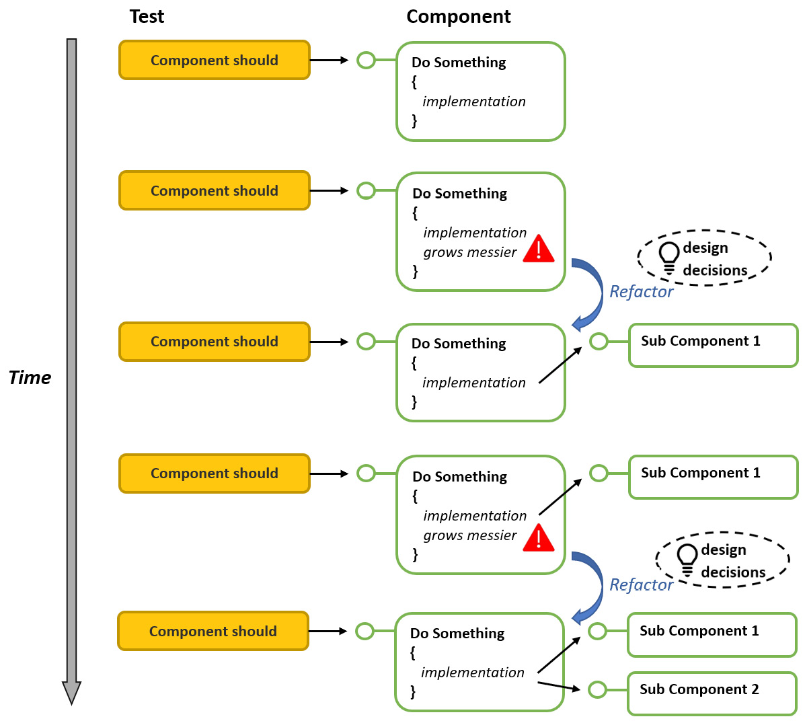
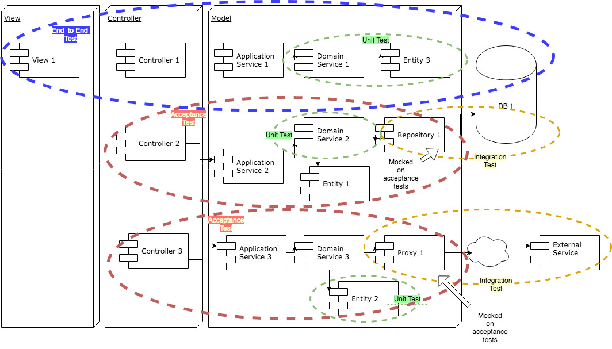
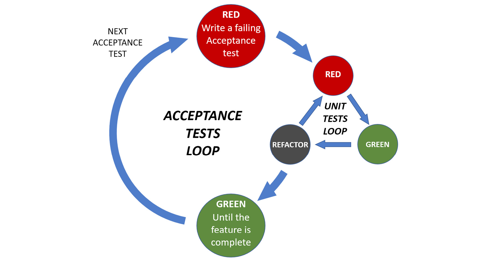
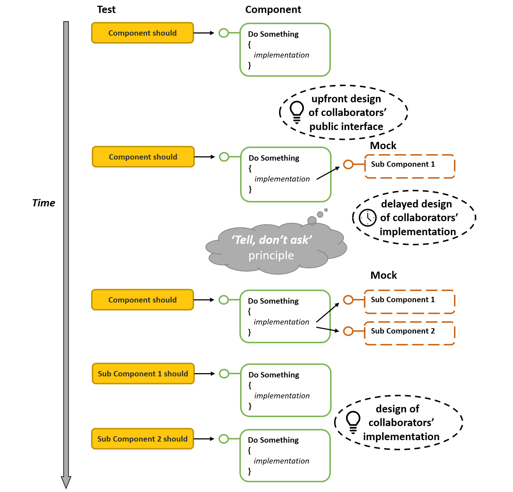
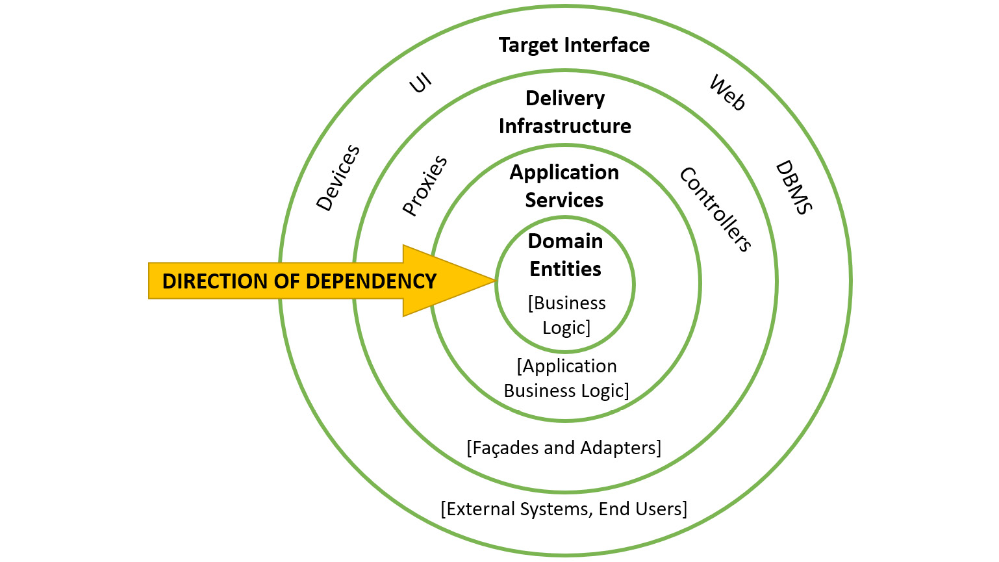
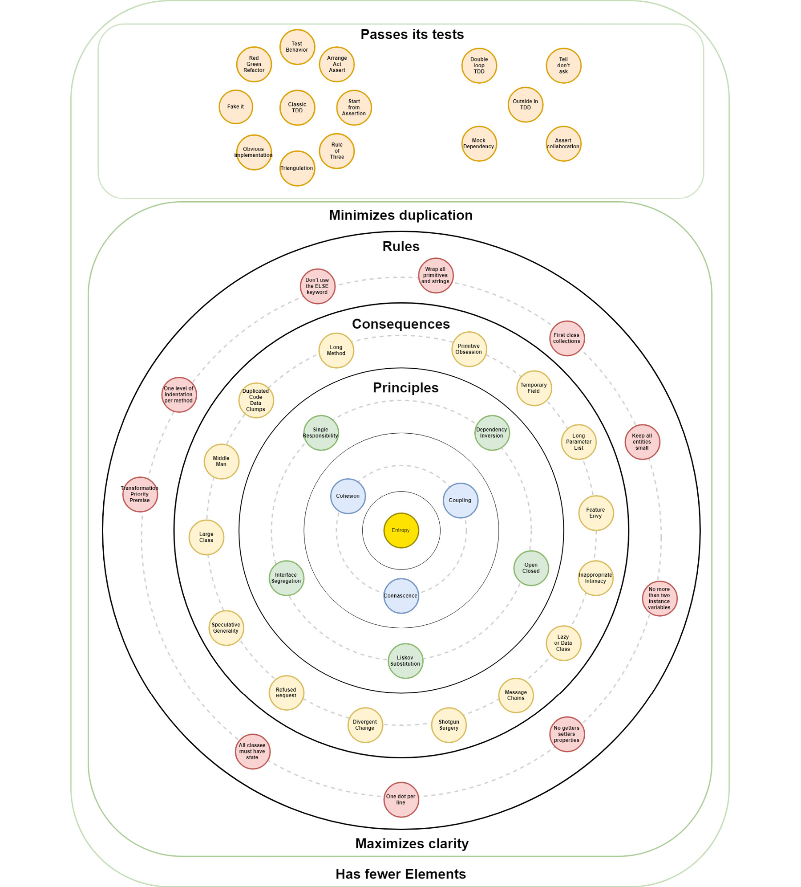

# 由外而内的发展
“制作伟大且可增长的系统的关键更多是设计其模块如何通信，而不是它们的内部属性和行为应该是什么。”

— 艾伦·凯

在本课中，我们将开始一段旅程，从正确构建事物到构建正确事物。正确构建事物是一个更具技术性的旅程，并且围绕迄今为止涵盖的原则展开。构建正确的事物是业务一致性的问题，并且涉及其他几种能力。

我们将在接下来的课程中看到，企业是由人与人之间的互动组成的，因此虽然卓越的技术很重要，但这还不够。我们觉得真正的掌握包含了这种理解。因此，让我们以最后一种技术开始旅程的最后一部分，根据我们的经验，它可以无缝地实现业务发展的观点转变。

由外而内是一种开发思维方式，默认情况下专注于业务视图，自然地弥合了两个世界之间的差距。这种思维方式源自由外向内 TDD 方法，也称为伦敦学派或 Mockist。它是测试驱动设计 (TDD) 的另一种方法，引导我们首先考虑类外部的观点，从公共接口的设计开始。这反过来又迫使开发人员站在用户的角度考虑，首先考虑用户的需求。

根据课程开始时 Alan Kay 的引用，这种技术的美妙之处在于服务方法所提供的服务方法，它专注于提供给类之外的世界的功能，而不是其内部。这有很多好处：

- 它自然适合业务至上的观点，使用业务功能来推动系统的内部增长。
- 它自然地解决了 YAGNI（你不需要它），因为如果业务没有明确要求，就不会开发任何东西。
- 它自然地最小化了熵，因为它对公共接口的关注导致了与外部世界通信的最简单方式，隐藏了内部的复杂性。
- 它自然鼓励表现力、可读性、干净的代码和简单的设计，因为对公共接口的关注有助于对设计和可读性的即时反馈。

所有这些点也可以通过使用经典的 TDD 来实现，但它需要软件开发人员付出更多的努力，并且不像在外在方法中那样自然。

## 经典的 TDD 方法

经典的 TDD 方法围绕着创建凌乱代码并不断重构以清理它的想法。经典 TDD 中的混乱很关键，因为它为重构设计提供了反馈。

实现最简单的东西并推迟重要的设计决策的想法是经典 TDD 的核心。经典 TDD 中的重构阶段至关重要；因此，良好的重构技能是其成功的关键。因此，了解代码异味、SOLID 原则以及内聚/耦合和 connascence 是在混乱变成难以重构的代码之前改变代码形状的主要优势。

三原则强调了混乱的重要性，它阻止我们过早地重构，最大化反馈以找到正确的模式。这种 TDD 风格的秘诀在于拥有适量的混乱来为设计决策提供反馈，但又不至于让重构变得太痛苦。

经典 TDD 存在一些问题：

- 它倾向于采用更具技术性的解决方案，并且更容易失去业务重点。
- 当探索的需求不是很大时，它有时会有点低效。
- 它可能会导致实施不需要的行为，特别是如果我们从系统内部向外部开始。在系统外部实现我们认为需要的功能的诱惑一直存在，因此不能很好地解决 YAGNI 的风险。

综上所述，经典 TDD 在了解此处描述的陷阱的经验丰富的软件工程师手中时，是一种令人惊叹的软件开发方式。在下图中，我们尝试使用经典 TDD 捕获软件增长的高级流程：



### 验收测试

我们从机械、化学或土木工程等其他工程领域借用了这个概念。维基百科对验收测试的定义如下：

> 在工程及其各个子学科中，验收测试是为了确定是否满足规范或合同的要求而进行的测试。它可能涉及化学测试、物理测试或性能测试。
>
> – 维基百科

ISTQB（国际软件测试资格委员会）在软件设计的上下文中定义验收测试如下：

针对用户需求、要求和业务流程进行的正式测试，以确定系统是否满足验收标准，并使用户、客户或其他授权实体能够确定是否接受系统。

– 国际软件测试资格委员会

> 笔记
>
> 国际软件测试资格委员会，ISTQB 词汇表：http://glossary.istqb.org/search/。

验收测试是验收标准的形式化，由 ISTQB 定义如下：

*为了被用户、客户或其他授权实体接受，组件或系统必须满足的标准。*

*– 国际软件测试资格委员会*

> 笔记
>
> 国际软件测试资格委员会，ISTQB 词汇表：http://glossary.istqb.org/search/。

验收标准定义了需要做什么，验收测试定义了应该如何做。

验收测试的组织方式类似于单元测试的安排-行为-断言部分。然而，在验收测试中，这些部分通常被称为 give-when-then：给定一些上下文，当执行某些操作时，应该会发生一系列后果。

我们将在下一课中更详细地讨论这个主题。耐心是强者的美德。

验收测试也类似于单元测试，因为它们只能有两种状态之一：通过或失败。他们的不同之处在于他们的目标；验收测试与用例场景相关，因此与业务场景相关。验收测试用于验证是否满足业务需求，因此与他们试图证明的业务需求密切相关。

### 验收测试样式

#### 单元测试风格

这是使用单元测试框架构建的，如下所示：

```c#
class CarShould
{
    [Test]
    void decrease_speed_when_brakes_are_applied()
    {
        var car = new Car();
        car.Accelerate(10);
        var beforeBreakingVelocity = car.Speed();
        car.Break(5);
        Assert.That(car.Speed(), Is.LessThan(beforeBreakingVelocity));
    }
}
```

#### 给定，何时，然后 (GWT) 样式

英语语言风格，例如：小黄瓜语言：

鉴于我有一辆车
我加速了 10 秒
我休息了 5 秒
当我测量速度时
那么速度应该低于破碎前测量的速度。

#### 表格样式

这涉及类似 Excel 的符号。一个例子是 FitNesse。

> 笔记
>
> FitNesse：http://docs.fitnesse.org。

## 测试边界

验收测试的引入迫使人们讨论测试边界。验收测试的界限是什么？单元测试、集成测试和端到端测试的边界如何？在下图中，我们尝试表达我们对不同测试边界的看法。



问题是测试术语不是很标准化，根据我们的经验，我们看到了对测试的不同概念的一些混淆。希望以下定义可以澄清术语：

- 端到端测试：专注于业务需求。练习完整的流程，包括外部系统。通常，这些测试执行起来很慢。
- 验收测试：专注于业务需求。练习我们系统中流程的所有部分。在反馈和执行速度上妥协。比端到端测试快，但没有那么彻底。
- 集成测试：专注于技术实现。练习我们系统中与外部系统连接的部分。执行速度可能很慢，具体取决于外部系统及其集成。
- 单元测试：专注于原子行为。在我们的系统中练习部分流程。执行速度非常快。

## 双环TDD

双循环 TDD 在 Red -> Green -> Refactor classic TDD loop 中引入了验收测试的概念。这个想法是有一个涵盖业务需求的高级测试。顾名思义，我们在 TDD 循环中添加了第二个循环。这是一个外循环，也有红色 -> 绿色 -> 重构阶段。在这个验收测试中，通过外部循环，我们有效地创建了一个“完成”的可执行定义。



当开始一个新功能时，我们首先编写一个验收测试。由于我们缺乏实现，因此该测试将不可避免地失败。在我们继续之前，我们需要确保我们的验收测试失败，因为它不符合验收标准。这通常会迫使我们定义系统的外部 API。

一旦我们的验收测试失败，我们就会移动到内部循环并保持在它上面，直到验收测试变为绿色。内循环对应于我们在之前课程中介绍的 TDD 单元测试循环。随着我们设计的发展，我们可能不得不重新审视我们在验收测试中做出的最初的高级设计决策。这绝对没问题。我们仍然希望在内部或单元测试循环中做出大多数设计决策。

在深入探讨这个主题之前，我们建议你先好好掌握关于测试替身的课程，因为它们被大量用于由外而内的风格。如果你觉得需要刷新测试双打的主题，请在继续之前进行。

## 由外而内的方法

从外到内不仅仅是一种测试策略；这是一种发展方式。有一种误解，认为由外而内是 Mockist 测试方法。你可以使用经典的测试方法进行从外到内的开发。你甚至可以在没有测试的情况下进行由外向内的开发。从系统的角度来看，由外向内意味着首先关注最重要的方面之一，即公共接口，对于系统而言，它代表与外部世界的通信。还记得我们将软件视为一个系统的系统吗？这就是本课开头引用 Alan Kay 的原因。

此外，使用这种开发方式非常适合最流行的 IDE 框架。绘制由外向内的方法使我们可以对几乎所有涉及接口创建、类创建和方法创建的操作使用快速快捷方式。它使开发主要是命名事物和使用 IDE 的自动完成功能，充分发挥其潜力，让它完成所有繁重的工作而不会出现错别字。我们强烈建议你尝试这种开发方式；我们还没有遇到任何人，一旦他们学会了，又回到了以前的方式。

### 由外而内的心态

从外到内是与业务保持一致、增加代码和描绘不同子系统之间协作的好方法。它专注于首先为业务提供价值，然后转向实施和单元测试策略。

由外而内的思维方式如下：

- 从外到内
- 从高层职责到底层细节
- 从主要目标到实现它的步骤
- 从战略到战术
- 遵循依赖流

让我们看一个简单的例子。想象一下，我们正在构建一个微波炉类。从外到内的流程开始于我们将首先构建的类的草图，在本例中是 MicrowaveOven 类。让我们暂时将测试放在一边，而是使用 Main 方法从最外层边界开始：

```c#
public void Main(){
    var oven = new MicrowaveOven();
}
```

此时，我们还没有该类的实现，因此 IDE 以红色突出显示它。但是，如果我们提示建议，其中一个会说类似创建 MicrowaveOven 类型的内容。让我们选择它，让它发挥作用。现在我们有这样的事情：

```c#
public void Main(){
    var oven = new MicrowaveOven();
}
public class MicrowaveOven(){
}
```

IDE 将再次以红色显示它，因为它没有实现。让我们打开它的 Suggestions Helper。我们现在看到选项之一说创建方法。让我们选择它并将参数重命名为分钟。我们会有这样的事情：

```c#
public void Main(){
    var oven = new MicrowaveOven();
    oven.Cook(5);
}
public class MicrowaveOven(){
    public void Cook(int minutes){
        throw new System.NotImplementedException();
    }
}
```

我们现在已经绘制了 MicrowaveOven 公共界面的草图。我们首先站在用户的角度，从外部开始实施。这种方法的主要目标是确保公共界面使用起来很直观；也就是说，对于将来使用它的人来说，它是立即可以理解的。

接下来，我们可以通过实现 Cook 方法进入它自己的抽象级别。

在该方法中，我们现在意识到我们只需要做一件事；按照方法中规定的分钟数打开微波发生器。所以，我们需要一个合作者，这里我们有两个选择：

1. 我们可以创建一个强依赖，让烤箱负责它。
2. 我们可以注入它，以便我们可以在运行时更改它并单独测试生成器。

为简单起见，让我们使用第一个选项，看看流程如何使用 IGenerateMicrowaves 接口进行。

```c#
public class MicrowaveOven(){
    private IGenerateMicrowaves _microwaveGenerator = new MicrowaveGenerator();
    public void Cook(int minutes){
        throw new System.NotImplementedException();
    }
}
```

我们现在在新的代码行中有两个红色项目：IGenerateMicorwaves 接口和具体的 MicrowavesGenerator。让我们再次使用这些建议，从界面开始。这里的 create 接口建议很简单，我们之后可以继续具体操作并再次使用 create 类型。在这种情况下，IDE 非常聪明，已经使类型从接口继承：

```c#
public class MicrowaveGenerator : IGenerateMicrowaves
{
}
public interface IGenerateMicrowaves
{
}
```

让我们把这些留空，继续关注我们的 MicrowaveOven 类；我们仍然有一个丑陋的扔那里要删除。现在我们终于可以按照我们的计划告诉发电机自己开启了！我们重新开始勾画它的公共界面：

```c#
public class MicrowaveOven(){
    private IGenerateMicrowaves _microwaveGenerator = new MicrowaveGenerator();
    public void Cook(int minutes){
        _microwaveGenerator.SwitchOnFor(minutes);
    }
}
```

与往常一样，该方法以红色突出显示。让我们打开自动建议并选择创建 IGenerateMicrowaves.SwitchOn 方法并将参数重命名为分钟的选项。瞧！界面现在变成：

```c#
public interface IGenerateMicrowaves
{
    void SwitchOnFor(int minutes);
}
```

我们现在可以看到其他东西变红了：MicrowaveGenerator 类标有未实现 IGenerateMicrowaves 接口的问题，因为它显然缺少该方法。但是我们有一个方便的建议来实现缺失的成员，它会自动添加方法：

```c#
public class MicrowaveGenerator : IGenerateMicrowaves
{
    public void SwitchOnFor(int minutes)
    {
        throw new System.NotImplementedException();
    }
}
```

通常，此时我们有两个选择。我们可以使用广度优先策略并继续实现 Cook 方法，以防在那里有其他事情要做，并保持当前抽象级别的焦点，或者在 MicrowavesGenerator 类中实现 SwitchOnFor 方法。流程将再次相同：首先编写公共接口并延迟实现。冲洗并重复。

如果我们不是从 Main 方法开始，而是使用测试来驱动代码并使用模拟/存根注入协作者的依赖项，那么这种方法将变得更加强大。这就是伦敦 TDD 学校背后的想法。

## 从外到内 TDD：伦敦学校

从外到内 TDD 通常也被称为伦敦 TDD 学院、验收测试驱动开发 (ATDD) 或 Mockist TDD。在外向内 TDD 中，我们使用模拟来勾勒我们尚不了解的系统部分的设计草图。

与经典的 TDD 不同，我们不会等待制造混乱来提取子组件；我们在编写测试后立即使用模拟来绘制它们。在经典 TDD 中，大多数设计决策发生在重构阶段，而在外向内 TDD 中，有关公共接口的设计决策发生在红色阶段。

在这里，责任的概念成为关键。确定不同的职责可以让我们了解可能需要的协作类型。然而，在这个阶段不需要实现子模块，因为我们可以存根它并为我们的测试伪造它的行为。

这个操作本身就是一个关键的设计决策，因为我们在这里做的是设计协作者的公共接口，将上下文切换推迟到它的实现。它本质上是一种将问题分解为子任务的方法，一次解决一个抽象层，而不是立即深入。这种方法在保持头脑一次专注于一个子问题、一次一个责任以及一次一个抽象级别方面具有令人难以置信的优势。

由外向内 TDD 和经典 TDD 之间的另一个重大区别是断言的性质。在经典的 TDD 中，我们通常编写基于状态的断言（断言函数返回的某个值等于某个预期值）。从外到内有利于告诉，不要在查询中询问命令的启发式。所以断言通常基于与其他一些组件（Mock）的协作。



在上图中，我们尝试使用外向内 TDD 来捕捉软件增长的流程。与经典的 TDD 一样，我们从编写测试开始，但现在我们立即尝试勾画一个合作者并围绕该合作编写断言。一旦我们通过了测试，我们可以进入内部并使用与合作者（现在成为新的测试对象）相同的策略并找到它的合作者，或者我们为当前组件找到其他合作者并使用相同的战略。

避免模拟模块中的每个抽象层。通过公共接口将其作为黑盒进行测试，同时对你与其他模块的交互进行声明和断言。

### 例子

在这个例子中，我们正在实现一个场景，我们必须将产品添加到客户在网站上的购物车中。在这种情况下，客户是金牌客户，有权享受折扣。

我们首先为此场景编写验收测试：

鉴于我有一个产品。
我有一个客户是黄金客户。
当我将产品添加到客户购物车时，数量为 1。
然后应保存购物车并应用黄金客户折扣。
在这种情况下，为了空间起见，我们只指定验收测试而不显示实现。在下面的实现中，我们使用验收测试来指导我们编写哪些单元测试。

在验收测试之后，我们转到内部单元测试循环。从外面开始，我们首先为购物车控制器编写一个测试。我们首先确定控制器合作者，在本例中是购物车。一旦我们对合作者有了一个想法，我们就会为它创建一个模拟，并决定控制器应该如何与购物车合作。使用购物车的模拟，我们编写了关于协作的断言。

```c#
class ShoppingCartControllerShould
{
    [Test]
    void add_product_to_shopping_cart()
    {
        var ABookId = 12345;
        var ACustomerId = 54321;
        var AQuantity = 1;
        var shoppingCart = new Mock<ShoppingCart>();
        var shoppingCartController = new ShoppingCartController(shoppingCart);
        shoppingCartController.Post(ACustomerID, ABookId, AQuantity);
        shoppingCart.Verify.Add(ACustomerId, ABookID, AQuantity).WasCalled();
    }
}
```

下一个测试使用相同的策略，但我们现在正在测试购物车及其与折扣计算器的协作。

```c#
class ShoppingCartShould
{
    [Test]
    void add_product_to_shopping_cart_with_discount_for_gold_customers()
    {
        var ABookId = 12345;
        var ACustomerId = 54321;
        var AQuantity = 1;
        var discountCalculator = new Mock<DiscountCalculator>();
        var repository = new Mock<ShoppingCartRepository>();
        var shoppingCart = new ShoppingCart(discountCalculator, repository);
        shoppingCart.Add(ACustomerId, ABookID, AQuantity);
        discountCalculator.Verify.ApplyDiscount(shoppingCart).WasCalled();
    }
}
```

最后，我们使用存储库测试购物车协作以保持其状态。

```c#
class ShoppingCartShould
{
    [Test]
    void save_shopping_cart()
    {
        var ABookId = 12345;
        var ACustomerId = 54321;
        var AQuantity = 1;
        var discountCalculator = new Mock<DiscountCalculator>();
        var repository = new Mock<ShoppingCartRepository>();
        var shoppingCart = new ShoppingCart(discountCalculator, repository);
        shoppingCart.Add(ACustomerId, ABookID, AQuantity);
        repository.Verify.Save(shoppingCart).WasCalled();
    }
}
```

## 依赖的方向

依赖是有方向的。那么，正确的方向是什么？让我们用下图考虑这一点：



依赖关系应该遵循从更有可能改变的方向向不太可能改变的方向移动；因此，抽象不应该依赖于细节。域应该是我们代码的纯粹部分，理想情况下不依赖于其他任何东西，因为它最不可能改变。

如果你仔细想想，这是有道理的；业务逻辑应该是自包含的，并且应该可以正常工作，而无需关心信息是保存在这个或那个数据库中、显示在 Web 上还是 CSV 文件中。应该可以在不更改域的情况下更改网页以另一种方式显示信息，并且它比域本身的修改更频繁地发生。

从外到内自然遵循相同的依赖方向。

## 我应该使用经典 TDD 还是外向内 TDD？

两个都。它们是两种不同的方法，不同的情况需要不同的策略。问题不是“我应该使用经典 TDD 还是外向内 TDD？”，而是“我什么时候应该使用经典 TDD，什么时候应该使用外向内 TDD？”

当我们对问题/领域的知识不是很高时，经典 TDD 是发现/探索解决方案的好方法。如果你是初学者，经典 TDD 更容易理解，因为你不必在没有反馈的情况下做出设计决策。从外到内 TDD 需要更深入的设计知识，因为我们没有得到混乱的反馈循环，但它可以更有效率并专注于业务。归根结底，语境为王，我们应该使用语境所需的最合适的技巧。

## Kata

### 股票组合

从验收测试开始，使用外向内 TDD 实现以下用户故事。

#### 投资组合用户故事

作为我们证券交易所经纪人的客户
我想看看我目前的投资组合
所以我可以更好地规划我的财务策略

#### 投资组合方案

我们需要提供一个能够记录客户的买卖操作并根据验收标准显示信息的类。为简单起见，你可以假设它一次只适用于一个用户。

#### 投资组合标准

鉴于我于 14/02/1990 购买了 1000 股“Old School Waterfall Software LTD”
我在 09/06/2016 购买了 400 股“Crafter Masters Limited”
我在 10/12/2018 购买了 700 股“XP Practitioners Incorporated”
我在 11/12/2018 卖出了 500 股“Old School Waterfall Software LTD”
“Old School Waterfall Software LTD”的当前股价为5.75美元
而“Crafter Masters Limited”目前的股价为17.25美元
而“XP Practitioners Incorporated”的当前股票价值为 25.55 美元
当我打印我当前的投资组合时
那么显示的结果应该如下：

公司 |股票|当前价格|当前值 |上次操作
Old School Waterfall Software LTD | 500 | 5.75 美元 | $2,875.00 | 2018 年 11 月 12 日售出 500
Crafter Masters Limited | 400 | 17.25 美元 | 6,900.00 美元 |在 09/06/2016 购买了 400
XP Practitioners Incorporated | 700 | 25.55 美元 | 15,785.00 美元 |在 10/12/2018 购买了 700
按首次操作日期升序排序。

#### 马可康索拉罗的肖尔迪奇墓穴

这个套路有点结构化和挑战性，因此你可以尝试将许多概念和原则在可以从中受益的领域中付诸实践。这是一个相当大的卡塔，所以期待花一些时间。

受Colossal Cave Adventure的启发，这是一款用于构建可增量和无限扩展的基于文本的冒险游戏的kata，并且仅受你的想象力的限制。

> 笔记
>
> https://en.wikipedia.org/wiki/Colossal_Cave_Adventure。

该游戏基于一个控制台应用程序，该应用程序描述了玩家通过一组命令探索的虚构地下世界。世界是在地理上（北、南、东或西）或通过特定连接点（门、通道、大门、楼梯等）相互连接的位置的集合。玩家可以使用基点作为方向，或利用连接点的动作或物品在位置之间移动。

其他重要方面：

- 可以简单地向各个方向看，但并非所有方向都可以随时查看或移动。
- 世界将在多个位置隐藏宝藏，如果玩家进入该位置或在正确的位置使用正确的物品，则可以显露这些宝藏。
- 当玩家找到地下墓穴的出口时游戏结束，得分为收集到的宝物价值的总和。
- 当看某处没有任何有趣的东西时，系统应该回复，在那里看没什么有趣的！
- 当一般动作不可用时，系统会回复，我这里做不到！
- 当系统无法理解命令时，它应该提示，我不明白。请用英语！

### 第一部分

开始游戏

启动时的游戏会显示初始位置的标题和主要描述。当玩家移动到另一个位置时，系统总是提示新位置的标题和主要描述。

迷失在肖里奇。
你正站在一座砖砌小巷的尽头，前面是一座叫做老杜鲁门啤酒厂的小砖砌建筑。
你周围是一片餐厅和酒吧的森林。一小股精酿啤酒从建筑物中流出，顺流而下。
探索世界：

移动

运动用 GO 表示，后跟基点字母。

```
> GO N => move to the NORTH
> GO E => move to the EAST
> GO S => move to the SOUTH
> GO W => move to the WEST
```

楼梯上的运动用 GO 后跟 UP 或 DOWN 表示，具体取决于楼梯的引导方向。

```
> GO UP => use stairs to go up
> GO DOWN => use stairs to go down
```

LOOK 允许玩家向各个方向看去，以了解周围环境或更好地描述物品。

迷失在肖里奇。
你正站在一座砖砌小巷的尽头，然后是一座名为 TRUMAN 啤酒厂的小型砖砌建筑。你周围是一片餐厅和酒吧的森林。一小股精酿啤酒从建筑物中流出，顺流而下。

```
LOST IN SHOREDITCH.
YOU ARE STANDING AT THE END OF A BRICK LANE BEFORE A SMALL BRICK BUILDING CALLED THE TRUMAN BREWERY. AROUND YOU IS A FOREST OF RESTAURANTS AND BARS. A SMALL STREAM OF CRAFTED BEER FLOWS OUT OF THE BUILDING AND DOWN A GULLY.
> LOOK N
I CAN SEE A BRICK BUILDING WITH A SIGN SAYING "TRUMAN BREWERY" AND A WOODEN WHITE DOOR.
```

对世界只有两个要求。首先是不应该有两个不同的位置具有相同的标题。第二个是位置必须相互反向引用。这意味着如果从位置 A 向南，玩家最终到达位置 B，那么从位置 B 向北 I 必须最终到达位置 A。相同的原则应该适用于所有基点，但也适用于向上和下楼梯。

游戏实用程序：

帮助

```
? lists all the available commands and their usage.

> ?
GO [direction], LOOK [direction/item], OPEN [item], TAKE [item], DROP [item], BAG, USE [item]
```

QUIT 终止游戏。

### 第二部分

与环境互动

有几个用于与环境交互的命令。这些命令总是由两部分组成：动作和对象。通常，对象在主要描述或 LOOK 命令的结果中指定。

#### 开幕

OPEN 尝试打开命令的对象。通常，它是关于门或大门的，但这应该是一个神奇的世界......

我可以看到一座砖砌建筑，上面写着“TRUMAN 啤酒厂”的牌子和一扇白色的木门。

```
I CAN SEE A BRICK BUILDING WITH A SIGN THAT READS "TRUMAN BREWERY" AND A WOODEN WHITE DOOR.
> OPEN DOOR
YOU ARE INSIDE THE MAIN ROOM OF THE TRUMAN BREWERY. THERE IS A STRONG SMELL OF HOPS AND A DOZEN EMPTY CASKS.
```

TAKE 从环境中收集物品并将其放入包中。 DROP 允许玩家将物品留在环境中。每个物品都可以在任何地方取放，游戏必须在主要描述之后列出环境中的物品。

建筑物内。
你在建筑物内，一座适合大泉水的井房。
地板上有一些钥匙。

```
INSIDE THE BUILDING.
YOU ARE INSIDE THE BUILDING, A WELL HOUSE FOR LARGE SPRINGS.
THERE ARE SOME KEYS ON THE FLOOR.
> TAKE KEYS
KEYS: TAKEN.
> DROP KEYS
KEYS: DROPPED.
```

BAG 显示包中的物品列表。袋子只能装 10 件物品。

```
> BAG
THE BAG CONTAINS: SOME KEYS, A SWISS KNIFE, A CANDLE AND A COMPASS.
```

如果为它设置了环境，并且玩家在包里有这个项目，USE 就会对这个项目执行一个操作。该操作可能会在主要描述中产生额外的句子，例如解锁通往隐藏位置的通道或在该位置释放新项目。

```
> USE KEYS
THE RED DOOR HAS BEEN UNLOCKED!
> OPEN DOOR
YOU ARE INSIDE THE RED CHAMBER.
```

我们在山洞里能找到的宝物都是金币形式的。它们会在玩家第一次移动到有金币的位置时自动收集，或者玩家第一次打开包含金币的物品时会自动收集。在袋子里可以看到取回的黄金总量。

## 大图



## 好习惯
在本课中，我们引入了一个新习惯。在以下列表中查看。

### 编写新测试时的注意事项

- 测试应该只测试一件事。
- 创建更具体的测试以推动更通用的解决方案（三角测量）。
- 为你的测试提供反映你的业务领域的有意义的名称（行为/面向目标）。
- 查看测试失败的正确原因。
- 确保你从失败的测试中获得有意义的反馈。
- 将你的测试和生产代码分开。
- 组织你的单元测试以反映你的生产代码（类似的项目结构）。
- 在安排、行动和断言块中组织你的测试。
- 先写断言，然后逆向工作。
- 编写快速、隔离、可重复和自我验证的测试。
- 考虑使用对象健美操来推动设计决策。
- 考虑向遗留代码添加测试。
- 考虑使用经典 TDD 或外向内 TDD（新习惯）。
- 如果使用外向内 TDD，请从验收测试开始并遵循双循环 TDD。

### 使失败的测试通过时的注意事项

- 编写最简单的代码来通过测试。
- 编写任何可以让你更快地进入重构阶段的代码。
- 使用转换优先前提。

### 测试通过后的注意事项

- 使用三法则来解决重复问题。
- 不断重构设计。
- 应用对象健美操来改进你的设计。
- 重构时保持绿色。
- 使用 IDE 快速安全地重构。
- 首先重构代码以提高可读性/可理解性。
- 注意代码异味并相应地重构代码。
- 在上下文合适时重构为模式。

## 资源
### 基于网络的资源：

- 由外向内发展的案例，Sandro Manusco：https://codurance.com/2017/10/23/outside-in-design/。
- 伦敦测试驱动开发学院，Emily Bache：http://coding-is-like-cooking.info/2013/04/the-london-school-of-test-driven-development/。
- 模拟作为设计工具，Sandro Manusco：https://codurance.com/2018/10/18/mocking-as-a-design-tool/。
- 使用双循环 TDD 进行外向内开发，Emily Bache：http://coding-is-like-cooking.info/2013/04/outside-in-development-with-double-loop-tdd/。
- 告诉，不要问，亚历克·夏普](https://pragprog.com/articles/tell-dont-ask。

### 图书：

- Growing Object-Oriented Software, Guided by Tests，Steve Freeman 和 Nat Pryce：https://www.goodreads.com/book/show/4268826-growing-object-oriented-software-guided-by-tests。