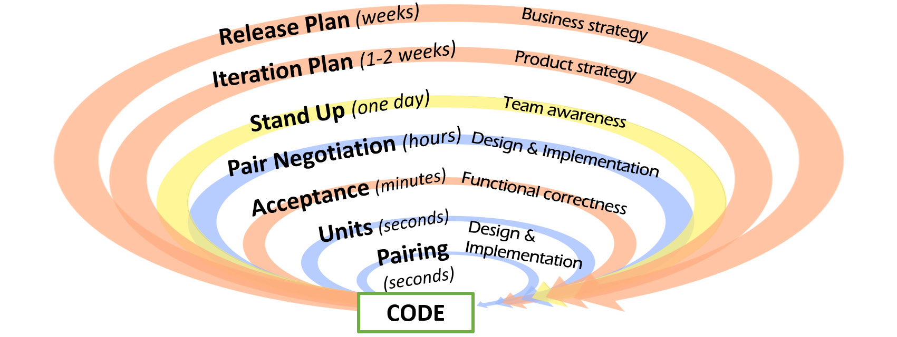
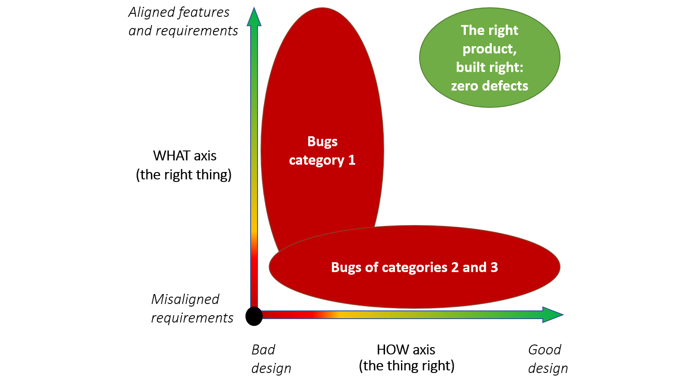
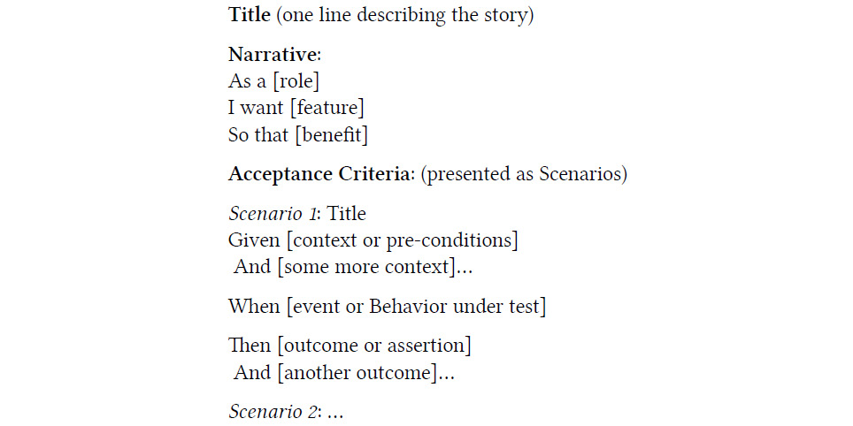

# 行为驱动开发
> 缺陷的原因在于工人的错误，而缺陷是忽视这些错误的结果。因此，如果事先发现并消除了工人的错误，错误就不会变成缺陷。
>
> – 重吾新乡

我第一次负责开发一个非常重要的项目时，我还是在意大利，这对于成功的创业公司来说是非常重要的。该公司希望在扩展方面改进他们的系统。他们有一个用 Visual Basic (VB) 编写的旧系统，该系统没有针对进入仓库的不断增加的物品量进行优化。

当时 .NET Framework 刚刚问世，这家初创公司想要替换他们的旧系统。然而，最令人兴奋的方面是范围不限于简单的代码重写。该软件旨在通过对真实物品进行编目的手动操作生成数据。该公司意识到流程也需要改进，因此他们聘请了专门优化供应链运营的经理 José，目标是创建一个负责该项目的高质量、跨职能团队。

我们没有任何书面要求、业务分析师、架构师、产品所有者或项目经理。那时，敏捷这个词并没有像今天这样被大肆宣传，仍然仅限于体育活动。但在没有意识到其重要性的情况下，团队已经将个人和互动置于流程和工具之上，将工作软件置于文档之上。事实上，何塞和我从来没有写过任何正式的要求，因为何塞是我的要求。我们不断完善产品并在现场进行测试，直到他对结果满意为止；记录的要求几天后就会过时。此外，我是唯一一个真正编码的人，所以花时间写需求不是一种选择。

几周后，尽管启动预算有限，我们还是交付了一个令人惊叹的系统。 José 和我为这一成就感到非常自豪，并在此过程中建立了基于相互尊重的牢固的专业关系，这种关系持续了多年。

我们成功的关键在于我们之间直接、持续开放的沟通流程，没有中间人，这创造了一个超快速的反馈循环。因此，我们自然而然地收敛到最佳解决方案，而不会在此过程中浪费任何时间。

## 防呆

如果我们考虑软件开发人员的工作所依据的非常深刻的原则，就会惊奇地发现许多概念根本不是新概念。在我们的代码中使用测试是减少错误的有效方法，但是几十年前这个想法已经在其他环境中得到了类似的应用。

Poka-yoke 是一个日语术语，意思是防错或防止意外错误。第二个翻译中的关键词，经常被省略，是无意的。没有防止操作员破坏行为的防呆解决方案，但破坏行为在人们中是一种罕见的行为。 poka-yoke 是任何过程中帮助设备操作员避免 (yokeru) 错误 (poka) 的任何机制。其目的是通过在人为错误发生时预防、纠正或引起人们注意来消除产品缺陷。这个概念被 Shigeo Shingo 作为丰田生产系统的一部分正式化，并采用了这个术语。

poka-yoke 背后的想法是，发现的任何缺陷都不应该传递给下游。下游不仅适用于消费者，也适用于组织中的任何人。在丰田装配线上，整条生产线都停下来，而不是将检测到的问题传递给排队的下一个人。这与大多数西方汽车制造商截然不同，后者通常在生产线的末端有一个特殊的小组来解决所有问题，并且检测到的缺陷只是简单地传下来，因为它们是其他人的责任。

Shingo 认为，在任何涉及人类工作的过程中，错误都是不可避免的，但如果实施适当的防错措施，则可以快速发现错误并防止导致缺陷。通过从源头上消除缺陷，公司内部的错误成本就会降低。

## 错误与缺陷：反馈是良药（再次）
Shingo 区分了错误和缺陷，错误是人类本性的一部分，这是不可避免的，缺陷是设法通过系统并到达客户的错误。 Poka-yoke 旨在防止错误变成缺陷。

在软件开发的上下文中，我们使用吸引人的词 bug 来识别缺陷，而测试套件就是我们的防错。

因此，防止缺陷的关键促成因素是拥有一种机制，可以在我们的流程中为开发的所有重要方面收集反馈。 反馈越快，越有效，因为及早发现错误可以防止浪费在不正确的产品上工作并将其发送到下游。

如果你以这种方式看待事物，那么我们所做的大多数活动，无论是方法上的还是技术上的，都源于敏捷的思维方式，并且旨在为我们工作的不同方面收集快速反馈。



## 错误和沟通
从产品的角度来看，广受赞誉的质量管理大师 Philip Crosby 将质量定义为“符合要求”。就这么简单直接。因此，如果我们将缺陷视为偏离需求的事物，那么当我们努力从代码库中消除任何类型的错误时，我们就可以为业务提供尽可能好的价值。

> 笔记
>
> Bob Marshall，对话：https://flowchainsensei.wordpress.com/2018/10/28/random-walks/。

丰田生产系统的主要人物之一大野耐一认为，如果不能减少缺陷数量，那就是能力不足，如果不能接近零缺陷，那就是缺乏毅力。

因此，考虑到这一点，让我们更深入地思考与需求相关的错误的性质，看看我们是否可以找到有助于获得能力的东西。从这个角度来看，在一个非常高的层次上，我们可以将软件缺陷分为三个不同的组：

- 第 1 类：要求是正确的，但代码无法按预期工作来满足它们。
- 第 2 类：需求不正确（或不完整），但代码工作正常（但无关紧要）。
- 第 3 类：需求是正确的，但被开发人员误解了，因此代码做了其他事情。

将测试自动化作为我们开发过程的一个组成部分引入并改进系统设计有很多好处，如果我们考虑第 1 类，这些好处是显而易见的。但是，第 2 类和第 3 类是不同性质的问题，因为它们是由相关问题引起的去沟通。

第 2 类是在组织上游发生的错误沟通，远在需求到达开发团队之前。在小型组织中体验它们是非常罕见的，在这些组织中，沟通渠道很短，利益相关者、产品所有者和开发团队之间有定期、直接的互动。仅从开发的角度来看，除了利用我们的敏捷性并在与业务客户澄清后及时修复它们之外，我们无能为力。

相反，第 3 类问题与业务和开发团队之间的沟通不畅有关，所以在这里我们实际上可以采取一些行动。

沟通是每个组织最重要的方面之一，对于项目的成功至关重要。正如我们在设计结论课程的系统熵部分中看到的，克劳德香农证明了通信受熵的影响，它自然会在每一步都会降低信息的质量。因此，通过过多的线路处理信息会增加误解的可能性。如果再加上缺乏标准化、严格和有效的信息交换格式，我们就有了导致误解的主要成分。你小时候玩过电话游戏吗？对于需求，同样的力量也在发挥作用。

> 笔记
>
> 维基百科，克劳德香农：https://en.wikipedia.org/wiki/Claude_Shannon。
>
> 维基百科，通信的数学理论：https://en.wikipedia.org/wiki/A_Mathematical_Theory_of_Communication。
>
> 并且：https://en.wikipedia.org/wiki/Chinese_whispers。



### 用户故事

如果沟通如此重要，那么很容易理解为什么敏捷原则如此重视它。特别是，第 6 条原则指出，“在开发团队内部和内部传递信息的最有效和最有效的方法是面对面的对话。”

> 笔记
>
> Kent Beck 等人，敏捷宣言背后的原则：http://agilemanifesto.org/principles.html。

在这种情况下，记住我们最喜欢将用户故事定义为对话的占位符是很有趣的，目的是达成共识。

用户故事是关于理想情况下发生在想要产品的人和将要构建产品的人之间的对话。它是关于对话的，而不仅仅是关于我们可以在用户故事中加入多少细节，以便其他人可以阅读、尝试解释并构建它。

> 笔记
>
> Brian Sjoberg - 编写用户故事，这是关于对话：http://anagilemind.net/2017/10/21/lets-take-a-journey-on-writinguser-stories/。

因此，进行这种对话是关键，但我们如何确保它能够开发出正确的功能呢？

这就是 Dan North 的行为驱动开发展示其所有力量的地方，它提供了一个结构来捕捉该对话的相关方面。这样做的结果是使伟大的事情发生，例如业务正确性证明的自动化，建立共享的业务相关词汇表（无处不在的语言），以及收集有关错误性质的数据以供团队改进它的表现。

### 行为驱动开发

行为驱动开发 (BDD) 的立场是，只要需求足够具体，每个人都知道发生了什么，你就可以将需求的想法简单有效地转化为已实施、测试、生产就绪的代码。为此，我们需要一种描述需求的方法，以便每个人——业务人员、分析师、开发人员和测试人员——对工作范围有一个共同的理解。由此，他们可以就“完成”的共同定义达成一致，并且我们摆脱了“这不是我要求的”或“我忘了告诉你这件事”的双重进取陷阱。

## 故事的结构

这个想法是用户故事的标题和可选的叙述是我们看板上可见的内容。这是可部署工作单元的单目标识，需要尽可能短；足以记住它是关于什么的。

在开发用户故事之前，三个朋友聚在一起进行我们之前谈到的对话。根据我们的经验，最好的结果是在“及时”完成此活动时出现，因为这些概念会在脑海中保持新鲜，这通常会最大限度地减少以后对问题的需求。然而，最重要的是对话发生在合适的人身上（https://dannorth.net/whats-in-a-story/）：

谁知道企业想要什么（产品所有者或业务分析师）
谁知道如何使系统实现它（开发人员）
最终，负责见证讨论并就如何证明其正确性达成一致的第三方（测试人员）

> 笔记
>
> George Dinwiddie – 开发用户故事的三个朋友策略：https://www.agileconnection.com/article/three-amigosstrategy-developing-user-stories。

该活动的最终目标是生成验收标准，应将其添加到那里，然后记录对要完成的工作的共同理解的增长。这项任务是最重要的，因为它启用了 BDD 构建到系统中的价值链。它是业务与信息系统之间的“粘合剂”，是实现其完全自动化的第一步。正是这种自动化为我们提供了最重要的反馈点之一：关于功能正确性的反馈。

这一定是我们开发的就是企业想要的最终证明。如果它不存在，则企业没有要求它。



### 验收标准：一切都与示例有关

> “但如果有人还没有概念，我会通过例子和实践教他使用这些词。——当我这样做时，我与他交流的内容不会比我自己了解的少。”
>
> ——路德维希·维特根斯坦，哲学研究

消除误解的最好方法是在讨论需求时尽可能清楚。有一个用于识别业务概念的共享词汇表是基本的，但是当需要将功能注入到信息系统中时，这还不够。

消除任何疑问并仔细检查对场景的理解的最佳方法是使用示例。示例是理想的，因为它们使用数据，超越了从中派生的语言和概念。它们是实现可重复和可预测的正确性证明的简单方法，并且可以轻松插入到自动化测试套件中，以确保软件解决方案真正满足业务需求。这种功能正确性对于消除第 3 类错误至关重要（要求是正确的，但被开发人员误解了，因此代码做了其他事情）。

通过示例成功应用规范以显着减少软件开发中的反馈循环，从而减少返工，提高产品质量，加快软件更改的周转时间，并更好地协调软件开发中涉及的各种角色（如测试员、分析师）的活动, 和开发人员。

> 笔记
>
> Adzic Gojko – 举例说明：https://www.goodreads.com/book/show/10288718-specification-by-example。

### 从标准到验收测试

一旦使用示例明确定义了验收标准，将它们转换为一套验收测试就变得微不足道了。此外，使用由外向内的方法，团队可以推动场景的开发，使用测试作为尚未完成的工作的反馈，以考虑故事的实施。

鉴于验收标准是使用商业语言表达的，它们也代表了记录项目状态的重要来源，因为它们永远不会过时，并且始终忠实地反映系统在那个时刻所做的事情。

这种方法的另一个巨大优势是，当发现错误时，可以精确分析其原因。事实上，从功能的角度来看，导致缺陷的代码总是可以追溯到需要它的用户故事；因此，可以根据其验收标准对其进行双重检查。这使团队能够确定发生事件的根本原因。

可能有两种情况：要么存在错误/缺少验收标准，要么存在代码执行问题。因此，始终可以将错误识别为 1、2 或 3 类，这提供了必要的洞察力，以通过手术准确性进行系统改进。

## 正确完成验收测试

验收测试套件必须具有明确定义的属性才能提供好处。尽早设定目标很重要，这样我们才能始终清楚地了解我们想要实现的目标，并根据这些目标做出权衡决策。

### 商业人士可读

在这样的背景下，简约设计的四个要素的表现力有着关键的作用。如果无法在验收标准前与分析师或产品负责人坐在一起进行前面提到的讨论，我们就会发出明确的红色警报信号。这意味着与业务的“粘合剂”无法正常工作，并且我们最终会进行无效和/或无用的验收测试的风险非常高。

没有必要使用重量级框架来实现这一点，只要我们保持场景规范的良好分类并与实现分开即可。如果我们在方法名称中使用下划线而不是空格，商务人士不会感到害怕。让他们害怕的是实现的复杂性（正确地）。

但是，使用与一点点创造力相匹配的设计技巧或语言的特定属性，保持规范足够干净并不难。例如，根据我们的经验，C# 具有“部分类”结构，这对于此目的非常有效。如果你不确定，请让业务分析师与你坐在一起，一起阅读代码中的验收标准；这种反馈是关键。

这是一个简单的验收测试如何在没有依赖关系的情况下看起来如何的简短示例，只需在文件底部推送方法实现——足以为讨论奠定基础：

```c#
//this is a "Refund" story
//we can use this to DRIVE THE CONVERSATION WITH THE BUSINESS
public partial class RefundSpecifications {
    //this is a scenario
    [Test]
    public void Refunded_items_should_be_returned_to_stock()
    {
        Given_customer_previously_bought_an_item();
        And_I_currently_have_four_items_in_stock();
        When_he_returns_the_item_for_a_return();
        Then_I_should_have_five_items_in_stock();
    }
    //we would have more scenarios here
    // ....
    //and implementations of methods afterward
    private void Given_customer_previously_bought_an_item()
    { ... }
    private void And_I_currently_have_four_items_in_stock()
    { ... }
    private void When_he_returns_the_item_for_a_return()
    { ... }
    private void Then_I_should_have_five_items_in_stock()
    { ... }
}
```

我们可以使用协作者将实现保存在另一个文件中并使其更具可读性：

```c#
public partial class RefundSpecifications {
    private readonly RefundContext _ = new RefundContext();
    [Test]
    public void Refunded_items_should_be_returned_to_stock()
    {
        _.Given_customer_previously_bought_an_item();
        _.And_I_currently_have_four_items_in_stock();
        _.When_he_returns_the_item_for_a_return();
        _.Then_I_should_have_five_items_in_stock();
    }
    //more scenarios ...
}
//and implementations of methods in a context class
public class RefundContext
{
    private void Given_customer_previously_bought_an_item()
    { ... }
    private void And_I_currently_have_four_items_in_stock()
    { ... }
    private void When_he_returns_the_item_for_a_return()
    { ... }
    private void Then_I_should_have_five_items_in_stock()
    { ... }
}
```

这是另一个没有重量级依赖的简短示例，仅使用基于一个抽象类的 EasyBdd 微框架。它可以很容易地允许前面的示例重用 Given/When/Then/And 结构中的方法：

```c#
public partial class RefundSpecifications {
    [Test]
    public void Refunded_items_should_be_returned_to_stock()
    {
        Given(Customer_previously_bought_an_item);
        And(I_currently_have_four_items_in_stock);
        When(He_returns_the_item_for_a_return);
        Then(I_should_have_five_items_in_stock);
    }
    //more scenario ...
}
//this partial class contains the implementation
//we hide this in a different file
[TestFixture]
public partial class RefundSpecifications : BddSpecification{
    private void Customer_previously_bought_an_item()
    { ... }
    private void I_currently_have_four_items_in_stock()
    { ... }
    private void He_returns_the_item_for_a_return()
    { ... }
    private void I_should_have_five_items_in_stock()
    { ... }
}
```

> 笔记
>
> C# 中的 .NET 微框架仅提供 Given、When、Then 功能，作者 Marco Consolaro https://github.com/conso/EasyBdd。这是非常微小的，因为它仅由一个抽象类构成。以下是一位朋友在被问及流行的 BDD 框架（我们将其称为 X）时对 EasyBdd 的看法： EasyBdd 就像 X 一样没有块状和脆弱性，但也没有 100% 自然语言。你支付的价格是 my_test_does_this 而我的测试是这样做的。好处是 IDE 可以正确重构你的测试，你可以使用标准的 Visual Studio 和 IDE 导航技术导航你的代码库，你不需要插件，并且运行速度更快。我个人认为 X 是一个虚荣的项目。极客类型喜欢它的聪明。但总的来说，成本对我来说太高了。我还不知道有谁尝试过这两种方法并从 EasyBdd 回到 X。如果你使用 .NET，你可以尝试一下——它是免费的！

### 功能完成

验收测试套件需要功能完整，才能被视为业务和开发团队之间的最终合同。作为开发人员，我们不能认为故事的某些部分是理所当然的，也不能只覆盖部分内容。根据我们的经验，我们注意到大多数时候，如果有足够的成熟团队成员，第 1 类和第 3 类的错误往往会几乎完全消失。那时，我们仍然看到第 2 类的错误以未考虑情况的缺失标准的形式出现。虽然有时很难考虑场景的各个方面，但考虑到这一点并通过提出正确的问题来帮助业务仍然很重要。

### 快速地

虽然良好的验收测试即使运行速度不是很快也能保持其主要业务价值（想想经典的测试金字塔），但我们认为它们执行得越慢，它们为开发目的提供的价值就越少。一般来说，有用的系统反馈的属性之一是它的速度，而业务接受度是开发人员在开发信息系统时最重要的一项。如果我们正在构建错误的东西，那么我们越早知道它，我们就能越快纠正错误（还记得防错吗？）。如果测试需要通宵运行（我们已经在某些团队中亲眼看到过），我们可能会在不知不觉中浪费一整天的工作！一点都不好。

此外，可以经常运行非常快速的验收测试，这对于编写代码的人来说是无价的：对功能开发进度的反馈。这是一个非常有用的方面，因为要实现某些东西，我们必须在脑海中将任务分解为较小的问题，并同时解决它们。我们通常必须首先关注高级组件，然后在信息管道完全构建之前转移到较低级别的组件（和/或反之亦然）。这是上下文切换的一个特殊情况，它可以很容易地使我们远离更高级别的功能。如果我们有一个可以运行的快速测试，我们可以将更高级别的方面完全委托给自动化，并更好地关注内部。这使我们能够预先编写它们并使用该反馈以非常有效的方式推动系统功能的增长。

## 边界
关于验收测试的正确边界有几种观点，这可能会对它们的执行速度产生重大影响。虽然确实只有通过在真实基础设施上运行测试才能实现工作系统的证明，但我们发现执行较慢测试的成本对于所提供的价值来说太高了。开发人员在测试太慢时避免运行测试的情况并不少见，这会使提供反馈太晚并使其无效。

归根结底，在接受度方面，我们有兴趣证明商业行为。如果我们很好地设计了我们的系统，那么这种抽象就存在于我们系统的一个非常特定的层中，正如我们在上一课中看到的那样。因此，运行我们的验收套件、跳过基础设施交付组件并触及应用层是一个完全可以接受的折衷方案。

如果我们正确地分离 UI 关注点和业务关注点，例如，通过使用应用层来接受业务用例，无论在速度还是功能证明方面，它都是非常有效的。然后我们可以将 UI 测试分离到他们自己的套件中，从而提供更好的粒度。毕竟，UI 出现错误显示某些数据的问题与由于域模型功能错误而导致数据库中的错误数据完全不同。同样，拥有一个设计良好的系统为我们的测试策略提供了很多选择。

### 行走的骷髅

> 步行骨架是执行小型端到端功能的系统的微小实现。它不需要使用最终架构，但应该将主要架构组件链接在一起。然后架构和功能可以并行发展。
>
> ——阿利斯泰尔·科伯恩

当你从头开始开发时，我们强烈建议你使用这种方法。由于在管道完成之前我们无法真正获得反馈，尤其是在分布式系统中，集成点是痛苦的主要来源之一（包括错误配置、访问密钥、网络可用性），构建最薄的端到端系统的一部分非常有价值，因为它迫使我们在我们还有时间并且代码库几乎是空的时候首先面对困难的基础设施问题。

最大的优势是，一旦行走骨架开始工作，这意味着我们运行代码和验收测试所需的所有基础设施都已设置好、成功连接并准备好扩展。

## Kata

### 凌乱的送货办公室要求

将以下非结构化需求转换为 BDD 样式的规范。理想情况下，应该使用 Given/When/Then 结构和自动化套件中的验收标准来完成，以便成为连续自动化环境的一部分。如果你愿意，你甚至可以使用 Outside-In TDD 继续并实施它们！

#### 预计发货日期服务

使用 DispatchDate 方法创建一个服务，给定通过我们的网站收集的客户订单的 ID，返回其估计的发货日期。

订单由订单日期和客户添加到购物篮的产品集合组成。这些产品中的每一种都是通过许多第三方供应商提供给我们公司的 Just In Time。一旦供应商收到订单，供应商将开始处理订单。

供应商在将订单交付到公司的交付办公室之前有一个约定的交货时间来处理订单。一旦交付办公室收到订单中的所有产品，就会将其发送给客户。供应商在收到订单的同一天开始处理订单。例如，交货时间为一天的供应商，今天午夜前收到订单，明天将其发送到交货办公室。一旦订单的所有产品从供应商处到达交付办公室，它们通常会在同一天发送给客户。

异常是由于交付办公室周末不工作造成的。周末从供应商处收到的包裹将在下周一寄出。此外，由于没有供应商在周末工作，因此如果在周五收到订单，交货时间为 2 天，交货办公室将在周二收货和发货。

## 资源
### 基于网络的资源

- 敏捷思维博客：http://anagilemid.net。
- Bob Marshall 的博客：https://flowchainsensei.wordpress.com。
- Dan North 的博客：https://dannorth.net。
- 熵（信息论），维基百科：https://en.wikipedia.org/wiki/Entropy_(information_theory)。
- 亚秒级验收测试，（存储库）：https://github.com/subsecondtdd/codebreaker-js。
- 亚秒验收测试，Aslak Hellesoy（SCLConf 2018）：https://www.youtube.com/watch?v=PE_1nh0DdbY。
- 开发用户故事的三个朋友战略，George Dinwiddie：https://www.agileconnection.com/article/three-amigos-strategy-developing-user-stories。

### 图书

- BDD in Action：针对整个软件生命周期的行为驱动开发，John Ferguson Smart：https://www.goodreads.com/book/show/20578311-bdd-in-action。
- Crystal Clear：针对小型团队的人力方法论，Alistair Cockburn：https://www.goodreads.com/book/show/3353.Crystal_Clear。
- 质量是免费的，Philip B. Crosby：https://www.goodreads.com/book/show/1031937.Quality_Is_Free。
- 示例规范，Gojko Adzic：https://www.goodreads.com/book/show/10288718-specification-by-example。
- 结构化分析和系统规范，Tom DeMarco，P.J. Plauger：https://www.goodreads.com/book/show/123719.Structured_Analysis_and_System_Specification。