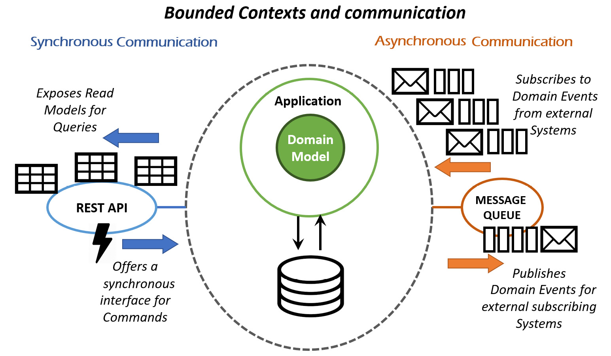

# 了解业务
> “事实是，人们工作的系统和与人的互动可能占绩效的 90% 或 95%。”
>
> ——威廉·爱德华兹·戴明

一般来说，在软件开发人员中观察到的最常见模式之一是他们倾向于将软件开发视为一门独立的学科——几乎与任何其他科学或商业领域脱节。这种观点使他们非常热情、深入和认真地思考它，但是对于其他对业务和软件开发本身的成功同样甚至更重要的话题，同样的深度和热情很快就会消失。

William Edwards (Bill) Deming 的这句话揭示了一个伟大的真理：软件开发是一项团队活动。成败就是团队的成败。据他介绍，如果团队的工作动力不好，单个开发人员的技术能力相关性仅占团队整体绩效的 5%。这就是为什么大卫 J. 安德森在他的杰作看板书中说：“一个只有广泛人才的团队可以通过正确的流程、良好的纪律和领导力产生世界级的成果。

> 笔记
>
> David J. Anderson，看板：技术业务的成功进化变革，https://www.goodreads.com/book/show/8086552-kanban。

## 知识与理解

系统思维领域的先驱者之一罗素·阿科夫（Russell Ackoff）表示：“你永远无法对所有事物做出完整的解释或理解，但你理解的系统越大，你的理解就越多。你理解的元素越小，你的理解就越多。” "

> 笔记
>
> Aleksis Tulonen：Ackoff 和系统思维：http://aleksistulonen.com/2018/10/28/ackoff-and-systemic-thinking/。

这似乎意味着知道和理解不是一回事。那么，两者有什么区别呢？让我们看看字典是怎么说的：

- 要知道：通过观察、询问或信息来了解。
- 理解：感知某事的意义、解释或原因。

根据一般原则来看待孤立的事实是理解的本质。那什么是理解？理解是一种概括的意义或洞察力。洞察力是对关系的基本感觉或感觉；它是一种意义或洞察力。经过检验的普遍洞察力是一种理解；它是一种含义或洞察力，可以有益地应用于几个甚至许多相似但不一定相同的情况或过程。最有价值的见解是那些被足够多的类似案例所证实的见解，可以概括为一种理解。

> 笔记
>
> Y.K.教授Ip，新加坡国立大学，知道不等于理解：什么是理解：http://www.cdtl.nus.edu.sg/success/sl20.htm。

所以我们可以说知识回答了关于某事的问题，而理解回答了为什么的问题。我们可以知道我们不理解的事情。我们知道事实，但理解想法。所以，理解解释了知识。它处于更高的抽象级别（使用软件设计术语）。

所以，无论你的目标是什么，想想你是否需要智慧、直觉或情感来实现它。然后设计你的练习来重新连接你大脑的这一部分，并为从知识到理解的漫长旅程做好准备。

> 笔记
>
> 知识与理解之间的真正区别，科林·罗伯逊，意志力进化 http://www.willpowered.co/learn/knowledge-understanding。

从 Ackoff 的角度来看，为了增加我们的理解，我们需要努力将我们的智力界限远远超出我们的小型开发团队甚至更广泛的 IT 部门。我们永远不应该忘记，软件开发团队并不是为了自己的目标而工作；他们努力为企业服务。他们的目标是建立一个信息系统，以更有效的方式支持和实现业务目标。所以，我们真正应该理解的更大的系统是整个业务。这就是在有效性方面产生真正差异的原因，不仅对于软件开发，而且对于为组织工作的任何人。

## 约束理论
约束理论 (TOC) 是 Eliyahu M. Goldratt 在其 1984 年的《目标》一书中介绍的一种整体管理哲学，旨在帮助组织不断实现其目标。 Goldratt 在 1997 年出版的《关键链》一书中将该概念应用于项目管理。

> 笔记
>
> 维基百科，约束理论：https://en.wikipedia.org/wiki/Theory_of_constraints。

TOC 的基本思想非常简单，但在我们专注于改进时非常强大，因为它旨在帮助确定我们应该在系统中做什么，以实现最快和最有效的收益。尽管最初是在制造业背景下阐述的，但其背后的原则非常普遍，可以适应每个系统环境。

该理论源于这样一个事实，即每个组织都有改进的空间，并且当前的绩效受到最有限的约束。删除约束将具有立即改善整个系统的效果，然后将受到不同约束的限制。改进工作的重点应始终放在最具限制性的约束上，一旦将其删除，则应将重点放在以下约束上。

打个比方，你可以把一个系统想象成一个环链。如果我们对链条施加张力，链条将在最弱的环处断裂。所以，要完善整个链条，我们应该加强最薄弱的一环。

要应用 TOC，你应该将系统吞吐量的概念视为它交付价值的速率。在每一个价值流中，总有一个约束步骤限制了整体吞吐量。

识别约束是第一步，包括了解系统和寻找瓶颈。在软件开发中，通常在具有超载列的看板板上很容易识别它，但在制造环境中，他们正在寻找“一大堆东西和闲置的人等着”。
利用约束突破其极限并最大化当前的整体吞吐量，而无需进一步投资。这可能相当于优化存储过程，例如，当依赖于它的特定数据库操作被确定为瓶颈时。
通过寻找减少压力的方法，优化与之交互的系统，让一切都服从约束。在前面的存储过程示例中，此步骤将优化调用存储过程的系统以减少使用它的频率，可能会缓存一些结果。
提升约束是要为它投入更多资源，直到它不再是系统的约束。在前面的示例中，这可能意味着扩展或扩展数据库，或重写负责操作的系统。
此时，你重复该过程，搜索下一个约束。

> 笔记
>
> 这个例子参考了我们朋友 Matthew Butt 的文章，标题为 How Applying TOC Helped Us Optimize Our Code，在 Matthew Butt 的博客 https://blog.matthewbutt.com/2016/12/18/how-应用约束理论帮助教育优化我们的代码/。

这个基本原则隐藏了一些非常重要的后果，主要是在一个系统中，如果我们不改进最有限的约束，改进其他方面不会对整个系统产生任何可见的后果，本质上是浪费精力.此外，如果没有一种简单的方法来监控系统以始终识别当前约束（通常的反馈），一旦我们对当前约束的改进工作成功消除它，我们应该立即停止工作并切换我们的专注于确定下一个约束。从那一刻起继续在旧版本上工作将成为一种浪费。

根据我们的经验，我们发现这个想法在许多情况下都是智慧的重要来源，不仅涉及有效的团队和组织改进，还涉及自我发展和走出自己的舒适区以提升相关约束。这是超越仅仅涉及组织理解的技术知识和学习科目的最终原因。这就是为什么在我们的蒸馏过程中，必须包括这一课。

## 领域驱动设计：什么领域？

关于领域驱动设计（DDD）的主要误解是“认为它只是少数实现模式，因为许多文章和博客都关注建模模式。开发人员更容易看到在代码中实现的 DDD 的战术模式，而不是而不是业务用户和团队之间在他们不关心或不理解的域上进行的对话”。

> 笔记
>
> Scott Millett 和 Nick Tune，领域驱动设计的模式、原则和实践，https://www.goodreads.com/book/show/25531393-patterns-principles-and-practices-of-domain-driven-design。

因此，第一个 D 的域不是域模型。它是业务领域。

此外，DDD 并不提倡先行大设计。 “驱动”并不一定意味着“首先构建完整的领域模型”。这意味着，既然业务领域如此重要，那么领域模型就是系统的核心；因此，它一定是我们给予更多爱的那个。从本质上讲，我们越接近领域模型，我们就越不应该对影响设计的权衡持开放态度。

如果你对正在工作的业务领域不够了解，软件项目就会失败。打字不是交付产品的瓶颈；编码是开发中最容易的部分。 [...] 创建和维护一个可以满足业务用例的有用的领域软件模型是困难的部分。

但是，你在了解你的业务领域方面投入的越多，当你尝试在软件中对其进行建模以解决其固有的业务问题时，你将拥有更好的装备。

> 笔记
>
> Scott Millett 和 Nick Tune，领域驱动设计的模式、原则和实践，https://www.goodreads.com/book/show/25531393-patterns-principles-and-practices-of-domain-driven-design。

因此，从这个角度来看，了解整个业务是一个巨大的优势。这不仅仅是因为了解来自上游和下游的内容有助于我们对软件进行建模，以提供最佳功能并与组织的其他部分进行交互。如果这种理解可以在业务层面提供有用的见解，改进其功能并优化整个系统，我们还将提高业务所有部门的绩效，包括我们自己的团队，正如戴明所说。

这是 DDD 作为一种开发哲学的强大力量，由 Eric Evans 在其史诗般的著作《领域驱动设计：解决软件核心中的复杂性》中定义。其目标是使团队能够通过与领域专家的合作有效地管理复杂问题领域的软件构建，以便建立对软件应该支持、自动化并最终改进的业务环境的共同理解。我们应该永远记住，任何自动化都有哲学上的理由来节省执行任务的时间，以便人们可以将这些时间用于更高目的或智力要求的活动。

## 超越要求：知识加工

与领域专家的合作是 DDD 的核心，它创造了术语“知识运算”来表达它。 “知识处理是从问题域中提取相关信息的艺术，以便构建一个可以满足业务用例需求的有用模型。”

> 笔记
>
> Scott Millett 和 Nick Tune，领域驱动设计的模式、原则和实践，https://www.goodreads.com/book/show/25531393-patterns-principles-and-practices-of-domain-driven-design。

知识加工的目标是走向集体理解的道路，使需求集中在为业务带来最大价值的特征上；这些功能反过来最大化实现它们的软件可以提供的价值。

正如我们在上一课中看到的，实现有效协作的是沟通，这再次符合敏捷原则。与 DDD 的这一方面一致，我们强烈认为仅在纯技术方面表现出色通常不足以实现真正的效果。有时，能够走出坐在屏幕后面的舒适区并采取能够进行交流的行动是很重要的。

发现你一直在构建错误的东西时的挫败感与你花费在构建它上的时间和精力成正比。所以最好尽早确定不是这样的，对吧？

幸运的是，有几种技术可以帮助防止这种情况发生。他们更多地关注软技能、促进和集体学习，目的是理解和探索更广泛的系统。在许多情况下，你的技术技能可能还不够。

### 5W

根据我们的经验，我们发现获得理解的最佳方式是提出问题。在意大利，有一句谚语：“Chiedere e' lecito, rispondere e' cortesia”。永远不要害怕提问。然而，为了最大化我们从答案中获得的价值，提出正确的问题很重要。

要达成理解，最有力的问题之一很简单：为什么？孩子们在理解世界的道路上经历了“为什么”，这并非巧合。相，不断地询问它，就像破纪录一样。

5W 是一种迭代疑问技术，用于探索特定问题背后的因果关系。该技术的主要目标是通过重复“为什么？”的问题来确定缺陷或问题的根本原因。每个答案构成下一个问题的基础。名称中的“5”源于对解决问题所需的迭代次数的轶事观察。

> 笔记
>
> 
>
> 维基百科，5 个为什么：https://en.wikipedia.org/wiki/5_Whys。

并非所有问题都有一个根本原因，因此要发现多个根本原因，你必须重复该方法并每次提出不同顺序的问题。这种方法对于要探索哪些问题行或继续搜索其他根本原因多长时间没有具体规则。因此，即使严格遵循该方法，结果仍然取决于相关人员的知识和坚持。

> 笔记
>
> 维基百科，5 个为什么：https://en.wikipedia.org/wiki/5_Whys。

它是解决问题培训的重要组成部分，作为丰田生产系统入门培训的一部分。丰田生产系统的架构师大野耐一表示，5 个为什么是“丰田科学方法的基础”，“通过重复五次为什么，问题的性质及其解决方案变得清晰。”该工具已在丰田以外广泛使用，现在已在 Kaizen、精益制造和六西格码中使用。在其他公司，它以其他形式出现。在 Ricardo Semler 的领导下，Semco 实践“三个为什么”并将实践范围扩大到目标设定和决策制定。”

> 笔记
>
> Taiichi Ohno，丰田生产系统：超越大规模生产，https://www.goodreads.com/book/show/376237.Toyota_Production_System。

这种技术在过去被证明对我们非常有用。有时，在第五个为什么之前，会发生一些神奇的事情；业务领域专家思考片刻后回答：“这是一个很好的问题！我自己也不知道。让我来了解更多……”这就是我们为知识处理和增长做出贡献的时刻共同的理解。

### 影响映射

另一种非常有用的方法可以超越传统需求，而是让它们作为业务目标的结果出现，这是影响映射。这是一种具有强大视觉成分的技术，因为它使用一种特殊的思维导图，旨在关注业务信息。思维导图真正有效的一点是，它是一种与利益相关者协作执行的交互式活动，从业务正在寻找的影响开始（即从战略目标开始）。

让我们看一个例子：

它是通过考虑以下四个方面促成的讨论中形成的思维导图：

- 目标：影响图的中心回答了最重要的问题：我们为什么要这样做？这是我们正在努力实现的目标。
- 演员：影响图的第一个分支提供了以下问题的答案：谁可以产生预期的效果？谁能阻挠？谁是我们产品的消费者或用户？谁会受到它的影响？这些是可以影响结果的参与者。
- 影响：影响地图的第二个分支级别从我们的业务目标的角度设置参与者。它回答了以下问题：我们的演员的行为应该如何改变？他们如何帮助我们实现目标？他们如何阻碍或阻止我们成功？这些是我们试图创造的影响。
- 可交付成果：一旦我们回答了前三个问题，我们就可以讨论范围。影响图的第三个分支级别回答了以下问题：作为组织或交付团队，我们可以做些什么来支持所需的影响？这些是可交付成果、软件功能和组织活动。

影响映射有助于通过防止范围蔓延和过度设计的解决方案来减少浪费。它通过将可交付成果置于它们应该实现的影响的背景下来提供交付重点。它通过创建一个全局视图来增强协作，业务发起人和交付团队可以使用该视图更好地确定优先级，并作为更有意义的进度监控和报告的参考。最后，通过清楚地传达基本假设并允许团队对其进行测试，它有助于确保实现正确的业务成果，或者在成本过高之前停止不切实际的项目。

> 笔记
>
> Gojko Adzic，什么是影响映射？ https://www.impactmapping.org/about.html。

在许多软件项目中，开发人员只能获得影响图的较低层——企业认为他们需要什么以及他们认为开发人员应该如何实现它。但是，通过影响图，你可以放松他们的假设并找出他们真正想要实现的目标。然后，你可以利用你的技术专长提出他们从未想过的优质替代方案。

> 笔记
>
> Scott Millett 和 Nick Tune，领域驱动设计的模式、原则和实践，https://www.goodreads.com/book/show/25531393-patterns-principles-and-practices-of-domain-driven-design。

### 爆米花流

康威定律指出，“设计系统的组织 [...] 被限制生产的设计是这些组织的通信结构的副本。”因此，如果我们想要实现最优设计，往往需要先对那些通信结构采取行动。系统应该首先改变，否则我们的努力会产生次优的解决方案。但更多的时候，人类不想改变。系统也不行。

> 笔记
>
> 维基百科，康威定律：https://en.wikipedia.org/wiki/Conway%27s_law。

根据我们的经验，最明显的后果之一是组织无法足够快地发展和适应。这是 John Gall 在其令人惊叹的著作《系统圣经》中定义的系统的另一个属性：

> 为了保持不变，系统必须改变。
>
> 具体来说，必须发生的变化是以前用来防止内部剧烈变化的变化模式（或策略）的变化。
>
> ——约翰·加尔，《系统圣经》

> 笔记
>
> John Gall，系统圣经：大小系统初学者指南（第 3 版）：https://www.goodreads.com/book/show/583785.The_Systems_Bible。

与这种自然的惯性倾向作斗争也是第 12 条敏捷原则的目标，如果你想一想：

> 团队定期反思如何变得更有效，然后相应地调整和调整其行为。
>
> – 第 12 条敏捷原则

在组织层面，我们最近看到的关于这个主题的最佳想法之一是由 Claudio Perrone 提出的 PopcornFlow。 PopcornFlow 方法有助于将促成变革的原则融入你的工作习惯。

PopcornFlow 自然地支持 DevOps 的三种有效方式的想法，使用可视化技术通过快速实验和反馈循环来支持批判性思维和组织学习。你可以在本书末尾的专用部分阅读更多关于 PopcornFlow 的信息。

### 用户故事映射

故事地图解决了在敏捷开发中使用用户故事的一大问题——忽视了大局。故事地图从用户的角度看待产品或功能。构建故事地图要求故事地图制作者从用户的角度思考使用产品的体验。

> 笔记
>
> Jeff Patton，用户故事映射：http://www.jpattonassociates.com/jeff-pattons-book-released-user-story-mapping/，http://www.jpattonassociates.com/user-story-mapping/。

用户故事映射是一个非常简单的想法——通过构建一个简单的模型来谈论用户在产品中的旅程，该模型可以像你一样讲述用户的故事。事实证明，这个简单的想法使得在敏捷开发中处理用户故事变得更加容易。更重要的是，它将保留你的用户，以及他们对你的产品所做的事情，并以你对这些产品的开发为中心。这比在功能争论中迷失要好。

该技术基于时间轴中与某人为达到目标而做某事相关的积压工作的可视化。为了实现这一点，用户故事根据他们对更高目标的贡献被分组到更广泛的活动和任务中。然后将它们排列在称为主干的叙事流中。较小的子任务、用户故事、细节和变化垂下来形成连接到主干的肋骨。

这是用户故事地图在对话结束时的外观示例。

用户故事映射在预先存在积压的情况下特别有用，但对它的整体理解缺乏、不清楚或分散在业务中的几个不同参与者之间。事实证明，它在将所有知识重新协调为整体理解方面非常有效。

### 事件风暴

不幸的是，大多数大公司都被组织成密封的部门，他们之间的沟通往往非常困难和低效。这使得对整个业务的理解变得困难，有时甚至是不可能的。

这种对系统的局部看法只会鼓励更大程度的专业化，因为在部门内部，存在一种无意识的偏见，即认为部门的需求比整个业务更重要。正如 John Gall 解释的那样，这种情况非常危险，因为系统往往会创建自己的目标。如果部门的独立目标与主要系统的总体目标不一致或相冲突，则结果是大量资源浪费，在某些情况下，可能会威胁到组织本身的生命。

我们最近看到的帮助确定有界上下文的最佳分离并提供对组织系统及其价值流的真正理解的最佳技术之一是 EventStorming。由 Alberto Brandolini 提出的 EventStorming 使用域事件流作为驱动程序来发现整个系统的所有其他组件。你可以在本书末尾的专用部分阅读更多关于事件风暴的信息。

### 商业模式画布

商业模式画布是一个战略管理和精益创业模板，用于开发新的或记录现有的商业模式。它是一个视觉图表，包含描述公司或产品的价值主张、基础设施、客户和财务的元素。它通过说明潜在的权衡来帮助公司调整其活动。

商业模型画布最初是由 Alexander Osterwalder 根据他早期在商业模型本体上的工作提出的。自 2008 年 Osterwalder 的作品发布以来，针对特定领域的新画布已经出现。

> 笔记
>
> 维基百科，商业模式画布：https://en.wikipedia.org/wiki/Business_Model_Canvas。

在其他画布中，最重要的是由 Ash Maurya 改编的精益画布。

精益画布改编自 Alex Osterwalder 的商业模式画布，并针对精益创业方法进行了优化，重点在于发现值得解决的客户问题。

> 笔记
>
> 精益画布：https://leanstack.com/leancanvas。

这些模板提供了一种非常集中的方式，可以从更高的角度看待整个业务，基本上提供了组织活动及其存在原因的一页快照。

虽然创建和更新画布的练习对于管理人员为了保持活动和业务目标一致非常有用，但练习的结果对于向新来者解释组织的大局也非常有效。所提供的信息是向领域专家提出有意义的问题并通过更深入地了解其领导团队的愿景参与业务发展的一个很好的起点。

商业模式画布的中心显示了对任何企业来说最重要的东西：价值主张。它基本上是企业存在的原因——它为客户提供的产品和服务的组合以及他们提供的核心价值。识别此价值的一种方法是让所有者指定他们希望客户记住他们与公司互动的内容。

画布的其他部分以流的形式与价值主张相关：

- 在顶部，从左到右的方向是价值流。
- 左上角是与创造价值有关的合作伙伴关系、活动和资源。
- 右上角是客户关系、渠道和客户细分，专注于价值的传递。
- 底部是相反方向的资金流向：从收入结构的右侧到成本结构的左侧。

客户为公司的产品或服务提供的价值付费，而后者又向其他参与者付款，以执行创造该价值的活动。收入和成本之间的差额就是利润（即所提供价值的净货币化）。

在我们看来，这个模板非常有用，因为它以非常紧凑的方式展示了任何业务的关键组成部分，专注于最重要的方面：目标是提供价值。它还表明，为了创造和交付该价值，组织应该组织为一系列活动：现金流只是这些活动与目标有效对齐的副作用。因此，每项业务的基础都是所谓的价值流。

## 价值流和领域事件

> “如果你不能将你正在做的事情描述为一个过程，那么你就不知道自己在做什么。”
>
> ——威廉·爱德华兹·戴明

价值流是从精益制造中借用的一个概念，它是组织为为客户、利益相关者或最终用户产生整体结果而进行的一系列端到端的增值活动，重点关注生产从原材料到最终产品的流程，以及从概念到实现的设计流程。

因此，我们可以将其视为对商业模型画布价值流的稍微更细化的解释，转换为设计、生产和交付价值主张所必需的活动时间序列。一个组织通常会有许多这样的价值观，而且它们通常会有独立的、不断变化的步伐。

有大量关于价值流和价值流映射的文献，但我们认为要理解的关键概念不会通过更详细的方式得到加强。从这个角度来看，将精益价值流作为活动序列的图表表示的想法是关键起点，如下所示：

因此，我们现在可以将业务视为一系列关键活动，所有这些活动都将由信息系统支持。如果缺少这种对组织活动的整体看法，那么有什么机会创建相互协调沟通的系统，将价值流与信息流平滑映射？

如果我们从价值流的角度来看软件开发，而不是简单地将这些活动视为一个过程，我们可以强调创造客户价值。正如我们从戴明那里了解到的那样，这一切都是为了改进整个流程，而不仅仅是零件——以最大限度地减少浪费并确保客户得到他们想要的东西。

流程的活动是独立的，但又是相互关联的；这是复杂系统的属性之一。每个活动都自主执行不同的任务，但将信息反馈给价值链进入下一阶段所需的系统其他部分。

例如，在一家在线销售实物商品的电子商务公司中，价值流活动包括：

- 获取（物理或远程）要出售的物品
- 描述他们的身体细节（颜色、质量、图片和其他有助于他们在市场上投放的信息）
- 评估和互动以处理库存数量
- 创建和管理客户浏览目录、下订单和付款、发货的机制

同时，有一个营销系统来投放广告，销售完成后，会有一些客户服务功能。以上所有这些都是价值流的活动。它们可以并行发生，并且流可能有些复杂，但它们可以彼此独立地进行。但是，它们有依赖关系；例如，负责让客户下订单的系统显然需要知道可用物品的库存——它们是相互关联的。

为了控制整个组织的信息系统的整体熵，业务必须正确地将这些活动分离和分组为独立但相互关联的子系统并优化它们的通信。这是一个关键点。在 DDD 的世界中，这些子系统称为有界上下文。

这些活动中的每一个都会产生数据，无论是新创建的数据还是更改的数据（从事件溯源的角度来看，这只是创建新数据的一种特殊情况）。但是，并非所有这些大量信息都与整个业务相关。大多数仅与特定活动或任务相关，而只有某些特定事件会产生与整个组织相关的信息。这些相关事件是为了优化子系统之间的通信而需要关注的关键信息。在 DDD 的世界中，它们被称为领域事件。

例如，在我们之前考虑描述项目的活动的示例中，必须考虑许多不同的方面：品牌、名称、简短描述和技术细节。然后必须拍摄、编辑照片并将其链接到该项目，并且应该评估可用库存。这些子任务产生并需要数据来完成，但每一个的完成在有界上下文之外是不相关的；因此，它的复杂性应该完全封装在有界上下文中。

什么与价值链的下一步相关？要在下一个活动中继续前进并将项目投放市场，所有这些子任务都必须已完成并且项目具有为下一步做好准备所需的所有信息。因此，这意味着已添加所需的值。此时，有界上下文需要将此事件通知其他上下文，这可能与它们相关并引发域事件。

## 限界上下文和通信

如果你还记得 Alan Kay 在上一课中的名言，那么制作一个出色的、可增长的系统最重要的是设计其模块的通信方式。这里的促成因素是模块化。 Kay 理所当然地认为系统是由分形组成的模块，并表示它们如何通信是关键点。

> 笔记
>
> 制作出色且可扩展的系统的关键在于设计其模块的通信方式，而不是设计其内部属性和行为应该是什么。

从这个角度来看，由于限界上下文是高级模块，因此还应该特别关注它们之间的通信。此外，鉴于为了达成良好的理解，我们应该将焦点转移到外部系统（如 Russell Ackoff 之前所指出的），这解释了为什么理解价值流以设计最佳交互流很重要。有界上下文。

系统的这种合乎逻辑的高级视图比内部结构更重要，因为它是做正确事情的关键。而这里，关键是在它们的独立性和相互关系之间找到完美的平衡，决定它们应该如何分割。哪些子任务应该组合在一起以形成有界上下文，哪些子任务应该单独保留？

答案是这取决于整体情况——这里也没有灵丹妙药，抱歉！但是我们有一些原则可以帮助进行决策的归纳过程。例如，我们可以在这里看到我们在凝聚力和耦合中看到的相同的力量：

- 过多的内聚：将每项任务保持在一个大的有界上下文中意味着纠缠系统，使其难以更改和扩展，类似于上帝类和发散的更改代码气味。
- 过多的耦合：将每个任务拆分到自己的有界上下文中意味着将复杂性转移到它们之间的通信上，从而产生依赖关系的爆炸式增长。

此外，在面向服务的体系结构 (SOA) 环境中，实现独立性的方法并不是免费的。必须创建、部署、维护和监测基础设施边界。

你必须选择在哪里付出复杂性的代价。因为 DDD 旨在降低软件的复杂性，所以结果是你为维护重复模型和可能的重复数据付出了代价。

> 笔记
>
> Eric Evans，领域驱动设计：解决软件核心的复杂性，https://www.goodreads.com/book/show/179133.Domain_Driven_Design。

在这里，一个很好的折衷方案是延迟基础设施边界的实施，直到系统需要扩展能力。使用上一节中解释的设计原则，可以保持所有模块之间的逻辑分离，而无需强制基础设施遵循。此外，对数据持久性及其访问的隔离的特别关注使我们能够拥有一个易于扩展的系统，而无需支付基础设施复杂性的代价，直到它被业务需求证明是合理的。

Eric J. Evans 的《领域驱动设计》一书中描述了有界上下文。这个想法是开发人员应该能够理解和更新服务的代码，而无需了解其对等服务的内部结构。服务严格通过 API（和消息队列）与其对等方交互，因此不共享数据结构、数据库模式或对象的其他内部表示。限界上下文确保服务被划分并具有明确定义的接口，这也使测试更容易。

> 笔记
>
> Gene Kim 等人，DevOps 手册：如何在技术组织中创建世界级的敏捷性、可靠性和安全性：https://www.goodreads.com/book/show/26083308-the-devops-handbook。

我们同意 Nick Tune 的观点，他说有界上下文应该表现出三个有效的核心属性：

- 隔离：必须能够独立地对不同的上下文进行更改，而不会破坏其他上下文。
- 可理解性：他们必须有一个无处不在的词汇表并以它命名，以便能够就他们与业务相关的整体对话。
- 并行化：它们应该能够在很少或没有协调的情况下并行发展。

> 笔记
>
> Nick Tune，战略领域驱动设计：模块化的 3 个优点是什么？你如何通过战略性 DDD 实现这些优点？ http://www.ntcoding.co.uk/speaking/talks/strategic-domain-driven-design/agile-2018-san-diego-august-2018。

这三个属性有可能最小化熵并允许可扩展性。

## 同步与异步

由于每个有界上下文都有自己对低级数据存储的隔离访问，因此为这种维护付出的最大代价不是数据复制，因为数据存储相对便宜。要付出的最大代价是处理和设计通信，以实现该数据的最佳传播并丰富价值流。有许多不同的方法可以实现这一点，但在这里，也有一些原则可以帮助我们做出决定。

为了正确选择使用其中一种，最重要的是要了解同步和异步通信的含义。

正如我们所见，有界上下文的实例应该具有高度的独立性，因此最小化它们之间的依赖关系非常重要。然而，正如我们在 connascence 的概念中看到的那样，理解它们的依赖类型也很重要，以便在面向服务的场景中最大化每个单个有界上下文的自主性。

从这个角度来看，服务之间的同步依赖意味着调用服务会阻塞执行，并在继续之前等待被调用服务的响应。与执行顺序一致性和时序一致性的概念非常相似，这种依赖性非常强，将调用者与被调用者紧密耦合。它不能很好地扩展，调用服务可能会受到被调用服务中的错误的影响。在将高可用性作为非功能性要求之一的系统中，不需要这种通信。

同步方法的一个强大替代方案是使用发布/订阅消息传递系统的异步通信。在这种情况下，调用服务只是发布有关发生的域事件的消息并继续其他工作（与此请求无关）。

它在发送请求后不会阻塞并等待响应，这提高了可伸缩性。另一个服务中的问题不会中断这个服务，当其他服务暂时中断时，调用服务可能无法完全完成一个进程，但调用服务本身并没有中断。因此，使用异步消息传递，服务更加解耦，保留了更多的自主权。

异步消息传递解决方案的缺点是它增加了系统的基础结构复杂性，因为它需要发送和处理消息的机制。此外，当这种模式被大量使用时，域事件流的设计变得至关重要，这会将复杂性转移到一个非常难以监控的区域，从而为不必要的风险打开了大门。我们已经看到系统与消息的内部紧密耦合的场景，以至于基本上不可能在不破坏另一个有界上下文的情况下对有界上下文进行更改。请记住，权力越大，责任越大。

### 命令-查询分离

从通信的角度来看，命令和查询之间的分离关注点也可以用有界上下文的概念来表示。如果我们考虑命令和查询的不同性质，我们可以看到它们非常适合同步和异步的想法。从本质上讲，查询适合同步通信，因为它们所要做的只是以只读模式公开数据，理想情况下，此操作非常快且没有任何竞争条件。

鉴于 CAP 定理的后果，在最终一致性条件下工作已被证明是分布式系统在弹性、可扩展性和性能方面的关键优势。这是在即发即弃模式下在异步通信中发生命令的理想情况。它们可能需要比查询更多的时间来执行，并且通常是事件的后果，因此它们非常适合。

> 笔记
>
> 维基百科，[T] CAP 定理意味着在存在网络分区的情况下，你必须在一致性和可用性之间做出选择：https://en.wikipedia.org/wiki/CAP_theorem。 CAP 定理是相关的，因为 Web 的性质不同于本地网络，更类似于网络分区，因此在我们的 Web 开发中需要考虑一致性和可用性之间的选择。

这里重要的是要指出事件和命令之间的区别：

- 事件是触发器，是系统层面发生相关事件的通知。它应该包含可以识别自己的最少信息（理想情况下，这只是其类型和所涉及实体的 ID 的问题）。
- 该命令是作为事件的结果执行的，而负责引发该事件的人甚至可能不知道该命令正在发生。如果命令需要更多数据来执行，它可以利用同步通信并通过 API 查询读取模型以完成必要的信息。这一点非常重要，因为它将对消息本身的依赖降至最低，在发布/订阅系统中，这可能是一对多的关系。通过这种方式，我们将依赖关系转移到读取模型上，这些模型更容易更改和扩展，并且可以具有更大的粒度，从而打破了一对多的关系。

## 业务和 DevOps

一旦正确定义和实施了有界上下文，对于一个完整且有效的信息系统，仍然需要考虑一个重要方面。如果不包括在生产中顺利部署更改的能力，那么进行更改的能力将毫无意义，因为只有在最终用户可以使用时才会交付价值。此外，必须对系统进行监控，以便在某些事情没有按预期工作时迅速采取行动。最后，必须能够在安全的环境中轻松进行实验，以便根据经验收集的经验数据找到最佳技术解决方案。这些是 Gene Kim、Kevin Behr 和 George Spafford 在 The Phoenix Project 中描述的 DevOps 的基本理念，并在 Gene Kim、Jez Humble、Patrick Debois 和 John Willis 的 The DevOps Handbook 中重新审视。

他们的工作对于理解如何最大化 DevOps 的价值至关重要，而且特别有价值，因为它具有面向业务的观点，对其应用了系统的愿景，我们试图将其应用于本书，并将分享现在也是。

从本质上讲，他们所说的是 DevOps 通过三种方式实现技术有效性。

### 第一种方式

第一种方式可以实现从开发到运营再到客户的快速从左到右的工作流程。为了最大限度地提高流程，我们需要让工作可见，减少我们的批量大小和工作间隔，通过防止缺陷传递到下游工作中心来提高质量，并不断优化以实现全球目标。

> 笔记
>
> Gene Kim 等人，DevOps 手册：如何在技术组织中创建世界级的敏捷性、可靠性和安全性：https://www.goodreads.com/book/show/26083308-the-devops-handbook。

这与我们专注于为客户提供价值的系统愿景一致，因此只有在系统部署并可供客户使用时，才能实现该价值。

### 第二种方式

第二种方式可以在我们价值流的所有阶段实现从右到左的快速和持续的反馈流。它要求我们放大反馈以防止问题再次发生，或实现更快的检测和恢复。通过这样做，我们从源头上创造质量，并在需要的地方生成或嵌入知识——这使我们能够创建更安全的工作系统，在发生灾难性故障之前很久就发现并修复问题。

> 笔记
>
> Gene Kim 等人，DevOps 手册：如何在技术组织中创建世界级的敏捷性、可靠性和安全性：https://www.goodreads.com/book/show/26083308-the-devops-handbook。

这个原则是关于反馈回路的，它是系统检查和适应的基础。反馈越快，行动就越快。这是通过监控和警报来实现的。

### 第三种方式

第三种方式能够创建一种生成性、高度信任的文化，支持动态、有纪律和科学的实验和冒险方法，促进组织学习的创造，无论是从我们的成功还是失败中。此外，通过不断缩短和扩大我们的反馈循环，我们创建了更加安全的工作系统，并且能够更好地承担风险和进行实验，帮助我们比竞争对手更快地学习并在市场上获胜。

作为第三条道路的一部分，我们还设计了我们的工作系统，以便我们可以倍增新知识的影响，将本地发现转化为全球改进。无论有人在哪里开展工作，他们都是凭借组织中每个人的累积和集体经验来开展工作的。

> 笔记
>
> Gene Kim 等人，DevOps 手册：如何在技术组织中创建世界级的敏捷性、可靠性和安全性：https://www.goodreads.com/book/show/26083308-the-devops-handbook。

最后一个原则是关于实验和知识共享，以便突破性发现能够迅速传播到组织中并改进整个系统。

## 系统思维和社会技术组织
我们即将结束旅程，在这一点上，细心的读者可能已经注意到了一些模式。反馈回路、沟通、独立、价值、熵、整体、有效性等概念的出现并非巧合。本书的所有主题都是从系统思维的角度来看的，因此有理由关注这些概念。

系统思维，作为“识别和理解系统、预测它们的行为并设计修改它们以产生预期效果的能力”，具有突出的优势，不仅可以理解编写好的软件原则背后的深层原因，而且还可以了解组织中出现的系统性问题。这是因为系统思维提供了一套适用于各种系统的通用原则。

> 笔记
>
> Ross D. Arnold 和 Jon P. Wade，2015 年系统工程研究会议。

从这个角度来看，企业可以被视为社会技术系统，其中确定性系统（我们编写的软件）的动态与复杂系统（人类与软件和彼此交互）的动态相遇，产生的环境显示通常不被理解的非常明确的属性。戴明说，“再多的细心或工艺技巧都无法克服系统的根本缺陷”。我们可以将其更改为“再多的敏捷技术实践都无法克服系统的根本缺陷”。

> 笔记
>
> Edwards Deming，走出危机，https://www.goodreads.com/book/show/566574.Out_of_the_Crisis。

人类表现出非线性行为，因此让他们有效地协同工作的困难部分不在于技术方面，而在于社会技术系统的社会方面，即企业。我们得出的结论是，技术性质的困难不仅隐藏了社会性质的问题，而且仅仅是这些问题的社会后果的副作用。

## 资源
### 基于网络的资源

- 关于约束理论你需要知道的一切，Smartsheet：https://www.smartsheet.com/all-about-theory-of-constraints。
- 从机械思维到系统思维，Russell L. Ackoff：https://www.youtube.com/watch?v=yGN5DBpW93g。
- 用户故事映射介绍，Jim Bowes：https://manifesto.co.uk/user-story-mapping/。
- 精益画布，Ash Maurya：https://leanstack.com/leancanvas。
- 微服务架构原则 #4：异步通信优于同步通信，Gero Vermaas：https://xebia.com/blog/microservices-architecture-principle-4-asynchronous-communication-over-synchronous-communication/。
- Story Map Concepts，Jeff Patton：http://www.jpattonassociates.com/wp-content/uploads/2015/03/story_mapping.pdf。
- 领域驱动设计的战略实践，Nick Tune：http://www.ntcoding.co.uk/workshops/strategic-ddd-practices。
- 知识与理解之间的真正区别，科林·罗伯逊：http://www.willpowered.co/learn/knowledge-understanding。
- 用户故事映射，Jeff Patton：http://www.jpattonassociates.com/user-story-mapping/。
- 什么是约束理论？精益生产：https://www.leanproduction.com/theory-of-constraints.html。
- 什么是约束理论，它与精益思维相比如何？精益生产：https://www.lean.org/common/display/?o=223。

### 图书

- Ackoff 的最佳作品：他关于管理的经典著作，Russell L. Ackoff：https://www.goodreads.com/book/show/1623149.Ackoff_s_Best。
- 敏捷教练，Rachel Davies，Liz Sedley：https://www.goodreads.com/book/show/6582184-agile-coaching。
- 敏捷回顾：让优秀的团队变得更好，Esther Derby 等人：https://www.goodreads.com/book/show/721338.Agile_Retrospectives。
- 商业模式生成，Alexander Osterwalder，Yves Pigneur：https://www.goodreads.com/book/show/7723797-business-model-generation。
- 关键链，Eliyahu M. Goldratt：https://www.goodreads.com/book/show/848514.Critical_Chain。
- DevOps 手册：如何在技术组织中创建世界级的敏捷性、可靠性和安全性，Gene Kim、Jez Humble、Patrick 
- Debois、John Willis：https://www.goodreads.com/book/show/26083308-the- devops 手册。
- 领域驱动设计：解决软件核心的复杂性，Eric Evans：https://www.goodreads.com/book/show/179133.Domain_Driven_Design。
- 目标：持续改进的过程，Eliyahu M. Goldratt：https://www.goodreads.com/book/show/113934.The_Goal。
- 影响映射：利用软件产品和项目产生巨大影响，Gojko Adzic：https://www.goodreads.com/book/show/16084015-impact-mapping。
- 实施领域驱动设计，Vaughn Vernon：https://www.goodreads.com/book/show/15756865-implementing-domain-driven-design。
- 看板：你的技术业务的成功进化变革，David J. Anderson：https://www.goodreads.com/book/show/8086552-kanban。
- 人月神话：软件工程论文集，Frederick P. Brooks Jr.：https://www.goodreads.com/book/show/13629.The_Mythical_Man_Month。
- 走出危机，W. Edwards Deming：https://www.goodreads.com/book/show/566574.Out_of_the_Crisis。
- 领域驱动设计的模式、原则和实践，Scott Millett 和 Nick Tune：https://www.goodreads.com/book/show/25531393-patterns-principles-and-practices-of-domain-driven-design。
    Phoenix 项目：关于 IT、DevOps 和帮助你的业务获胜的小说，Gene Kim、Kevin Behr、George Spafford：https://www.goodreads.com/book/show/17255186-the-phoenix-project。
- 精益运行：从 A 计划迭代到可行的计划，Ash Maurya：https://www.goodreads.com/book/show/13078769-running-lean。
- 系统圣经：大小系统初学者指南：作为系统学的第三版，John Gall：https://www.goodreads.com/book/show/583785.The_Systems_Bible。
- 约束理论，Eliyahu M. Goldratt：https://www.goodreads.com/book/show/582174.Theory_of_Constraints。
- 约束理论手册，F. Cox III，John G. Schleier Jr.：https://www.goodreads.com/book/show/8361069-theory-of-constraints-handbook。
- 用户故事映射：发现整个故事，构建正确的产品，Jeff Patton：https://www.goodreads.com/book/show/22221112-user-story-mapping。
- 价值流图：如何可视化工作并调整组织转型的领导力，Karen Martin 和 Mike Osterling：https://www.goodreads.com/book/show/20456190-value-stream-mapping。