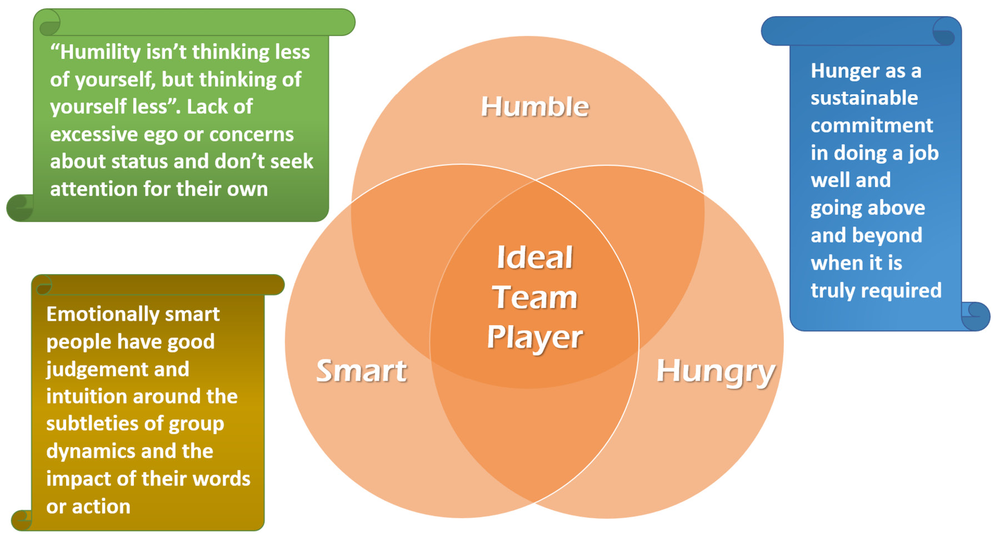

# 结论
信息、知识和理解使我们能够正确地做事，变得高效，而智慧使我们能够做正确的事情，变得有效。科学追求数据、信息、知识和理解：什么是真理；但人文追求智慧：什么是对的。

——拉塞尔·林肯·阿科夫

在小公司工作的一大好处——尤其是在成长中的初创公司——是你可以与企业中的每个人进行深入的人际接触，包括推动愿景付诸实施的关键领导者。这些人通常具有丰富的经验和知识。当他们也是仆人式领导时，和他们在一起真的很愉快，因为总有一些东西要学，即使是在意想不到的情况下。

例如，在加入当时最令人兴奋的意大利初创公司之一几天后，我被董事会重要人物 Max 邀请共进午餐。我们之前已经交流过一些话，我很惊喜地看到他是多么脚踏实地。对话很愉快，我立刻对他产生了好感。

在一些面食上，对话转向了体育——意大利经典。

“我确实喜欢足球，”我说。

“你支持哪支球队？”

“佛罗伦萨。”

这并不顺利，因为他效力于尤文图斯——历史上佛罗伦萨最糟糕的对手。但我们对此一笑置之。

他突然问了我一个棘手的问题，“既然你和我一样热爱足球，那就看看你知不知道：上届意大利世界杯夺冠球队的阵容是什么？”

我毫不犹豫地开口，“Zoff、Gentile、Cabrini、Scirea、Collovati、Oriali……”

> 笔记
>
> 这个故事发生在2006年意大利赢得上届世界杯之前。故事中提到的前一个是 1982 年的那个。

他简直不敢相信自己的耳朵，打趣道：“你确定你是开发者吗？CTO一定漏掉了什么！你知道我还没有找到一个开发者声称他热爱足球甚至知道吗？”

我们又笑了。然后，他问我，“你玩或玩过任何运动吗？”

我解释了一点我的故事：“当我还是个孩子的时候，我为我所在城市的青年队打了 12 年半职业曲棍球，这恰好是意大利大联盟的成员。我们甚至在 1986 年赢得了意大利冠军。上大学的时候我就放弃了……”

我能感觉到他很感兴趣，并且有理由提出这些奇怪的问题。他说：“你知道，这是我经常向受访者提出的问题，因为我相信我雇用的人的关键品质是成为一名优秀的团队合作者。根据我的经验，我观察到那些参加过团队运动和爱他们也往往对专业团队有出色的处理方式。”

我惊叹了。年轻时，那是我第一次听到资深人士谈论团队合作。这让我产生了很大的共鸣，正如你所看到的，我仍然记得那次谈话。我喜欢在那里工作，这种精神是他们成功的关键。不幸的是，随着岁月的流逝，我意识到有这种心态的高管并不常见。

## 人的因素
如果我们不触及人的话题，那么有效地构建软件的灵丹妙药将失去一种基本的味道。即使在作为单个开发人员构建软件时，也总是以客户、利益相关者和最终用户的形式与其他人进行交互。封闭系统只存在于理论的学术世界中，只存在于书本中。

如果不考虑人类和社会方面，任何模型——技术的、方法论的或心理的——都与现实几乎没有关系。这最终是 12 条敏捷原则中最大的优势。

> 笔记
>
> Kent Beck 等人，敏捷宣言背后的原则：http://agilemanifesto.org/principles.html。

尽管我们对敏捷炒作感到普遍的、分散的幻想破灭，但我们仍然不同意我们所听到的，即“敏捷已死”。也许是炒作即将消亡，这甚至可能是一件好事。敏捷首先是一个基于 12 条原则的想法。你不能扼杀想法或原则——这是它们的终极力量。

然而，想法可能会被误解和抵制，无论是无意识的还是恶意计划的——你决定。最初的敏捷理念已被扭曲，直至成为自嘲。取而代之的是一套仪式、方法和自我参照促进技术，尽管它们易于品牌化（因此也易于认证），但与最初的 12 条原则几乎没有关系。

我们建议读者超越敏捷宣言，阅读 12 条原则以更好地理解它们。不幸的是，它们被归类到敏捷宣言网站的“第 2 页”，因此我们在本书的末尾复制了它们。

当有人说“敏捷已死”时，我们建议（在阅读了原则之后）他们应该首先询问敏捷是否曾经“诞生”过。由于衣服不能成为男人，因此工作规范中的“敏捷方法”、代码中的一些测试、带有彩色便签纸的白板以及早上 9:00 的站立/scrum 并不能构成团队敏捷。

一个更好的起点是高度重视在团队和公司内工作的个人的人性，这可以通过关注他们的需求和欣赏他们的专业性来证明。

这就是为什么丰田允许竞争对手穿过他们的工厂和生产工厂的原因。当其他人问丰田是否担心会被抄袭时，他们回答说丰田生产系统的优势不在于他们使用的方法，而在于其背后的原则：团队精神、激情和持续改进他们的人的技能。你不能仅仅通过看看板来掌握这一点。

毕竟这是第五个原则：

围绕有动力的个人建立项目。

> 为他们提供所需的环境和支持，并相信他们能够完成工作。
>
> – 第五敏捷原则

## 团队合作

> 团队合作需要预先做出一些牺牲；团队合作的人必须将团队的集体需求置于个人利益之上。
>
> ——帕特里克·伦乔尼

最好的团队成员都有一个非常显着的共同特征：他们将团队的共同目标放在任何个人目标之前。在这种情况下，他们是无私的——因为他们能够将自己的自我与团队的集体意识融合在一起。

这个单一方面对于任何团队的成功来说都是最重要的，而且远远超出了技术或方法论的范畴。在一个由无私人格组成的环境中，少数经验丰富的领导者足以迅速传播知识和共识，因为每个人都在不断地专注于给予，而不是接受。这实现了最美妙的反馈循环，即每个人都获得了其他人所缺少的技能和见解，从而使团队每天都在不断稳定地成长。不仅个人变得更好，而且积极的合作形式和对新方法的集体探索给予了实现个人单独工作无法实现的目标所需的热情和动力：

这正是我们有动力用六只手来写这本书的原因。过去，我们非常喜欢与教练和开发人员团队一起工作，尽管不得不作为一个团队走出我们的编码舒适区，但分享这一愿景并体验这种魔力是轻而易举的事。

编写这本书的最佳部分是聚在一起进行远程暴民写作会议。我们总是对由此产生的想法（和动机）的连锁反应感到惊喜。我们讨论了很多，有时讨论得非常深入，而且来自不同的立场。但是，当新的相关因素出现时，彼此之间总是有信念和信任，并且有机会改变主意。

> 当团队成员相互信任并且知道每个人都有能力承认自己的错误时，冲突就变成了追求真理或最好的答案。
>
> ——帕特里克·伦乔尼

## 有限理性与知识共享

有限理性是这样一种观点，即在决策过程中，个人的理性受到他们所拥有的信息、他们思想的认知限制以及他们做出决定的有限时间的限制。这个词是 Herbert A. Simon 在 1950 年代创造的，并且从经济的角度来看它的含义已经写了很多。这个简单的概念在我们如何作为一个群体做出决策时起着非常重要的作用。

本质上，复杂系统中的演绎理性往往会崩溃。显而易见的原因是，超过一定程度的复杂性，人类的思维就会达到其应对的自然极限。因此，人的理性是有限的。

这就是为什么拥有一个有效的小团队比拥有一个大团队更容易的原因。这就是为什么我们保持我们的类很小，我们将用户故事分解成最小的可交付单元，我们努力减少我们有界上下文的责任。反过来，这限制了我们服务的规模。限制系统的复杂性，即力求低熵，也最大限度地发挥演绎理性的潜在用途。

问题在于，正如 W. Brian Arthur 所指出的，一旦我们在复杂的交互情况下达到这些界限，当涉及到人类时，这在某种程度上是不可避免的，“代理不能再依赖其他代理 [...]在完美的理性下，因此被迫猜测他们的行为。这使他们陷入了一个主观信念的世界，以及关于主观信念的主观信念。

因此，如果我们必须像 Arthur 所说的那样，使用主观信念来依靠归纳理性，我们应该作为一个团队（和一个组织）共享一套原则和价值观。这些应该足够简单以被广泛理解，但又足够强大以使我们能够做出限制主观性的决定。这样，决策更有可能正确，达成共识也变得更简单。

根据我们与开发团队的经验，分享知识以达成对我们在本书中提出的原则和价值观的共同理解的目标，在限制共识摩擦方面总是产生巨大的积极影响。事实上，我们写这本书的目的也是为了拥有一本参考手册，用于回忆和回顾原则，以支持我们的教练和导师的个人活动，希望我们可以帮助处于相同情况并分享相同价值观的每个人。

我们最近一直在做的教学活动对我们来说是一个真正的游戏规则改变者，我们强烈建议读者尝试一下。在我们的职业中，没有什么比与经验不足、渴望学习的年轻专业人士分享我们的知识和理解，并看到他们一天天进步更有意义的了。他们对所学知识的感激之情一直令人谦卑，这代表了我们一直在帮助他们完成他们认为很重要的事情的真正证据。

此外，与他们的富有挑战性的讨论使我们澄清了自己的想法。我们也对我们一直理解的概念有了更多的了解，一路上出现的新想法是无价的。

最后，我们不仅仅是团队或组织的一部分。作为 IT 专业人士，我们都是通过一般知识和理解联系在一起的更广泛社区的一部分。如果你仔细想想，我们的职业是建立在过去好心分享它的人们的知识和理解之上的。

例如，想想艾伦·图灵、冯·诺依曼、克劳德·香农和其他许多人的工作。如果他们一开始不分享他们的想法（后来成为常识），我们的工作就会大不相同。但他们的想法是在他们利用前人的知识和想法研究其他材料之后产生的。我们可以把这个概念带回到史前时期。共享知识、理解和思想，是人类文明全面进步的真正赋能点。

这就是为什么我们认为知识是我们作为社会人所拥有的最宝贵的集体事物之一。所以，培养它，分享它，并用新的想法扩展它。这是我们能想到的最高目的之一。能够真正享受这种欣赏和分享非物质事物的过程是软件开发、组织和生活中真正的不同之处。

> 只有用心才能看清；重要的东西是肉眼看不见的。
>
> ——小王子安托万·德·圣埃克苏佩里

## 资源
### 网络

- 归纳推理和有限理性、复杂性和经济，W. Brian Arthur：http://tuvalu.santafe.edu/~wbarthur/Papers/El_Farol.pdf。

### 图书

- 驱动器：关于激励我们的令人惊讶的真相，Daniel H. Pink：https://www.goodreads.com/book/show/6452796-drive。
- 团队的五个功能障碍：领导力寓言，Patrick Lencioni：https://www.goodreads.com/book/show/21343.The_Five_Dysfunctions_of_a_Team。
- 钻石之心，鲍勃·马歇尔：https://leanpub.com/heartsoverdiamonds。
- 理想的团队合作者：如何认识和培养三个基本美德，Patrick Lencioni：https://www.goodreads.com/book/show/28930640-the-ideal-team-player。