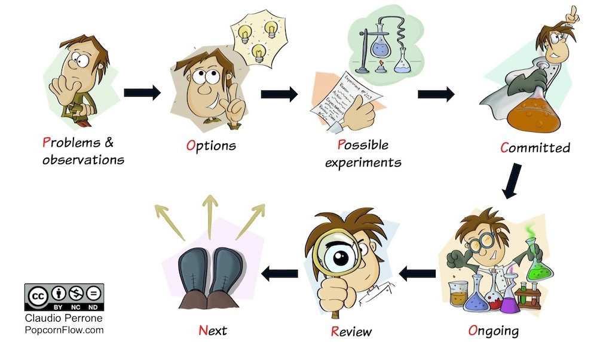

# 克劳迪奥·佩罗内的 PopcornFlow
> 惯性是你的敌人。
>
> ——克劳迪奥·佩罗内

我们已经看到，我们工作的团队和组织是自然倾向于惯性的社会技术系统。让我们再次阅读 John Gall 的名言，并尝试更好地理解它。 “为了保持不变，系统必须改变。具体来说，必须发生的改变是改变以前用来防止内部发生剧烈变化的改变模式（或策略）。”

约翰在这里所说的是惯性不是绝对的。系统实际上有变化的模式，但它们是自然的，而且大多是无意识的，用来防止内部发生剧烈的变化。它们通常只是在没有改变目标的情况下做出的决定的影响。

由 Claudio Perrone 创建的 PopcornFlow 概念利用了这些变化的模式，本质上是通过可视化使系统的集体意识意识到它们。这种意识使在系统中工作的人们能够应对这些变化，因此他们可以通过实验和学习积极地做出有意识的决定。再加上一种迭代的反馈方式，这导致了能够实现集体学习的实验，引发倡议和想法的连锁反应，因为团队认为他们拥有自己的命运，并且可以客观地看待他们愿意朝着特定方向前进的后果。

从这个角度来看，PopcornFlow 引入、维持和加速了持续的创新和变革，促进了超快速的实验，以帮助支持不确定性下的决策过程。它由两部分组成：一个基于七个可视化步骤的迭代决策周期，以及一组原则：

## 七步决策周期

迭代周期由七个步骤组成，每个步骤都映射到一个列，这对于了解学习活动的状态至关重要。每个步骤的首字母构成单词 POPCORN。

- 问题和观察
- 选项
- 可能的实验
- 坚定的
- 进行中
- 审查
- 下一步

团队和个人关注并讨论他们面临的问题、解决或减少这些问题影响的选项，以及探索其中一个或多个选项的可能实验。他们及时或定期但快节奏地描述便签上的细节并将它们放在板上。然后他们执行实验，让笔记在黑板上流动，创造克劳迪奥所说的“学习流”。

原则
PopcornFlow 是一种基于原则的反脆弱哲学，以下是它的指导原则：

1. 如果改变很难，那就让它持续下去。
2. （病毒原理）
3. 重要的不仅是你做了什么，而且你从中学到了什么。
4. （阶梯原理）
5. 每个人都有权发表自己的意见，但共同的意见是事实。
6. （自由原则）
7. 这不是“快速失败，经常失败”，而是“快速学习，经常学习”。
8. （滑板原则）
9. 小赌，大赢..
    （我们喜欢称之为风险原则）

> 笔记
>
> Nassim Nicholas Taleb，反脆弱：从无序中获得的东西：https://www.goodreads.com/book/show/13530973-antifragile。

该原则的措辞仍在进行中，但它基于 Nassim Taleb 的“期权不对称”概念。简而言之：这不是关于我们达到或超出预期的频率，而是关于如何限制每个实验的成本以及我们在正确时获得多少收益，即使只是偶尔。我们喜欢称其为“风险投资原则”，因为它与初创企业的风险投资理念相同；大部分都迷失在会失败的想法中，但少数成功的想法所获得的回报将远远超过所失去的。

## 谁可以从 PopcornFlow 中受益

根据 Claudio 的说法，PopcornFlow 在问题本质上是系统探测的复杂领域中表现最好。在很大程度上，该方法所做的是使用不受控制的并行实验来探索选项并改变系统动力学。

它在任何想要创新的组织中都特别有用，尤其是在它不知道如何创新的情况下。它已经进入了初创企业、大型金融机构、知名科技公司以及更多不同的环境。例如，去年，加拿大公共部门的一个团体使用它获得了两项享有盛誉的国家创新奖。

PopcornFlow 是克劳迪奥在敏捷和精益环境中工作时的想法，显然非常适合指导敏捷团队并促进高效的回顾。团队也可以在他们的直接圈子之外交易选项——这是减少不可避免的偏见的关键机制。结合待完成的工作理论，它也适用于产品和服务创新，甚至可以帮助销售和营销团队。

## 资源
### 基于网络的资源：

- PopcornFlow：通过超快速实验持续进化，Claudio Perrone：https://popcornflow.com/。

### 图书：

- 反脆弱：从无序中获得的东西，纳西姆·尼古拉斯·塔勒布：https://www.goodreads.com/book/show/13530973-antifragile。