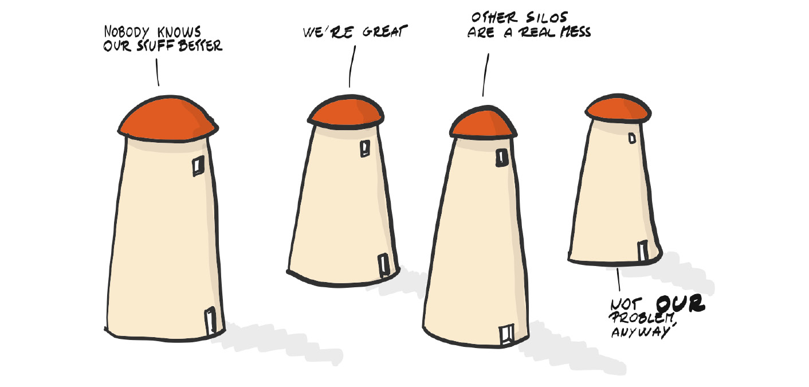
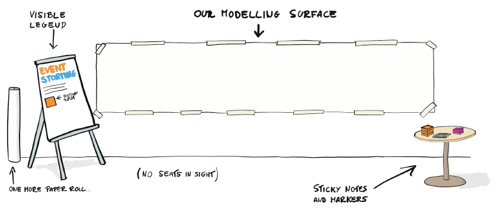
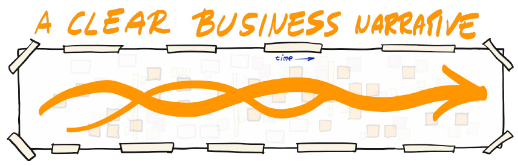
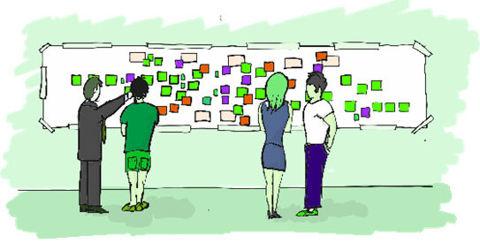

# 阿尔贝托·布兰多里尼的事件风暴
> 每个人都是自己筒仓里的主人。
>
> ——阿尔贝托·布兰多里尼

我们已经看到，构建软件系统是一项旨在使信息流自动化以支持企业价值流的活动。这意味着应该存在一个软件系统来支持业务流程，并且应该围绕它们进行塑造，为它们服务，优化它们，并使它们更有效。

出于几个原因，说起来容易做起来难。我们在过去的客户中反复看到的主要原因之一是对他们的价值流缺乏共同的理解。只有少数精选的人对整个高层次的图景有一个想法（通常不是最新的），而其他人则被密封地分成几个部门，在那里他们可以用尽可能少的知识来生产。

EventStorming 的概述（和图表）借用了 Alebrto Brandolini 的书，介绍 EventStorming：故意集体学习的行为，并获得他的许可。要了解更多信息，请参阅本附录末尾的资源部分。

## 筒仓和价值流
部门的另一个词是筒仓，使用一个常见的比喻。 Brandolini 说：“筒仓在一件事情上确实很出色：它们最大限度地减少了新人所需的学习量”，或者反过来说，它们“最大限度地提高了组织内的整体无知”。每个组织在某种程度上都是由孤岛组成的，这降低了它的效率，侵蚀了它的利润，或者——在最坏的情况下——注定要失败。 “筒仓真正令人讨厌的特征是它们的不对称性；它们很容易建立，但很难消除。”

> 笔记
>
> 本附录中的所有引述均来自 Alberto Brandolini 的著作。 Alberto Brandolini 是一位企业家、顾问、开发人员、教师、公众演说家和作家。他从 1982 年开始从事编码工作，他的技能包括敏捷、领域驱动设计、精益、复杂性、管理 3.0 和“解决问题所需的一切”等主题。他是 Avanscoperta (https://www.avanscoperta.it/en/) 的 CEO 和创始人，他写博客 (http://ziobrando.blogspot.com/)，他是一位非常活跃的公众演说家 (https://ziobrando.blogspot.com/) ://www.slideshare.net/ziobrando)。

在复杂的环境中，最小化有限理性影响的关键因素是获取正确的信息以做出决策。基本上，孤岛充当边界，限制知识在组织中的传播，并阻止整体理解。这使得不同部门的行为更像是不同的实体，而不是同一组织内的各个部分。因此，这促进了 Brandolini 所说的专业知识分布不均。 “通常我们必须处理不同的知识和专业知识，而我们将获得的信息只能在本地保持一致：没有人掌握全部真相。”

> 笔记
>
> 有限理性是 1978 年诺贝尔经济学奖和 1975 年图灵奖获得者赫伯特·西蒙（Herbert Simon）定义的概念。它指出，“人类做出相当合理的决定，但仅基于他们拥有的信息。”这个想法是，当个人做出决定时，他们的理性受到决策问题的易处理性、他们头脑的认知限制以及做出决定的可用时间的限制（https://en.wikipedia.org/wiki/Bounded_rationality和 https://en.wikiquote.org/wiki/Bounded_rationality）。

当我们考虑到一个组织的价值流跨越了它的所有孤岛时，主要问题就变得很明显了。通常一个部门的输出是下游下一个部门的输入。 “这个问题的明显证据是，单一的知识来源不足以解决跨越多个领域的问题。”

## 学习的重要性

> 软件开发是一个学习过程，工作代码是一个副作用。
>
> ——阿尔贝托·布兰多里尼

在没有有效沟通的情况下将组织划分为密封的部门会产生几个问题，主要是单个部门内部的人员缺乏对整个业务系统的了解。好消息是，通过适当的学习，这个问题有可能得到解决——或者至少得到改善。在这种情况下，EventStorming 成为在组织层面实现快速共享学习的绝佳工具。

“它允许学习跨越孤岛边界。这不是改变组织的举措，而是在更广泛的范围内了解正在发生的事情的工具。我们将看到要求利益相关者一起为复杂的业务流程建模将如何暴露在孤岛之间的边界上发生的许多冲突和矛盾。它也将有助于寻找系统最优的解决方案，这很难，因为系统真的很难看到，而不是一个局部的、次优的解决方案和许多无用的政治来证明它们的合理性。”

## 事件风暴方法

EventStorming 是一项以研讨会形式提供的有关业务价值流的学习活动。在非常高的层次上，它可以被看作是一个由几个步骤组成的过程：

- 将系统视为一个整体。
- 找到一个值得解决的问题。
- 收集最好的、即时可用的信息。
- 从可能的最佳起点开始实施解决方案。

这就是 Alberto 对 EventStorming 所做的事情：他将拥有最适合该工作的可用知识的人聚集在一起，并协作构建问题空间的整体模型，这通常是非常复杂的。

在不断变化的世界中，一切都在发展：技术、人员、组织本身、周围的业务以及就业市场。假设这些要素之一在重大变革计划中是不可变的，这不是一个合理的简化：它只是单纯的幼稚。但是我们可以做一件事：我们可以对当前的现实进行快照，并确保所有关键参与者都在关注同一件事。

无论目标是为组织编写一个关键软件，还是为初创公司设计业务流程的下一个实现，还是为现有业务线重新设计关键业务流程，这意味着拥有一个清晰的、共享的了解问题格局和可能的解决方案。

## 研讨会：快速概览

车间需要足够大的空间，可以将长纸卷（至少 8 米）贴在墙上，有足够的空间让相关人员在靠近墙壁的地方上下走动，但也有一定距离以便更好整体看来。座位不应轻易获得，以激发参与和专注：

研讨会包括使用领域事件及其时间流来构建当前对业务的共同理解的模型。每个参与者都对他最了解的系统部分做出贡献，该部分总是与其他部分相互关联。在研讨会结束时，所有内容都将在一个连贯的时间线流中组织在一起，提供当前系统的详细模型。

在整理好后勤工作之后，对于一个成功的研讨会来说，最重要的是让合适的人参与进来。从本质上讲，房间里有两种人特别有趣：一种是关心并会提出问题的人，另一种是知道并会提供答案的人。

关心问题、背景的多样性以及积极、好奇的态度至关重要。事实上，EventStorming 为跨孤岛边界的有意义的对话提供了坚实的背景，并提供了一种可适应的格式，允许跨多个学科进行协作。这意味着业务专家、精益专家、服务设计师和软件开发人员都可以参与同一个对话。

研讨会的目标在一开始就确定了：“我们将通过将所有相关事件放在一个时间线上来探索整个业务流程。我们将在此过程中强调想法、风险和机遇。考虑下图：

该过程从识别域事件流开始，由橙色便利贴和名称表示。事件以过去时态书写（提交的订单、已付款等）。这种时间流形成了业务的叙述，事件将成为与业务相关的故事讲述的基石。

然后，该模型通过事件源（用户交互触发命令、外部系统和时间触发器或其他事件的结果自动触发）、帮助用户决策的读取模型以及描述事件“后果”的策略得到丰富。一个事件，以其他命令的形式被触发。然后，发现继续进行，让聚合成为负责执行某些命令和引发相关事件的中心实体。模型的这些不同元素中的任何一个都将具有不同的颜色，以更好地识别不同的概念并在时间轴上突出显示它们：

## 不同风格的 EventStorming
有几个深度级别对应于几种 EventStorming 风格，每一种都适用于不同的上下文。阿尔贝托说他喜欢把它想象成“披萨”，有一个共同的基础但不同的配料。

以下是不同风格的 EventStorming：

- 大图 EventStorming：用于启动项目的方法，每个利益相关者都参与其中。
- 设计级事件风暴：挖掘可能的实现，通常采用 DDD-CQRS/ES7 风格。
- 价值驱动的事件风暴：一种进入价值流映射的快速方法，使用讲故事作为可能的平台。
- UX 驱动的 EventStorming：与价值驱动的 EventStorming 类似，专注于用户/客户在寻求可用性和完美执行方面的旅程。
- EventStorming 作为回顾：使用领域事件来确定流程的基线并扩大范围以寻找改进机会。
- EventStorming 作为一种学习工具：非常适合最大限度地提高新员工的学习能力。

## 复杂系统和经过验证的解决方案

在复杂系统中，上下文成为驱动力；策略和解决方案不能安全地重复。没有灵丹妙药，因为新的上下文信息会有所不同，所以以前有效的方法明天可能不适用于不同的情况。

我们同意 Alberto 的说法，“保守的组织通常不愿意完全接受复杂性的后果。规避风险的文化体现在追求经过验证的解决方案，而不是在受控环境或形式中进行冒险的实验性解决方案。”

不幸的是，在复杂的领域中，没有“经过验证的解决方案”这样的东西。就像足球一样，聘请连胜时间最长的最佳教练并不能保证你的球队明年就能夺冠。

在实践中，教条规避风险被证明是复杂领域中非常冒险的策略。而且，我们可能会补充说，非常浪费。

## 资源
### 网络

- Alberto Brandolini 的博客：https://medium.com/@ziobrando。

    ### 图书

- 介绍 EventStorming，一种刻意集体学习的行为，Alberto Brandolini：https://leanpub.com/introducing_eventstorming。